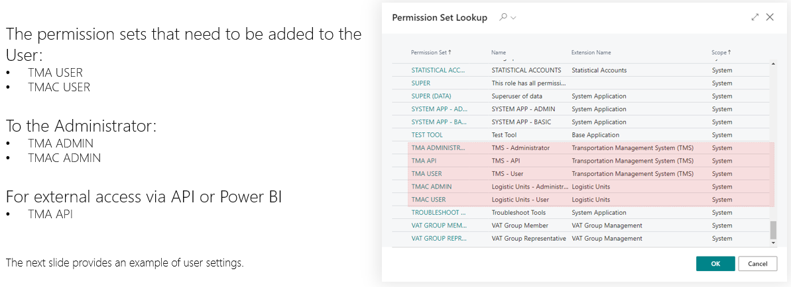
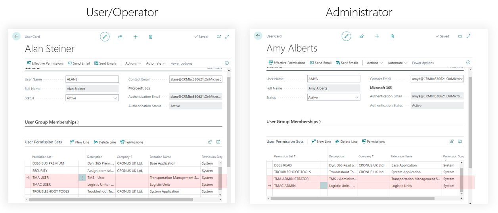

# Assign Permission Sets to Users

## Assign user permissions

Users can be divided into two groups: those who work with TMS, perform operations, and handle documents, and administrators who can configure TMS and change settings.

The permission sets that need to be added to the User:

- TMA USER Permissions Set
- TMAC USER Permissions Set

To the Administrator:

- TMA ADMIN Permissions Set
- TMAC ADMIN Permissions Set

For external access via API or Power BI:

- TMA API Permissions Set

