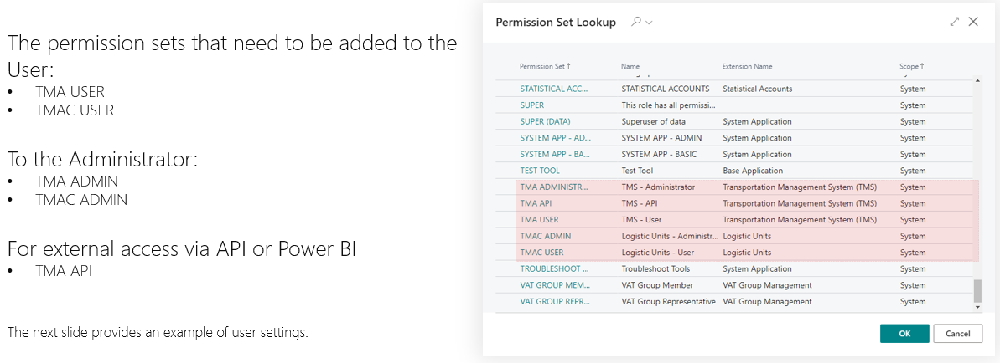
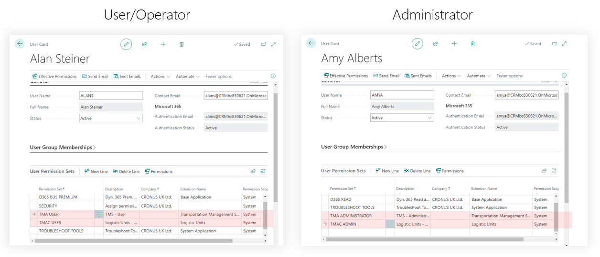

# Assign permission sets

Permission sets control which TMS pages and actions a user can access.

Assign permission sets after the app is installed and licenses are assigned.

## Which permission set to use

| User type | Permission set |
|---|---|
| Operations and finance users | **TMS User** |
| TMS administrators | **TMS Administrator** |
| API, Power BI, or integration users | **TMS API** |
| Capacity sourcing users, if enabled | **TMA Capacity Sourcing** |

Older permission sets with the `TMA` prefix can exist for compatibility. For new assignments, use the `TMS` permission sets unless your implementation guide says otherwise.

## Recommended assignment pattern

| Role | Recommended access |
|---|---|
| Forwarding coordinator | **TMS User** |
| Dispatcher | **TMS User** |
| Finance user | **TMS User** |
| Setup administrator | **TMS Administrator** |
| External integration account | **TMS API** |

## Assign a permission set

1. In Business Central, search for **Users**.
2. Select the user.
3. Open **User Permission Sets**.
4. Add the required TMS permission set.
5. Repeat for each user who must work with TMS.

## Verify

1. Ask the user to sign out and sign in again.
2. Search for **Forwarding Orders**.
3. Confirm the page opens.
4. Confirm the user can perform the expected task.

## Troubleshooting

| Problem | What to check |
|---|---|
| User cannot open TMS pages | Check license assignment and permission set assignment. |
| User can open pages but cannot configure setup | Assign **TMS Administrator** if the user is responsible for setup. |
| API calls fail with permission errors | Use an integration account with **TMS API** and company access. |

## Related

- [Buy licenses](buylicenses.md)
- [TMS Setup](setup.md)
- [API](api.md)
