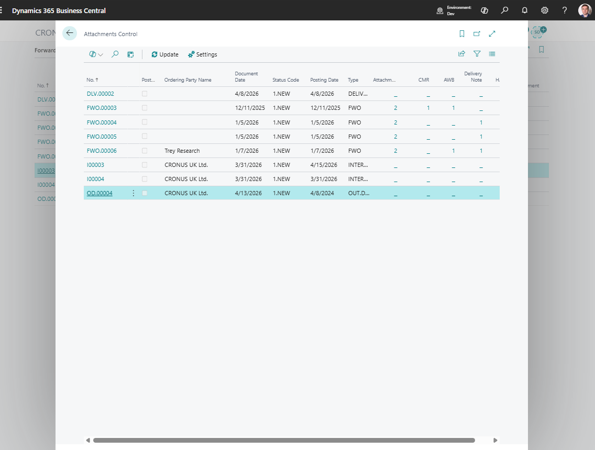

# Attachment Control

Use **Attachment Control** to monitor whether TMS documents have the files your process requires.

The page gives operations and compliance users one place to review attachment counts by document and category.

## Before you start

Make sure that:

- attachment categories are created,
- status profiles are configured if attachments are required before status changes,
- users have permission to open document attachments,
- Azure Blob Storage is configured in [TMS Setup](setup.md) if your company stores files outside the Business Central database.

## What Attachment Control shows

| Column or area | Use it for |
|---|---|
| **Document No.** | Opens the source document or posted document. |
| **Ordering Party** | Shows who ordered the transportation job. |
| **Status Code** | Helps identify whether the document is ready for the next step. |
| **Posting Date** | Helps review posted history and audit periods. |
| **Total Attachments** | Shows the complete attachment count. |
| **Category columns** | Show counts for selected attachment categories. |

## How to work in this page

1. Open **Attachment Control**.
2. Review the total attachment count for each document.
3. Use category columns to find missing files.
4. Drill down into a count to open filtered attachments.
5. Choose **Settings** to change which categories are shown.
6. Follow up with the document owner when required files are missing.

## Attachment categories

Use **Attachment Categories** to classify files such as carrier confirmation, customs document, insurance certificate, invoice support, customer approval, or internal note.

Attachment categories are also used by status extended control. A status can require selected attachment categories before the Forwarding Order moves forward.

## Good to know

- Attachment Control is a monitoring page. The source documents remain the place where users attach and review files in daily work.
- Category columns are configurable, so each company can monitor the document types that matter most.
- Attachment requirements are enforced through status setup, not through the monitoring page itself.

## Troubleshooting

| Problem | What to check |
|---|---|
| A category column is empty | Check **Settings** and confirm the category filter is correct. |
| A user cannot open an attachment | Check user permissions and file storage setup. |
| Posting is blocked by missing files | Review the status profile extended control and attach the required categories. |
| Attachment count looks wrong | Refresh the page and check whether the file is attached to the expected document. |

## Related

- [Statuses and Status Profiles](statuses.md)
- [Forwarding Order](forwardingorder.md)
- [Posted History](postedhistory.md)
- [TMS Setup](setup.md)
