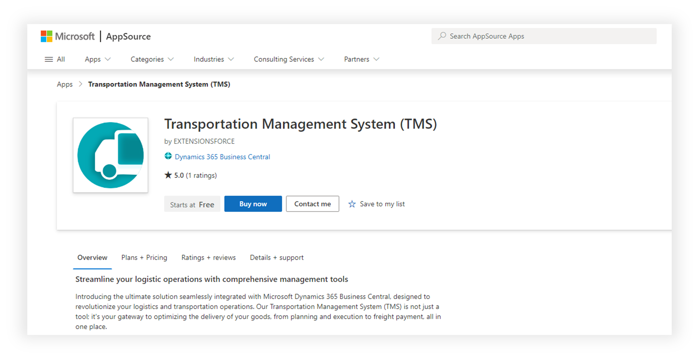
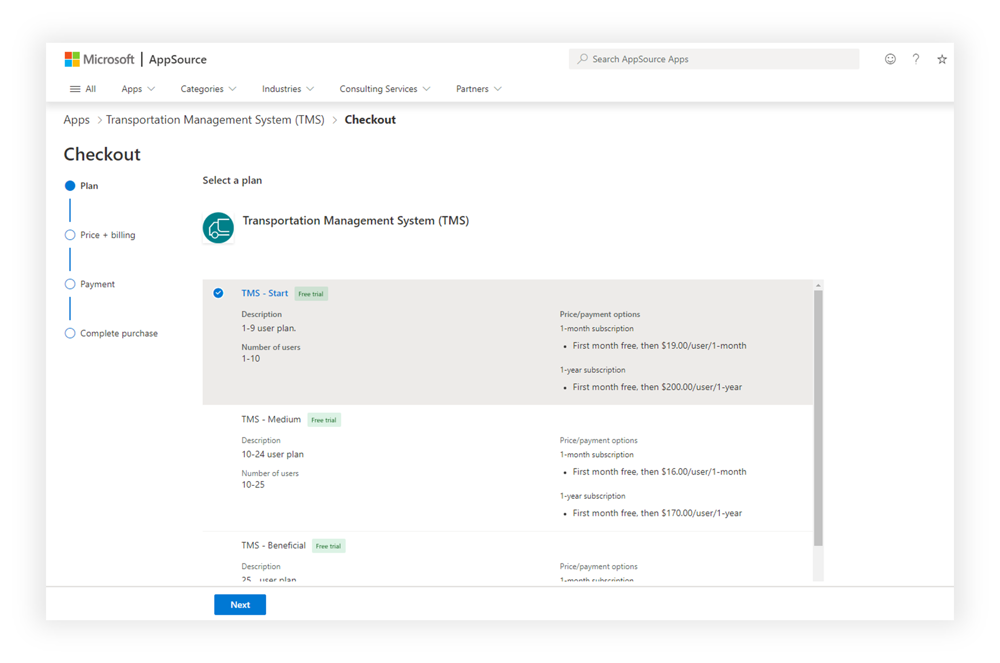
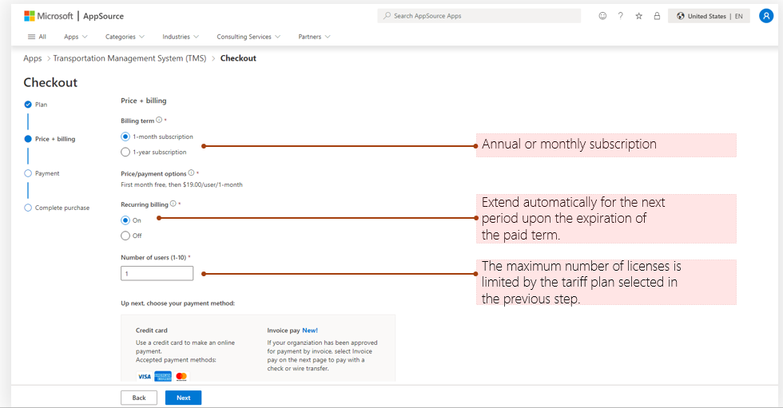
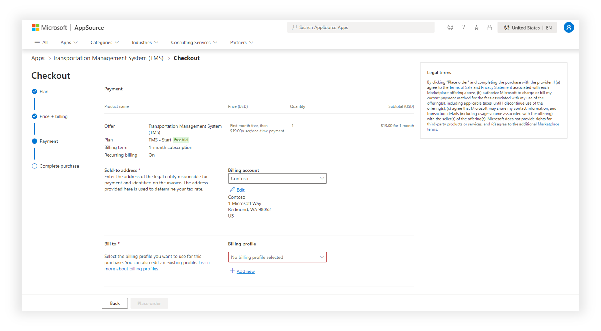
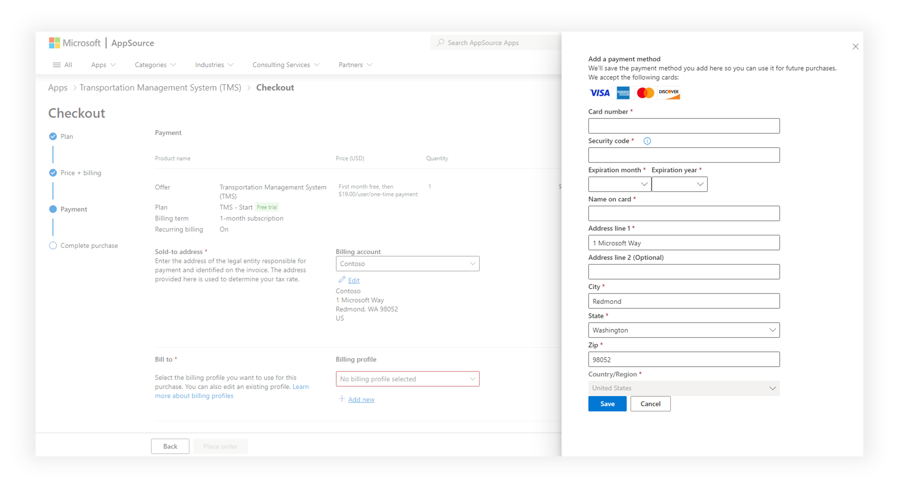
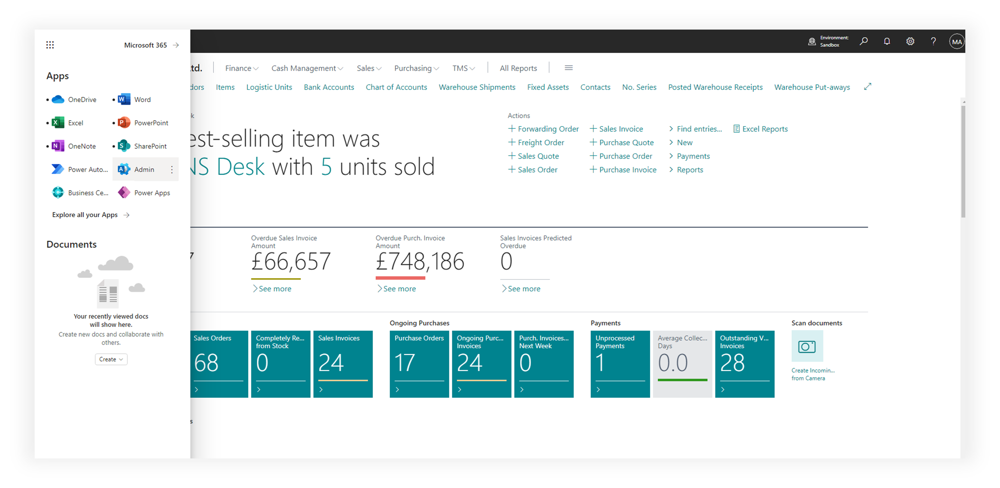
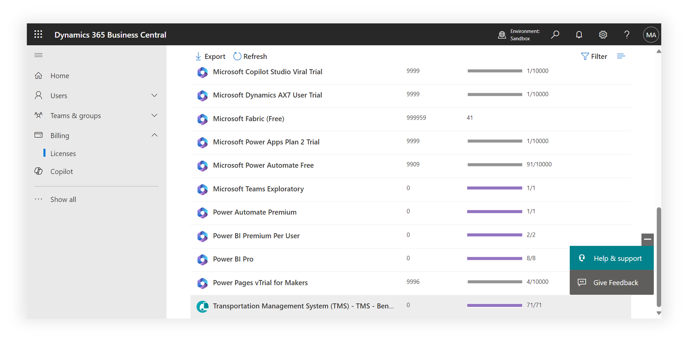
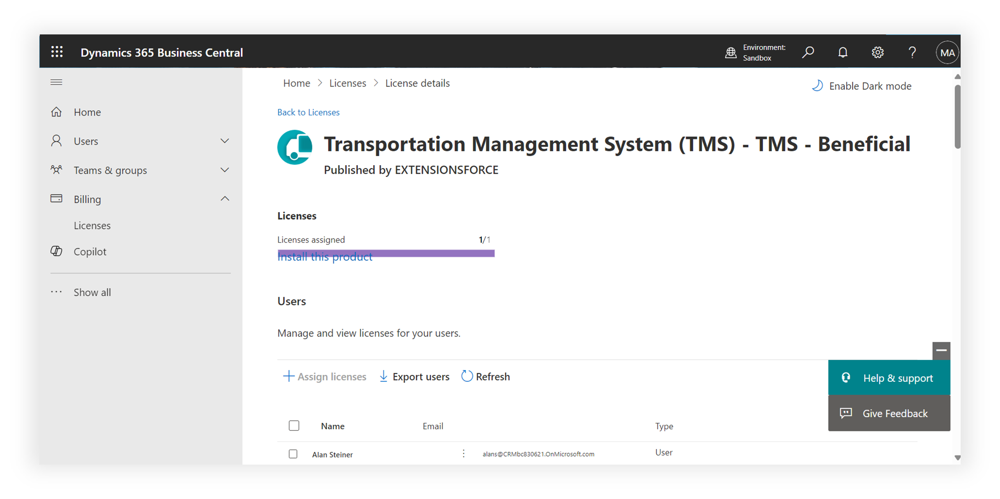
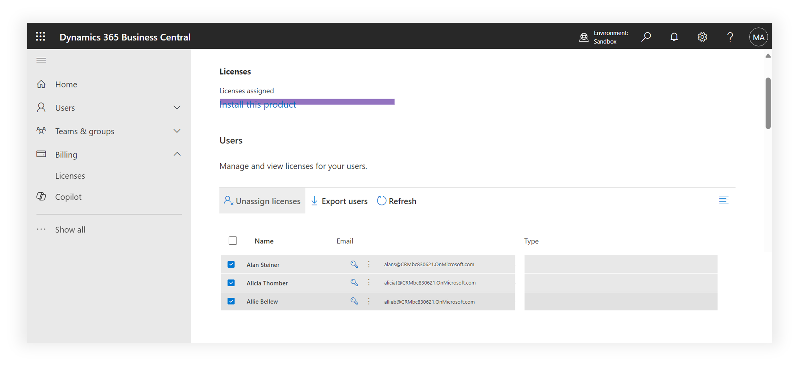

# Transportation Management System (TMS) - Buy Licenses

Purchase and assign licenses. Immediately after installation, TMS is not available to users and is not visible in the Business Central menu, therefore, it is necessary to purchase TMS licenses. This can be done from the TMS page on AppSource by selecting the pricing plan that best suits your company. Then, assign licenses to users who will work with TMS in the Microsoft 365 Admin Center.

p.s. It is not mandatory to buy as many licenses as Business Central licenses; you can limit it to only those who work with transportation and TMS.

Licenses are purchased directly on the TMS page on the AppSource portal. Click "Buy now" button.

Choose the suitable pricing plan according to the number of users you need. Each plan includes a one-month trial period.

Set the subscription parameters. For demo mode, auto-renewal can be disabled (Recurring billing).

In the next step, it is necessary to check the subscription parameters and select the billing account from which payments will be made and to which Microsoft will issue invoices.

Payment by card is possible. To do this, it is necessary to press the +Add new button to add a new payment method.

Assigning licenses to users is done in the Microsoft 365 admin center.

Select the Billing > Licenses menu item and scroll down to the TMS product licenses

On this page, licenses are distributed among users. Click Assign licenses button and find users.

To revoke TMS licenses from users, you need to select the users and press the 'Unassign licenses' button.

