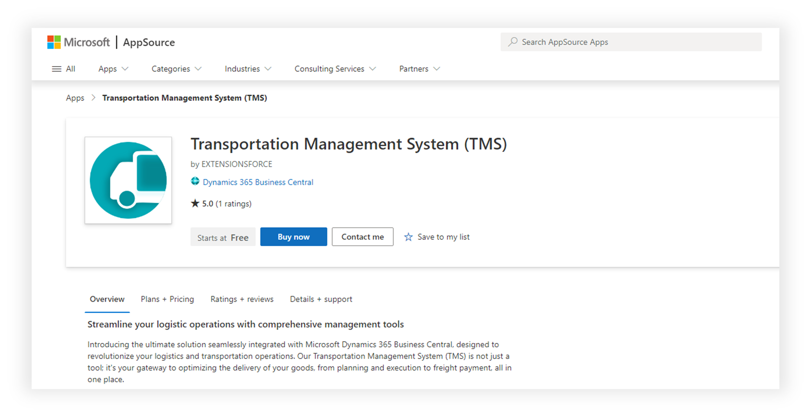
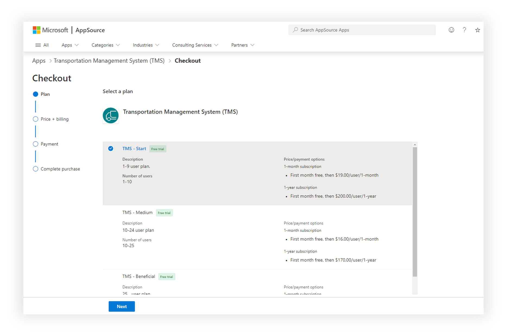
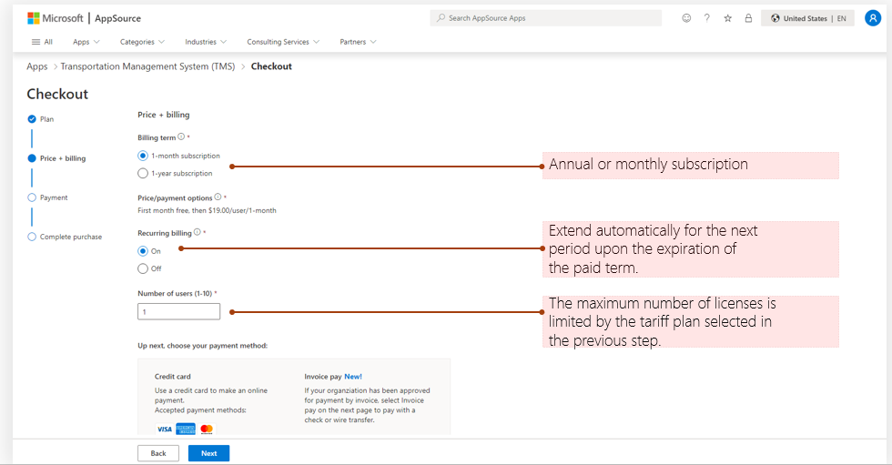
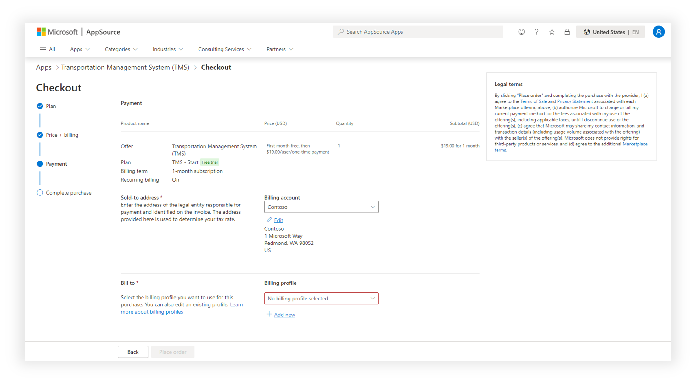
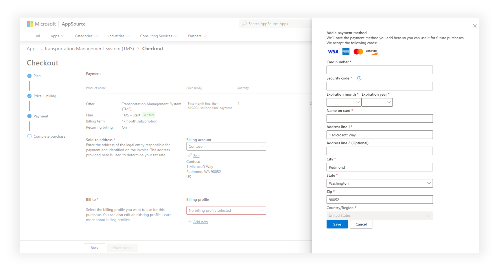
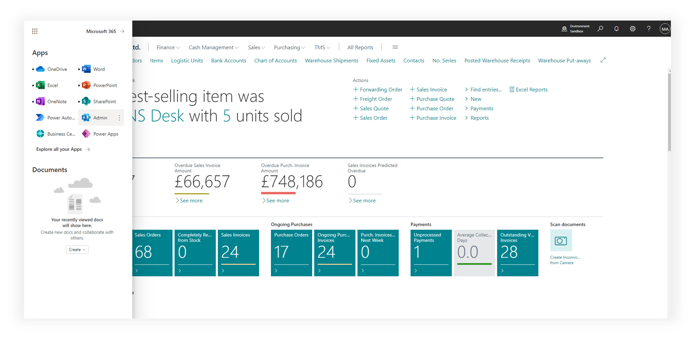
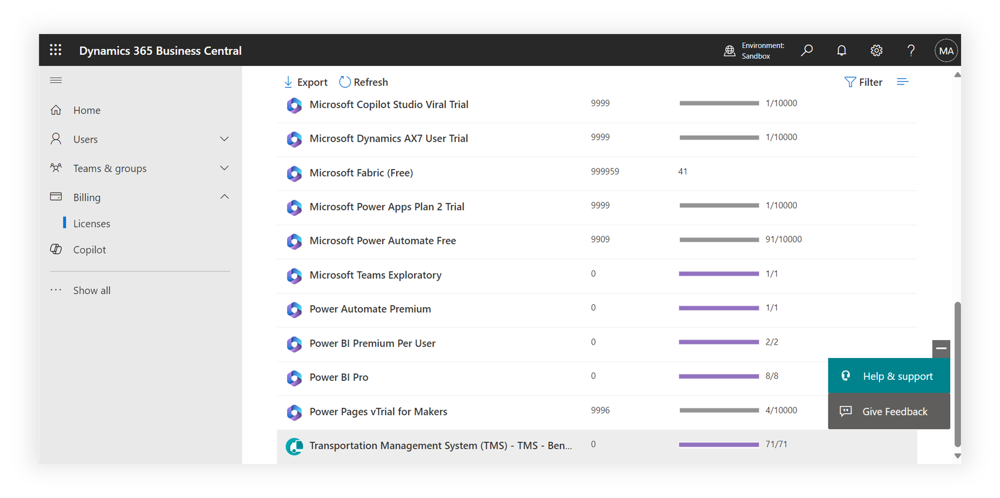
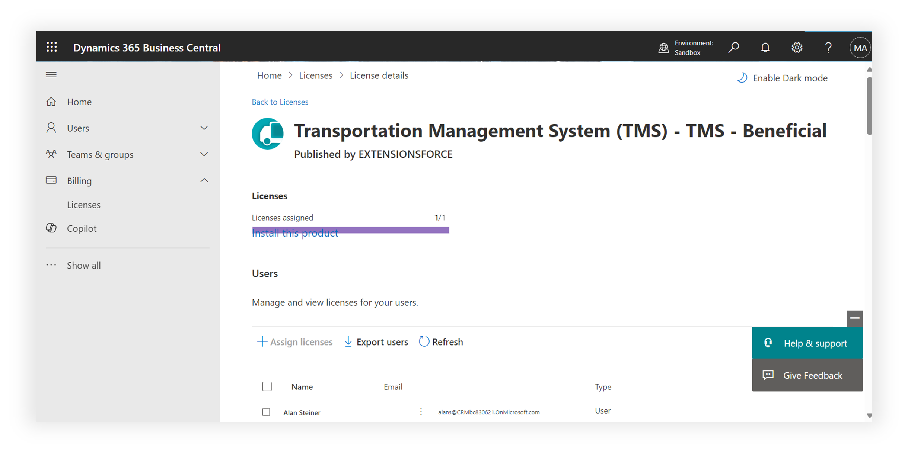

# Buy licenses

Users need an assigned TMS license before they can work with the app.

Buy licenses from the TMS AppSource listing, then assign them in Microsoft 365 Admin Center.

## Who needs a license

Assign licenses to users who work with TMS pages, documents, setup, or integrations.

You do not need to buy a TMS license for every Business Central user. Buy licenses only for users who use TMS.

## Buy the licenses

1. Open the TMS page on AppSource.
2. Choose **Buy now**.
3. Select the pricing plan that matches the number of users you need.
4. Review subscription settings.
5. Select the billing account.
6. Add or confirm the payment method.
7. Complete the purchase.

## Assign licenses to users

1. Open Microsoft 365 Admin Center.
2. Go to **Billing** > **Licenses**.
3. Find the TMS product license.
4. Choose **Assign licenses**.
5. Select the users who will work with TMS.
6. Save the assignment.

## Verify

1. Ask a licensed user to sign in to Business Central.
2. Search for **Forwarding Orders** or **TMS Setup**.
3. Confirm that the page opens.

## Troubleshooting

| Problem | What to check |
|---|---|
| User cannot see TMS | Confirm both license assignment and Business Central permission sets. |
| License was bought but not visible | Wait for Microsoft 365 license synchronization, then refresh the user session. |
| User should no longer use TMS | Remove the TMS license in Microsoft 365 Admin Center. |

## Related

- [Installation](installation.md)
- [Assign permission sets](assignpermissionsets.md)