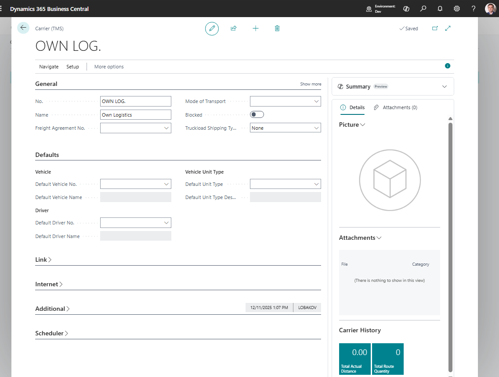

# Carriers

Use **Carriers** to store the companies that execute transportation work for your LSP operation.

A carrier can be an external vendor, a partner carrier, or an internal execution unit that your company wants to track as a carrier.

## Before you start

Make sure that:

- the vendor exists if carrier invoices are posted to a vendor,
- default contact and address data is available,
- [Freight Agreements](freightagreement.md) are ready if carrier rates are maintained as contracts,
- map location and route data are ready if the carrier is used in route planning,
- default vehicle, driver, or logistic unit type records exist if you want them copied to Freight Orders.

## How to create a carrier

1. Search for **Carriers**.
2. Choose **New**.
3. Fill the carrier code and name.
4. Link a vendor if the carrier is paid through purchase documents.
5. Fill address, contact, and communication details.
6. Fill operational defaults such as vehicle, driver, and unit type when used.
7. Save the card.

## Fields that matter most

| Field | Why it matters |
|---|---|
| **No. / Code** | Identifies the carrier in TMS documents. |
| **Name** | Appears in lists, reports, and user lookups. |
| **Vendor No.** | Connects carrier cost to Business Central purchase processing. |
| **Pay-to Vendor** | Supports cases where the invoice vendor differs from the executing carrier. |
| **Default Vehicle / Driver** | Speeds up Freight Order creation when the carrier uses known resources. |
| **Blocked** | Prevents users from using a carrier that should no longer be selected. |

## Where carriers are used

| Area | Use |
|---|---|
| **Freight Order** | Defines who executes the transportation stage. |
| **Settlement** | Supports carrier cost and vendor invoice allocation. |
| **Freight Agreements** | Stores commercial terms and expected cost lines for the carrier. |
| **Charges** | Provides vendor context for purchase-related cost lines. |
| **Reports** | Prints carrier details on execution documents. |
| **API** | Exposes carrier data to portals and external planning systems. |

## Good to know

- Blocking a carrier is safer than deleting it when the carrier already exists on historical documents.
- A carrier can be used without a vendor only when your process does not create vendor financial documents from that carrier.
- Use Freight Agreements when carrier rates or contract lines should be maintained separately from individual Freight Orders.
- Keep carrier names and vendor links clean. They are visible in settlement and reports.

## Troubleshooting

| Problem | What to check |
|---|---|
| Carrier is not available on a Freight Order | Check whether the carrier is blocked and whether user filters hide it. |
| Vendor cost cannot be created | Confirm the carrier has the correct vendor or pay-to vendor. |
| Carrier details are missing on a report | Review address, contact, vehicle, and driver fields on the carrier and Freight Order. |
| Wrong vendor receives the cost | Check pay-to vendor setup on the carrier and the Freight Order. |

## Related

- [Freight Order](freightorder.md)
- [Charges](charges.md)
- [Freight Agreements](freightagreement.md)
- [Settlement](settlement.md)
- [Vehicles](vehicle.md)
- [Drivers](driver.md)
