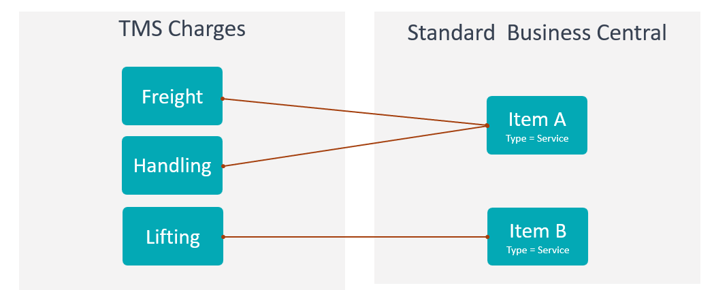
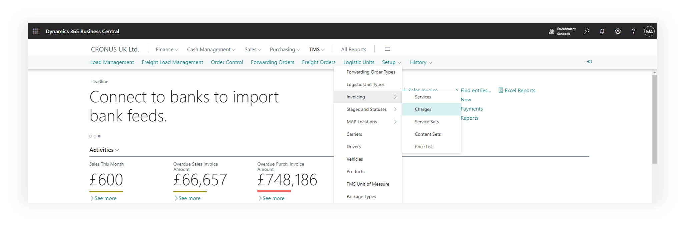
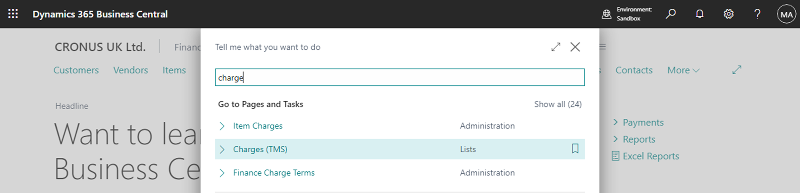
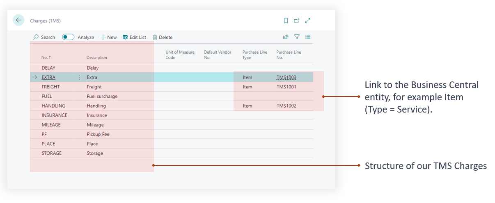
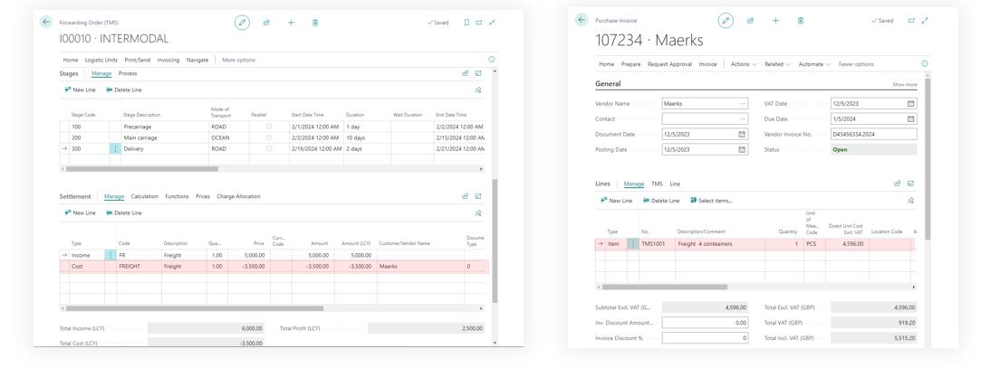
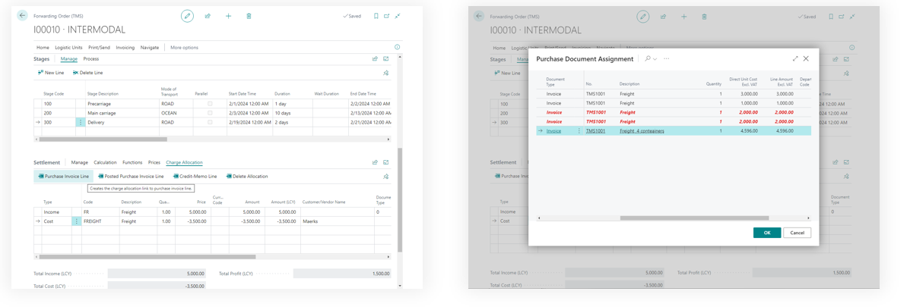
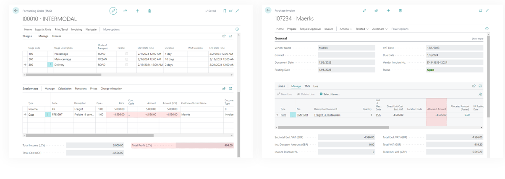

# Charges

- The TMS module includes a charges directory, allowing for the accounting of costs incurred during transportation.
- TMS Charges, similar to TMS Services, have mapping to the standard business center items, facilitating the allocation of transportation order costs.
- Mapping can be one-to-one, where a TMS charge has its equivalent in the product directory, or many-to-one, where multiple TMS Charges are represented by a single item.
- TMS Charges are used in the settlement of forwarding orders to account for expenses entered in Business Central as a purchase invoice.

When a service provider (carrier) issues an invoice to our company, we enter it into Business Central as a "Purchase Invoice" document, specifying products (with a Type = Service) that are mapped to "TMS Charges" in the lines.

Setting up a connection between TMS charges and items with type = Service in Business Central is implemented similarly to “TMS Services”

## Where to find

using main menu of the TMS

using search

## TMS Charges page

## How it works

When planning the transportation, we estimated that the sea stage would cost 3500 pounds. After the transportation, the supplier Maersk sent an invoice for 4596. In the Forwarding Order, we select TMS Charges, which in the purchase order are represented as item.

We will allocate the actual costs to the transportation order. Click "Charge Allocation" then "Purchase Invoice Line" (cost allocation is performed at the line level). In the window that appears, select the lines of the desired invoice and click OK. The system relies on the mapping of TMS charges and items.

The system will establish a connection between the settlement line and the purchase invoice line, adjusting the amounts in accordance with the actual values.

## Prerequisites

To change or create status profiles user must have TMS Admin or Super Permissions.
