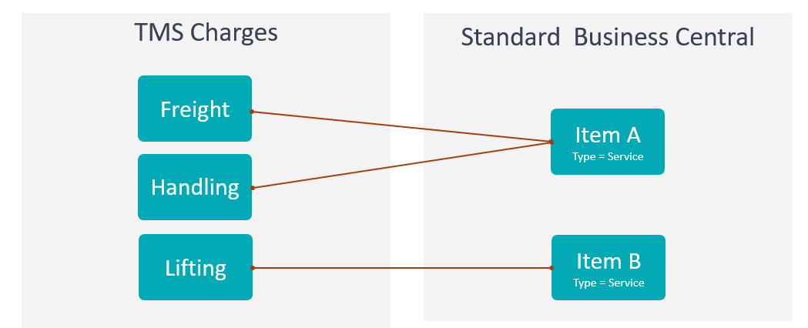

# Charges

Use **Charges** to define the cost types your company records for carrier, vendor, and operational expenses.

Charges are the cost side of settlement. Services are the customer billing side.

## Before you start

Make sure that:

- item charges or G/L accounts are available if costs are posted to Business Central financial documents,
- vendors and carriers are created,
- [Freight Agreements](freightagreement.md) are configured if charges are copied from carrier agreements,
- settlement rules are configured in [TMS Setup](setup.md),
- users understand which costs are estimated and which costs are actual.

## How to create a charge

1. Search for **Charges**.
2. Choose **New**.
3. Enter a code and description.
4. Select the posting or purchase mapping used by your process.
5. Fill defaults such as quantity, unit of measure, VAT/product posting data, or currency when required.
6. Mark the charge blocked only when users must stop using it.

## Fields that matter most

| Field | Why it matters |
|---|---|
| **Code** | The charge identifier used on documents and settlement lines. |
| **Description** | Appears on cost lines, reports, and documents. |
| **Vendor or carrier mapping** | Controls which supplier context is used for cost processing. |
| **Item Charge / G/L mapping** | Controls how the cost is posted or allocated. |
| **Blocked** | Prevents new use without breaking history. |

## Where charges are used

| Area | Use |
|---|---|
| **Freight Order** | Records expected or actual carrier cost. |
| **Freight Agreements** | Defines reusable carrier cost lines and calculation flags. |
| **Settlement** | Allocates cost to the Forwarding Order and calculates margin. |
| **Purchase Assignment** | Maps vendor purchase lines into Freight Order charges and settlement cost. |
| **Purchase processing** | Supports vendor invoice or cost document creation. |
| **Reporting** | Shows cost structure by charge type. |

## Good to know

- Use short, stable charge codes. They become reporting dimensions for cost analysis.
- Do not delete charges used in historical documents. Block them instead.
- Keep service codes and charge codes separate. It helps users understand income versus cost.

## Troubleshooting

| Problem | What to check |
|---|---|
| Charge cannot be selected | Check whether the charge is blocked. |
| Cost does not post correctly | Review item charge, G/L, VAT, and vendor mapping. |
| Margin is wrong | Confirm the charge amount, currency, allocation, and settlement recalculation. |
| Cost cannot be allocated | Check the settlement line status and linked Forwarding Order. |
| Purchase invoice line cannot be matched | Check charge setup and [Purchase Assignment](purchaseassignment.md). |

## Related

- [Settlement](settlement.md)
- [Services](services.md)
- [Freight Agreements](freightagreement.md)
- [Purchase Assignment](purchaseassignment.md)
- [Freight Order](freightorder.md)
- [TMS Setup](setup.md)
