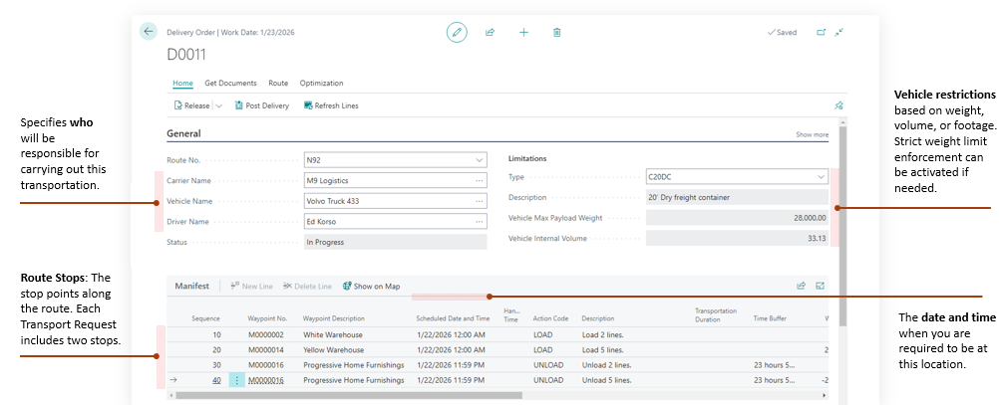
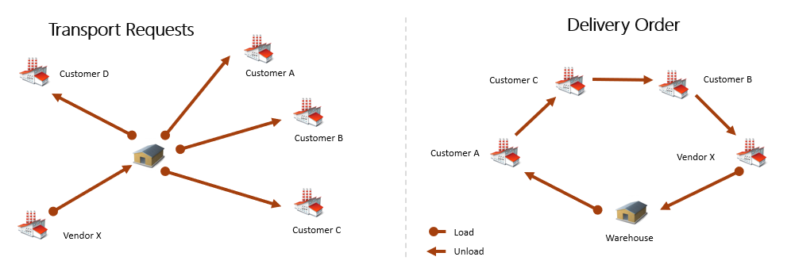
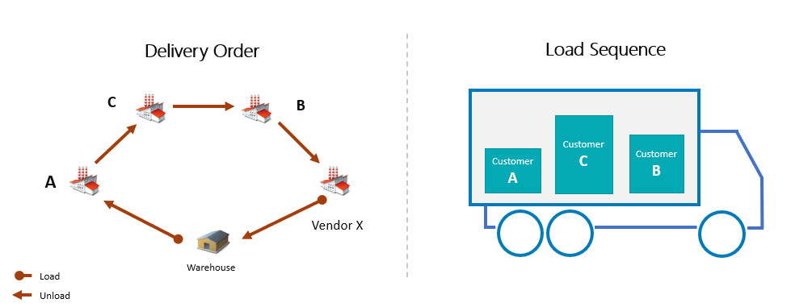
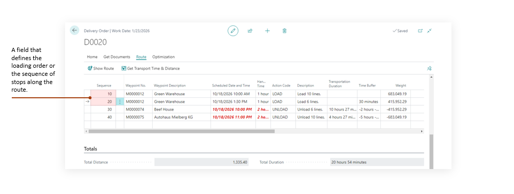
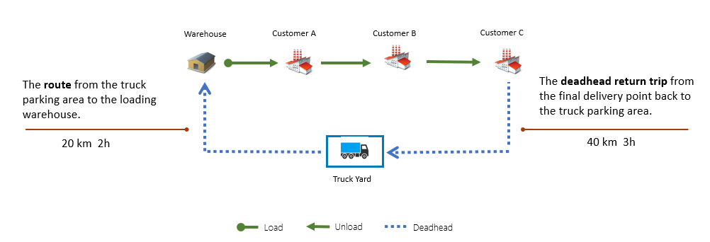
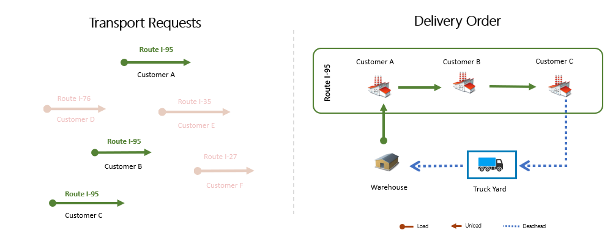
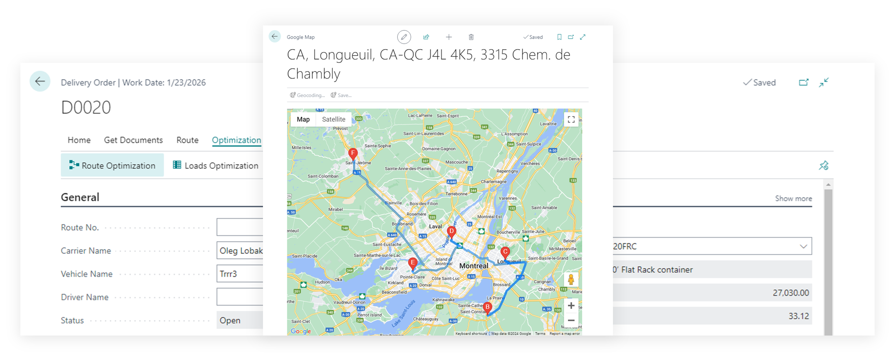
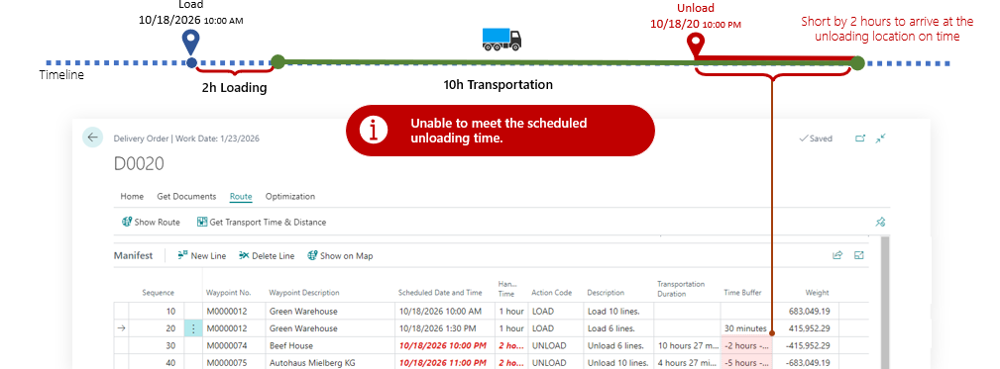

# Delivery Order

is a document that details HOW the transportation will be carried out. It specifies the carrier, driver, and vehicle. The Delivery Order represents the actual journey of the truck, outlining the stops where loading or unloading will take place.

## Capabilities

The Delivery Order document covers the following functional areas of the TMS:

- Load Management
- Route Management & Optimization
- Weight, Volume, Footage Control
- Load Sequencing

A Delivery Order is:

- a real vehicle run, the actual driving route, detailing the order of stops the vehicle must make
- a set of tasks to be completed, such as loading, unloading, or pallet pickup,
- a loading sequence for the truck,
- a tool for control weight, volume, or footage limits at each stop along the route

Delivery Order consolidates multiple transport requests into a single document, creating a vehicle route that accounts for weight and volume constraints, while optimizing the route based on distance or duration.

Delivery Order allows for the automatic determination of the vehicle loading sequence at the warehouse, based on the order of the delivery stops along the route.

The Delivery Order allows you to manually set the vehicle loading sequence or the order of stops along the route by adjusting the Sequence field.

Delivery Order can control for additional route elements, such as the trip to the warehouse or the return journey (distance and duration), which are critical for managing driver work hours or fleet operations for companies with their own vehicle fleets

Delivery Order enables the selection of Transport Requests based on route numbers. Each customer can be assigned a route number that corresponds to their delivery address.

Integration with Google Maps for constructing the optimal delivery route between MAP locations with the capability for optimization based on distance or duration criteria. [Google MAP Integration](googlemapintegration.md)

Automatically checks the loading and unloading schedule for the entire route, accounting for transportation time, and indicates if it’s not possible to arrive at a specific location at the required time.

## Fields Description

- **No.** : Specifies the unique number for this delivery order, used to track and manage shipping stages.
- **Geographic Zone Code** : Specifies the geographic zone or region for this delivery, aiding route categorization.
- **Route No.** : Specifies the route identifier that outlines the planned path for this delivery. The Route Code is used as a geographical grouping attribute for consolidating customers and orders. What is considered a “route” is defined and interpreted by your organization. For example, a route code may represent a highway, a major road, or a city district. This route code is assigned in the Customer Card and is then inherited by all subsequent documents — Sales Order → Transport Request — and can later be used when creating a Delivery Order.
- **Carrier No.** : Specifies the carrier code responsible for transporting goods in this delivery. If you are delivering with your own transport, you can create a Carrier with the code OWN LOGISTICS.
- **Carrier Name** : Specifies the carrier name responsible for transporting goods in this delivery. If the Delivery Order card is displayed in compact view, only the carrier’s name (without the code) is shown. By clicking the Assist Button, you can select the required carrier.
- **Mode of Transport** : Specifies the primary transport method, such as road, sea, or air, for the delivery. This field can be set by default in the carrier’s card.
- **Vehicle No.** : Specifies the unique vehicle number or license plate used for this delivery.
- **Vehicle Name** : Specifies the labeled vehicle name or identifier for dispatch and scheduling. If the Delivery Order card is displayed in compact view, only the vehicle’s name (without the code) is shown. By clicking the Assist Button, you can select the required vehicle.
- **Driver No.** : Specifies the driver code operating the vehicle, used for scheduling and compliance.
- **Driver Name** : Specifies the driver's full name responsible for operating the assigned vehicle. If the Delivery Order card is displayed in compact view, only the driver’s name (without the code) is shown. By clicking the Assist Button, you can select the required driver.
- **Status** : - Specifies the current status of the delivery order, such as Open or Released.
- **Vehicle Type** : Specifies the code that defines the vehicle's type, capacity, or dimension limits. All dimensional and weight parameters of any logistics units in TMS are defined using Logistic Units Type. Even a truck has its own size, volume, and weight limitations, so it is considered a logistics unit that can be described with a Logistic Units Type. The Vehicle Type is inherited by default from the Vehicle, if specified. Typically, for each truck type used for deliveries, a separate Logistic Units Type is created with its own weight and/or volume limits and then assigned to the Vehicle.
- **Vehicle Type Description** : Specifies a descriptive name for the chosen vehicle type or logistic unit definition.
- **Comment** : Specifies any additional notes or instructions relevant to this delivery order. This field is filled in only on the Delivery Order card and is not inherited from anywhere.
- **Master Waybill** : Specifies the master waybill reference (e.g. MAWB or MBL) used by the carrier.
- **Consol Number** : Specifies the consolidation number for grouping multiple shipments under one reference.
- **Pay-to Vendor No.** : Specifies the vendor code to whom costs or invoices will be assigned for billing.
- **Pay-to Vendor Name** : Specifies the vendor's name designated to receive payment for this delivery's costs.
- **Total Distance** : Specifies the summed travel distance from all delivery order lines in this order.
- **Total Duration** : Specifies the total duration of travel and handling across all stops for this order.

## Delivery Order and Transport Requests

Transport Requests in a Delivery Order are always represented as two lines: one for loading and one for unloading. These two points—typically shown on the map using MAP Location—are locations where specific actions need to be performed (loading, unloading, picking up pallets, collecting documents, etc.).

The sequence of these points can be configured in any way. For example, you can load all orders at one location (e.g., the warehouse) and then deliver them to different customers, or you can handle orders one by one: load an order, deliver it to the customer, return to the warehouse, load the next order, and so on.

Representing a Transport Request as two lines provides the flexibility to organize any transportation model.

## Functions

### Delivery Order and Warehouse Shipments

In essence, a Delivery Order represents a truck loaded with orders that are scheduled for delivery. Planning is typically done well in advance of the actual delivery.

Therefore, when the truck arrives at the warehouse for loading, we need to select—out of a potentially large list of sales orders — which specific ones are to be shipped at that moment. This can become a challenge.

If you are using Advanced Warehouse Management (WMS) in Business Central, you also need to create a Warehouse Shipment (or Receipt, in the case of purchases) for each relevant order.

To simplify this process, the Delivery Order includes a menu option: Warehouse → Create Warehouse Documents.

This function checks the contents of each Transport Request of the Delivery Order, and if the source document type requires a warehouse document, it automatically creates one.

### Route Optimization

The Delivery Order includes a route optimization tool designed to simplify the prioritization of drop-off points (Drops).

This tool uses distance data between drops — including the warehouse as the starting point—to determine the most efficient route with the shortest total distance (or duration). It does this by calculating all possible combinations of drop-off points.

Keep in mind that route optimization relies on data from the MAP Provider, which typically returns distances for standard vehicles. This is important to consider, as some roads may be closed to trucks or heavy vehicles, meaning the calculated route may not always be suitable for freight transport.

Use the route optimization tool as an estimation aid, rather than an absolute routing solution.

Note: The tool is optimized for up to 10 points. If the number of drop-off locations exceeds this, the processing time increases significantly.

### Load Optimization

The Delivery Order also includes a load optimization tool. Navigation: Delivery Order → Optimization → Load Optimization

This function arranges the loading points in the reverse order of their unloading sequence. Naturally, the orders that will be unloaded last need to be loaded first. The resulting sequence is then used in the documents that can be printed directly from the Delivery Order, such as the Load Manifest: Delivery Order → Print → Load Manifest.

### Get Transport Requests

The Get Transport Requests function allows you to manually create or add content to a Delivery Order. Path: Delivery Order → Prepare → Get Transport Requests. This makes it possible to build the truck’s load in scenarios such as:

- grouping delivery orders by route or geographic zone, or transport conditions
- adding new orders that have just been released in Business Central and need to be delivered.

Important notes:

- Get Transport Requests only adds Released Transport Requests to the Delivery Order.
- If the Delivery Order card contains values for Route No., Geographic Zone Code, or Transport Conditions (e.g., “Frozen only”), these fields are used as filters when selecting eligible Transport Requests.

### Show Route

This function allows you to view the resulting route on the map at any time. Path: Delivery Order → Route → Show Route.
For it to work correctly, integration with MAP Providers must be configured [details](googlemapintegration.md).

### Get Transport Time & Distance

This function works only for an open (planned) Delivery Order. It sequentially processes the route points in the order defined in the Sequence field, calculates the distance and transportation duration between the previous point and the current one, and updates the fields "Transportation Duration" and "Transportation Distance". These fields always show the values calculated relative to the previous point.
It is useful to run this function whenever you make changes to the route.

For it to work correctly, integration with MAP Providers must be configured [details](googlemapintegration.md).

## FAQ

### How to add additional stop in Delivery Order Route

Yes, you can add an extra stop anywhere along the route.

For example: You may need to visit a customer who has no shipments in this delivery but requires pallet or document pickup. Or, the route might start not from the shipping warehouse but from the truck’s parking location. In that case, you need to account for travel time from the parking spot to the warehouse for loading, and then from the last customer back to the parking location.

To add such a stop, simply create a new line and select a Waypoint No. This represents a point that does not belong to any entity in TMS — that is, a MAP Location with Source Type = Undefined in the MAP Location card.

### How to change waypoint for route

By default, each line in a Delivery Order corresponds to a point on the map (MAP Location), either real or virtual. For a customer, you can create as many MAP Locations as needed (office, warehouse, etc.), but the one that appears in the Transport Request is the default specified in the Customer Card or the Ship-to Address. If a customer has multiple delivery addresses, the best practice is to create several Ship-to Addresses, set them in the Sales Order, and assign the appropriate MAP Location to each one.

However, if a transportation manager does not have access to these reference tables, it is also possible to create MAP Locations for the customer directly in TMS and adjust them in the Delivery Order without modifying already released source documents (Sales Orders, Transport Requests, etc.).

Key requirement when changing a Waypoint in a Delivery Order line:

- The MAP Location must belong to the Shipper entity for a loading line.
- The MAP Location must belong to the Consignee entity for an unloading line.

### How to manage delivery planning and scheduled deliveries

For planning purposes, it’s better not to work directly with documents like Transport Requests and Delivery Orders, but instead to use the dedicated [Load Management](shipperloadmanagement.md) tool.
Load Management allows you to:

- Work within a selected or planned time period
- Manage truck capacity and workload
- Assign and distribute Transport Requests across trucks.

## Documents from which Delivery can be created

If you use the "Create Delivery Order" function from documents, Transport Requests will first be created in the background, and then all of them will be included in the newly created Delivery Order.

Document Card and List Pages

- **Purchase Credit Memo** / **Purchase Credit Memos**
- **Purchase Invoice** / **Purchase Invoices**
- **Purchase Order** / **Purchase Order List**
- **Purchase Return Order** / **Purchase Return Order List**
- **Sales Credit Memo** / **Sales Credit Memos**
- **Sales Invoice** / **Sales Invoice List**
- **Sales Order** / **Sales Order List**
- **Sales Return Order** / **Sales Return Order List**
- **Transfer Order**

Posted Documents Card and List Page:

- **Posted Purchase Invoice** / **Posted Purchase Invoices**
- **Posted Purchase Receipt** / **Posted Purchase Receipts**
- **Posted Return Shipment** / **Posted Return Shipment**
- **Posted Purchase Credit Memo** / **Posted Purchase Credit Memos**
- **Posted Sales Credit Memo** / **Posted Sales Credit Memos**
- **Posted Sales Invoice** / **Posted Sales Invoices**
- **Posted Return Receipt** / **Posted Return Receipts**
- **Posted Sales Shipment** / **Posted Sales Shipments**

## Reports

- **Loading Manifest**: Prints a concise manifest showing vehicle, driver, route, and the ordered loading/unloading stops with items, quantities, weights, and addresses to guide efficient loading and delivery.
- **Packing List Report** provides a concise, per-drop summary of all goods included in a Delivery Order. It shows key delivery information (carrier, driver, vehicle, route) and, for each stop, the addresses, notes, and totals such as weight, volume, and number of logistic units. When enabled, it also lists detailed item lines (items, quantities, weights, volumes, GTINs). Use it to guide loading and unloading, verify shipped contents, and share clear, structured information with drivers, warehouses, and consignees throughout the delivery process.
- **Bill of Lading** report provides a per-drop (stop) shipment document for a Delivery Order, using the route’s unload points. It compiles company details, carrier/driver/vehicle information (including registration, mode of transport, route number, waybill and external tracking references), and key delivery metrics such as total distance and duration. For each stop, it shows the sequence/drop number, waypoint/action, scheduled date/time, comments, source document references, and aggregated cargo figures (weight, volume, and footage). It also details shipper and consignee addresses and contacts for the specific drop, along with load/unload notes and priorities. When logistic units are involved, the report lists each unit with barcode, type, weight, and volume, plus per-drop totals (gross/net weight, total volume, line count, and quantity). The report is produced from the Delivery Order page via “Bill Of Lading” and is rendered with a Word layout for sharing with the carrier and consignee.
