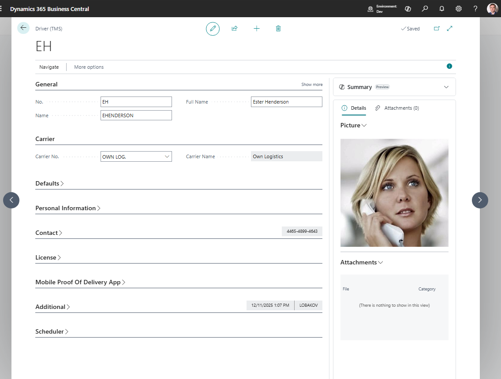

# Drivers

Use **Drivers** to store driver information used on Freight Orders and transportation documents.

Drivers help operations identify who executes the work, print useful documents, and report activity by resource.

## Before you start

Make sure that:

- carrier records exist if drivers belong to a carrier,
- vehicle records exist if drivers have default vehicles,
- your company policy defines which personal data can be stored,
- users have permission to edit driver master data.

## How to create a driver

1. Search for **Drivers**.
2. Choose **New**.
3. Enter the driver number or code.
4. Fill name, carrier, contact, and license details as required.
5. Add default vehicle or unit details if used.
6. Mark the driver blocked only when the driver should no longer be selected.

## Fields that matter most

| Field | Why it matters |
|---|---|
| **No. / Code** | Identifies the driver in TMS. |
| **Name** | Appears on Freight Orders and documents. |
| **Carrier No.** | Links the driver to the executing carrier. |
| **Default Vehicle No.** | Speeds up Freight Order assignment. |
| **Phone / Email** | Supports operational communication. |
| **Blocked** | Prevents new assignment while preserving history. |

## Where drivers are used

| Area | Use |
|---|---|
| **Freight Order** | Shows the driver assigned to the execution work. |
| **Carrier setup** | Provides defaults when a carrier is selected. |
| **Reports** | Prints driver information on operational documents. |
| **API** | Exposes driver data to integrations when needed. |

## Good to know

- Do not delete driver records used on historical Freight Orders. Block them instead.
- Keep personal data minimal and aligned with company policy.
- Driver assignment is operational information. Financial posting is normally driven by carriers, vendors, services, and charges.

## Troubleshooting

| Problem | What to check |
|---|---|
| Driver is not available | Check whether the driver is blocked or filtered by carrier. |
| Wrong driver appears by default | Review carrier and vehicle default setup. |
| Driver details are missing on a report | Fill the driver card and review the Freight Order before printing. |
| User cannot edit driver data | Check permission sets and master data ownership. |

## Related

- [Freight Order](freightorder.md)
- [Carriers](carrier.md)
- [Vehicles](vehicle.md)
- [Reports and Documents](reports.md)
