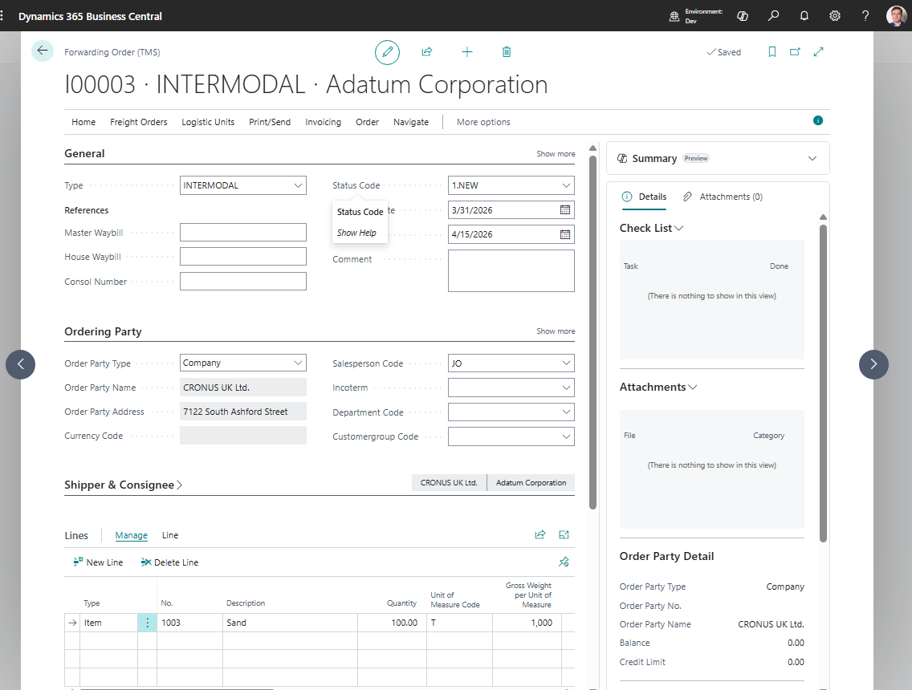

# Forwarding Order

Use a **Forwarding Order** to manage a customer transportation job from request to posted history.

The Forwarding Order defines what must be moved, who ordered the transportation, origin and destination parties, cargo, dates, stages, services, costs, and settlement.

## Before you start

Make sure that:

- a [Forwarding Order Type](forwardingordertype.md) exists,
- status and stage profiles are configured,
- customers, vendors, contacts, or locations exist for the involved parties,
- [Services](services.md) and [Charges](charges.md) exist when settlement is used,
- map locations exist when route or distance calculation is used.

## What lives on a Forwarding Order

| Part | Use it for |
|---|---|
| **General** | Order number, type, status, references, dates, and commercial terms. |
| **Ordering Party** | The customer or party that ordered and usually pays for the job. |
| **shipper** | The party that releases the cargo. |
| **Consignee** | The party that receives the cargo. |
| **Content** | Goods, products, logistic units, or unit types being transported. |
| **Stages** | Transportation legs that can be executed through Freight Orders. |
| **Settlement** | Income, cost, allocation, invoicing, and margin. |
| **Attachments** | Files required for compliance, customer communication, or posting. |
| **Check List** | Operational tasks for the order. |

## How to work in this page

1. Create a Forwarding Order.
2. Select the **Forwarding Order Type Code**.
3. Fill the ordering party.
4. Fill origin and destination party details.
5. Add content lines or logistic units.
6. Review stages created from the stage profile.
7. Add or calculate settlement lines.
8. Create Freight Orders for stages that need execution.
9. Attach required documents.
10. Post the Forwarding Order when operations and financial controls are complete.

## Key actions

| Action | Use it for |
|---|---|
| **Assign Freight Order** | Create or assign carrier execution for a selected stage. |
| **Freight Order List** | Open Freight Orders linked to the Forwarding Order. |
| **Logistic Unit Builder** | Create logistic units from selected content. |
| **Create Sales Invoice** | Create a customer invoice from settlement income lines. |
| **Create Credit Memo** | Create a customer credit memo from negative income lines. |
| **Sync with Sales** | Push settlement income changes to linked sales documents. |
| **Attachments** | Add or review files for the order. |
| **Post** | Move the order to posted history after controls pass. |

## Fields that matter most

| Field | Why it matters |
|---|---|
| **Forwarding Order Type Code** | Controls defaults, stages, statuses, and allowed behavior. |
| **Status Code** | Controls which actions are available. |
| **Stage Profile Code** | Defines the transportation legs. |
| **Ordering Party No.** | Defines the customer or party for billing. |
| **Origin and destination parties** | Define where cargo starts and where it goes. |
| **Requested and Planned Dates** | Drive operations and customer commitments. |
| **Total Income / Total Cost / Total Profit** | Shows financial result from settlement. |
| **Attachments** | Shows document completeness. |

## Posting requirements

Posting can be blocked by setup or status rules. Common blockers include:

- required settlement documents are not posted,
- Forwarding Order posting date is earlier than linked settlement document postings,
- required attachment categories are missing,
- current status does not allow posting,
- required fields, content, or stages are incomplete.

## Good to know

- The Forwarding Order defines **what** is transported and **who** ordered it.
- Freight Orders define **who executes** the transportation work.
- Settlement defines **how the order is billed and costed**.
- Posted Forwarding Orders are read-only history.

## Troubleshooting

| Problem | What to check |
|---|---|
| Freight Order action is disabled | Check the current status and status profile. |
| Settlement actions are unavailable | Check status rules and user permissions. |
| Posting is blocked | Review setup posting controls, required attachments, and settlement document status. |
| Totals look wrong | Recalculate settlement and review service, charge, currency, and allocation lines. |
| Route is not shown | Check map locations and map provider setup. |

## Related

- [Forwarding Order Types](forwardingordertype.md)
- [Freight Order](freightorder.md)
- [Settlement](settlement.md)
- [Attachment Control](attachmentcontrol.md)
- [Posted Forwarding Order](postedforwardingorder.md)
- [AI and Copilot Features](copilot.md)
