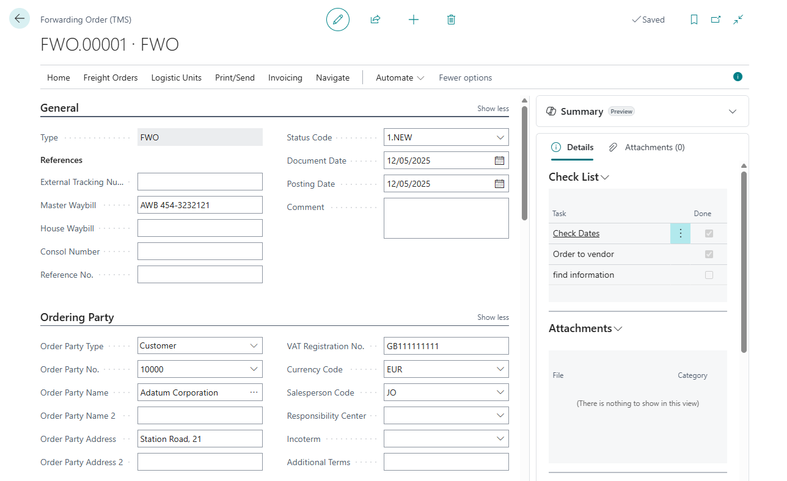

# Forwarding Order

The Forwarding Order represents the central document in the Transportation Management System (TMS) extension for Business Central, specifically designed for Logistics Service Provider (LSP) scenarios. It serves as a comprehensive transportation request that orchestrates the movement of goods from origin to destination, managing the entire logistics workflow from initial request through final delivery and settlement.

## Core Structure and Components

The Forwarding Order consists of several interconnected entities that work together to provide complete transportation management:

- General (Forwarding Order Header) - The main document containing essential information such as unique order number, document type, posting date, and comprehensive party details including ordering party, shipper, and consignee information. It manages document-level attributes like status codes, stage profiles, dates (requested/planned/actual pickup and delivery), and includes extensive address information for both loading and unloading locations with full contact details, phone numbers, email addresses, and GLN identifiers.
- Content (Forwarding Order Line) - Detailed line items specifying the cargo being transported, supporting multiple types including Items, [Products](product.md), Unit Types, and actual (Logistic Units). Each line contains comprehensive physical characteristics including quantities, dimensions (length, width, height), weights (gross, net, chargeable), volumes, freight classifications, and GTIN identifiers. The system automatically calculates volumetric weights and chargeable weights based on configurable multipliers.
- Settlement ([Forwarding Order Settlement](settlement.md)) - Financial settlement lines that manage both income (services provided to customers) and costs (charges incurred from vendors/carriers). These lines support multi-currency transactions with automatic exchange rate calculations, link to Business Central sales and purchase documents, and maintain comprehensive audit trails with posting dates and document references.
- Stages - Transportation stages that break down the journey into manageable segments, each potentially assigned to different freight orders - carriers, enabling complex multi-modal transportation scenarios.

## Key Features and Capabilities

The Forwarding Order provides sophisticated functionality including:

- status management with configurable [status profiles](statuses.md) controlling document workflow
- stage management through [stage profiles](stages.md) that define transportation segments
- logistic unit integration for cargo consolidation and tracking
- freight order assignment for carrier management [about freight orders](freightorder.md)
- settlement management with automatic invoice and credit memo generation [details](settlement.md)
- map integration for route visualization and location management [details](googlemapintegration.md)
- document generation with confirmation and invoice printing capabilities
- transport documents control system [details](attachmentcontrol.md)
- AI-powered assistance through Copilot integration for automated order creation
- track, and monitor completion of operational tasks [details](checklist.md)

## Business Process Integration

The Forwarding Order seamlessly integrates with Business Central's core functionality, automatically generating sales invoices and purchase documents, maintaining currency conversion with exchange rate management, supporting multi-company scenarios, providing extensive reporting capabilities, and offering flexible customization through configurable order types that define default behaviors, allowed services, and workflow rules.
This system enables logistics service providers to efficiently manage complex transportation operations while maintaining full integration with standard Business Central financial and operational processes, providing a complete solution for modern transportation management needs.

## Fields Description

- **No.** : Unique identifier for the forwarding order
- **Posting Date** Date used for posting transactions to the ledger
- **Document Date** Date when the order was created or became valid

### Workflow Fields

- **Forwarding Order Type Code** : Type definition controlling order structure, stages, and services [about Forwarding Order Type](forwardingordertype.md)
- **Status Code** Current status controlling actions and changes [details](statuses.md)

### Reference Fields

- **External Tracking Number** External system's reference number
- **Master Waybill** Main carrier's waybill reference (MBL/MAWB/AWB)
- **House Waybill** Forwarder's waybill reference (HAWB/HBL)
- **Consol Number** Consolidation reference number
- **Reference No.** Additional internal or customer reference
- **Comment** Additional remarks or instructions

### Ordering Party

- **Order Party Type** Who pays/requests the service (Company itself/Customer)
- **Order Party No.** Customer or entity code
- **Order Party Name** Name of ordering party
- **Order Party Address** Street address
- **Order Party Agreement No.** Contract or agreement number
- **Order Party VAT No.** Tax registration number
- **Salesperson Code** Responsible salesperson
- **Order Party Currency Code** Currency for invoicing. Value from Customer card.
- **Responsibility Center** Specifies the distribution or warehouse center handling this order.

### Shipper Fields

- **Shipper Type** Whether shipper is Company/Customer/Vendor/Contact
- **Shipper No.** Shipper code/number
- **Shipper Name** Shipper entity name
- **Shipper Address** Shipper street address
- **Shipper Map Location No.** Map reference for TMS display
- **Shipper VAT No.** Shipper's VAT registration number
- **Shipper Notes** Additional shipper instructions
- **Load Address Code** Predefined pickup location code
- **Load Address Name** Label for pickup location
- **Load Address** Primary pickup street address
- **Load Address Country Code** Country/region for pickup
- **Load Address City** City for pickup location
- **Load Address Post Code** Postal code for pickup
- **Load Address Contact** Contact person at pickup
- **Load Address Phone No.** Phone number for pickup contact
- **Load Address County** County/region name
- **Load Address E-Mail** Email for pickup location
- **Load Address GLN** GLN for EDI/location references

### Consignee Fields

- **Consignee Type** Whether consignee is Company/Customer/Vendor/Contact
- **Consignee No.** Consignee code/number
- **Consignee Name/Name 2** Consignee entity name
- **Consignee Address/Address 2** Consignee street address
- **Consignee Map Location No.** Map reference for TMS display
- **Consignee VAT No.** Consignee's VAT registration number
- **Consignee Notes** Additional consignee instructions
- **Unload Address Code** Predefined delivery location code
- **Unload Address Name** Label for delivery address
- **Unload Address** Primary delivery street address
- **Unload Address Country Code** Country/region for delivery
- **Unload Address City** City for delivery address
- **Unload Address Post Code** Postal code for delivery
- **Unload Address Contact** Contact person for delivery
- **Unload Address Phone No.** Phone number for delivery contact
- **Unload Address County** County/region name
- **Unload Address E-Mail** Email for delivery location
- **Unload Address GLN** GLN for EDI/location references

### Planning Fields

- **Requested Pick-up Datetime** Requested pickup date/time
- **Planned Pick-up Datetime** Scheduled pickup date/time
- **Requested Delivery Datetime** Requested delivery date/time
- **Planned Delivery Datetime** Scheduled delivery date/time
- **Actual Start Date** When transportation actually began
- **Actual End Date** When transportation was completed

### Calculated Fields

- **Gross Weight (base)** Total gross weight in base units
- **Net Weight (base)** Net weight excluding packaging
- **Volume (base)** Total volume in base units
- **Duration** Total time span of all stages
- **Total Income** Total revenue in local currency
- **Total Cost** Total cost in local currency
- **Total Profit** Net profit in local currency
- **Logistic Unit Types Qty.** Number of different unit types
- **Total Income (ACY)** Revenue in additional currency
- **Total Cost (ACY)** Cost in additional currency
- **Total Profit (ACY)** Profit in additional currency
- **Total Chargeable Weight (Base)** Weight used for billing
- **Total Volume Weight (Base)** Volumetric weight
- **Estimated Footage** Estimated space needed on the floor of the truck
- **Uninvoiced Amount (LCY)** Amount not tied to invoices
- **Profit % (LCY)** Profit margin percentage in LCY
- **Profit % (ACY)** Profit margin percentage in ACY

### Freight Order Allocation Fields

- **Planned Reserved Weight** Weight allocated to freight orders
- **Planned Reserved Volume** Volume shared with freight orders
- **Planned Reserved Footage** Footage allocated to freight orders
- **Attachments** Count of attached documents

### Additional Fields

- **Incoterm** - Shipping terms (FOB, etc.)
- **Additional Terms** - Extra shipping/commercial terms

## Content and Logistic Units

Content to be transported. The content may include: goods, logistic units, types of logistic units, or products. Products refer to the TMS system's cargo type directory. If the transportation order is created from a sales order, the goods from the sales order will be copied into the Forwarding Order.

Created logistic units. SSCC, Containers. TMS enables the packaging of transported goods into pallets, boxes, or containers. These logistic units are then transferred to the Freight Order for transportation execution.

## Stages and Settlement

Process of reconciling and finalizing all financial transactions associated with a particular transportation. [About settlement](settlement.md)

## Documents Control

The TMS attachment control system allows for the configuration of types of documents to be attached, such as CMR, AWM, Bill of Lading, Proof of Delivery, and assigns this type at the time of file upload. This enables the verification that all necessary documents are collected throughout the transportation process [details](attachmentcontrol.md).

## Use case

Request for transportation from either an external client or the company itself. It specifies **WHAT** needs to be transported, where to pick up and deliver the item(s), identifies the shipper and consignee, outlines the logistic units being shipped, the relevant dates, and who will cover the costs, etc.

## History

After posting Forwarding Order is transfered to the history [Posted Forwarding Order](postedforwardingorder.md)
