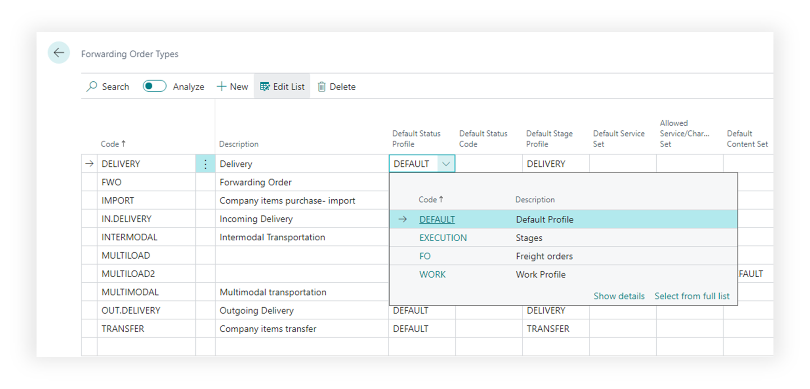

# Forwarding Order Types

Use **Forwarding Order Types** to define how different transportation jobs behave.

A type can represent an import job, export job, domestic move, air freight job, sea freight job, brokerage job, or any other process your company manages.

## Before you start

Make sure that:

- status profiles exist,
- stage profiles exist,
- services and charges exist if the type uses settlement defaults,
- report and attachment rules are understood by the business owner.

## How to create a type

1. Search for **Forwarding Order Types**.
2. Choose **New**.
3. Enter a code and description.
4. Select status and stage profiles.
5. Fill default values used on new Forwarding Orders.
6. Configure document, attachment, and settlement behavior as needed.
7. Test the type by creating a Forwarding Order in a sandbox.

## Fields that matter most

| Field | Why it matters |
|---|---|
| **Code** | The type users select on the Forwarding Order. |
| **Description** | Helps users choose the correct process. |
| **Status Profile Code** | Controls allowed actions by status. |
| **Stage Profile Code** | Controls default transportation legs. |
| **Default values** | Reduce manual entry on new orders. |
| **Posting and document settings** | Control completion rules and output. |

## Setup decisions

| Decision | What it changes |
|---|---|
| Separate types by process | Gives users the correct stages and controls for each operation. |
| Separate types by mode | Makes air, sea, road, and multimodal jobs easier to report. |
| Use strict status control | Prevents users from invoicing, posting, or changing data too early. |
| Use attachment requirements | Blocks movement to controlled statuses until required files exist. |

## Good to know

- Keep type codes stable. They are used in filtering, reporting, and historical documents.
- Do not create too many types for small differences. Use stages, services, or references when the process is mostly the same.
- Test every new type with a real working example before users start using it.

## Troubleshooting

| Problem | What to check |
|---|---|
| New order has wrong stages | Check the stage profile selected on the type. |
| User cannot perform an action | Check the status profile and current status. |
| Required files are not enforced | Check extended control and attachment category rules. |
| Wrong defaults appear | Review default fields on the type and TMS Setup. |

## Related

- [Forwarding Order](forwardingorder.md)
- [Statuses and Status Profiles](statuses.md)
- [Stages](stages.md)
- [Attachment Control](attachmentcontrol.md)
- [TMS Setup](setup.md)
