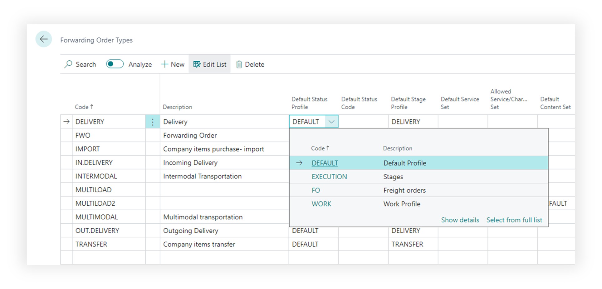
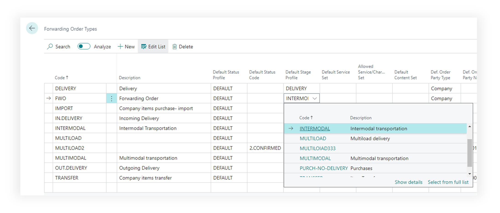
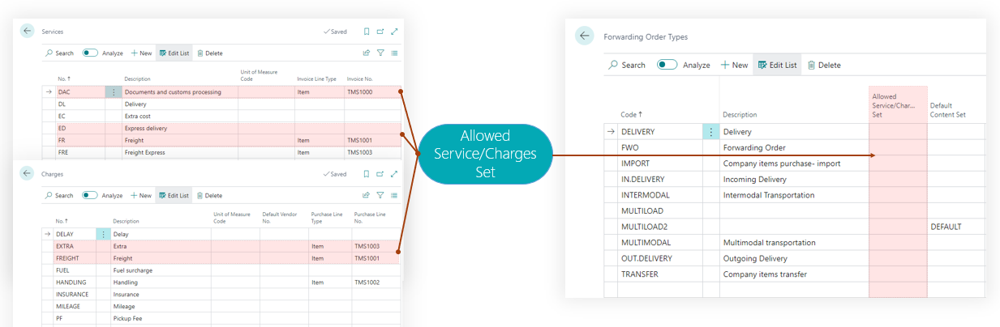
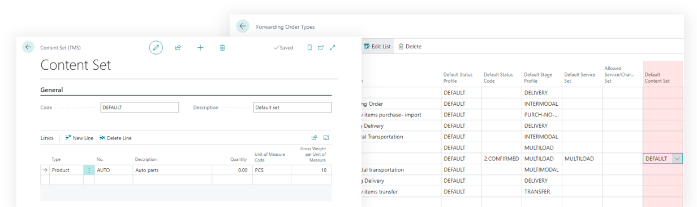
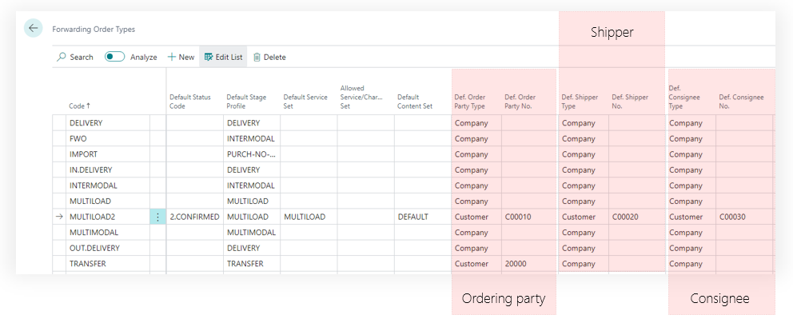
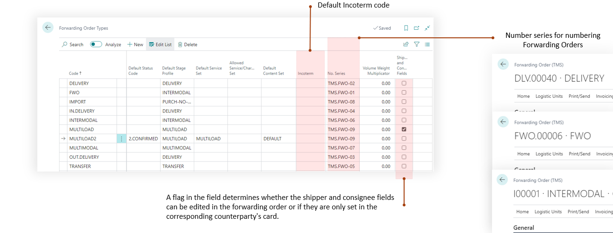

# Forwarding Order Type

is a template configuration that defines the structure, behavior, and default values for forwarding orders (LCP Scenario) in the Transportation Management System (TMS).
It serves as a blueprint that automates the creation of forwarding orders by pre-configuring:

- Process Management: Status profiles and stage profiles that define the workflow and transportation stages.
- Party Defaults: Default shipper, consignee, and ordering party information
- Service Configuration: Default and allowed service/charge sets for billing
- Content Templates: Default content sets for order items/products
- Business Rules: INCOTERM terms, payment status, volume weight calculations, and field editability
- Numbering: Number series for unique order identification
- This entity enables standardization of transportation processes while providing flexibility through configurable templates for different types of shipments (e.g., domestic, international, express, standard freight).

## Prerequisites

To change “Forwarding Order Types” user must have TMS Admin or Super Permissions.
Before configuring forwarding order types, you must create the required entities: a set of services, a number series, a shipper and consignee, status profiles, and stages profiles.

## Process Management field description

 Status profiles and stage profiles that define the workflow and transportation stages.

- Default Status Profile - the status profile that will be set for an order upon its creation for the selected order type. A status profile is a set of statuses that a document can have within the business process of its handling. Default status code - the status value that a document will have upon creation, thereby allowing for the automatic advancement of the document to a specific stage of its processing.

- Default Stage Profile - the stage profile defines the structure of the transportation, whether it be a simple single-stage delivery or a complex multi-stage intermodal transportation involving multiple carriers.

- Default Service Set - is a set of lines for default settlement. This setting allows for the creation of a set of services and charges that will be automatically added to the order upon its creation. The Service Set can include services to be invoiced as well as charges whose structure may be known in advance.

- Allowed Service/Charges Set - a set of permitted services or charges that can be added to the settlement. If this field is filled, a restriction system is activated, allowing only values from this set to be added to the settlement.

- Default Content Set - a default set of contents for transportation. It's possible to create a set of standard contents and add them automatically when an order of this type is created. This is convenient for LSPs with abstract cargo descriptions like SHIPMENT (cargo space).

- Default values - specific default values for the ordering party, shipper, and consignee can be set for regular transportation orders. Fill in the type value and then select the value in the “… No." field.

- Other parameters.
-- Default Incoterm code.
-- Number series for numbering the created Forwarding Orders.
-- A flag in the field determines whether the shipper and consignee fields can be edited in the forwarding order or if they are only set in the corresponding counterparty's card.

## Mandatory fields

For better productivity, always make sure to fill in all the fields:

- Default Status Profile
- Default Status Profile
- No. Series
