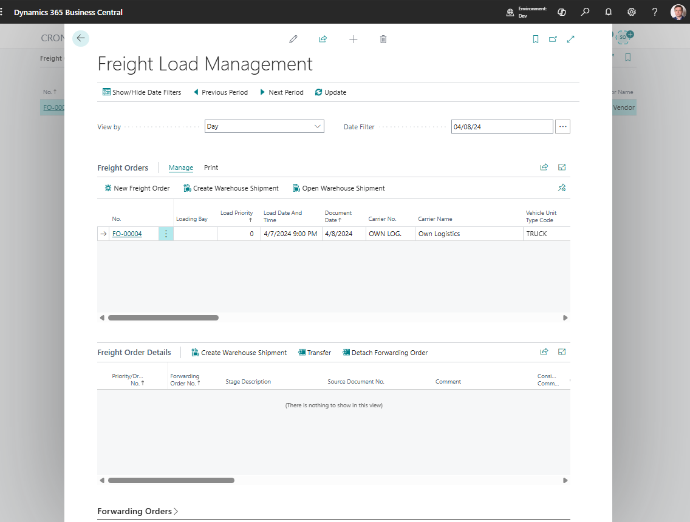

# Freight Load Management

Use **Freight Load Management** to review and organize Freight Orders from an operations planning view.

This page helps planners see carrier work, planned dates, execution assignments, and Freight Order workload without opening each document one by one.

## Before you start

Make sure that:

- Forwarding Orders and stages exist,
- Freight Orders have been created or can be created from stages,
- carriers, vehicles, and drivers exist when you track execution resources,
- status rules allow the changes planners need to make.

## How to work in this page

1. Open **Freight Load Management**.
2. Filter by date, carrier, route, status, or planner-owned workload.
3. Review unassigned or incomplete Freight Orders.
4. Assign carrier, vehicle, or driver when the status allows it.
5. Open the Freight Order when detailed changes are needed.
6. Review workload before releasing or confirming carrier execution.

## What planners review

| Area | Use it for |
|---|---|
| **Date and time** | Confirm the planned execution window. |
| **Carrier** | Check who performs the work. |
| **Vehicle and driver** | Check internal or known resource assignment. |
| **Status** | See whether the work can still be edited. |
| **Content totals** | Review cargo and capacity indicators. |
| **Route or stages** | Understand the movement covered by the Freight Order. |

## Good to know

- Freight Load Management is an LSP planning view for Freight Orders.
- Use the Freight Order card for detailed settlement, document, and stage changes.
- Keep filters narrow when the company has a large number of active Freight Orders.

## Troubleshooting

| Problem | What to check |
|---|---|
| Expected Freight Order is missing | Check filters, date range, carrier, and status. |
| Planner cannot assign carrier or driver | Check status rules and user permissions. |
| Workload totals look wrong | Open the Freight Order and review content, stages, and quantities. |
| Changes do not save | Confirm the Freight Order is in a status that allows edits. |

## Related

- [Freight Order](freightorder.md)
- [Forwarding Order](forwardingorder.md)
- [Carriers](carrier.md)
- [Vehicles](vehicle.md)
- [Drivers](driver.md)
