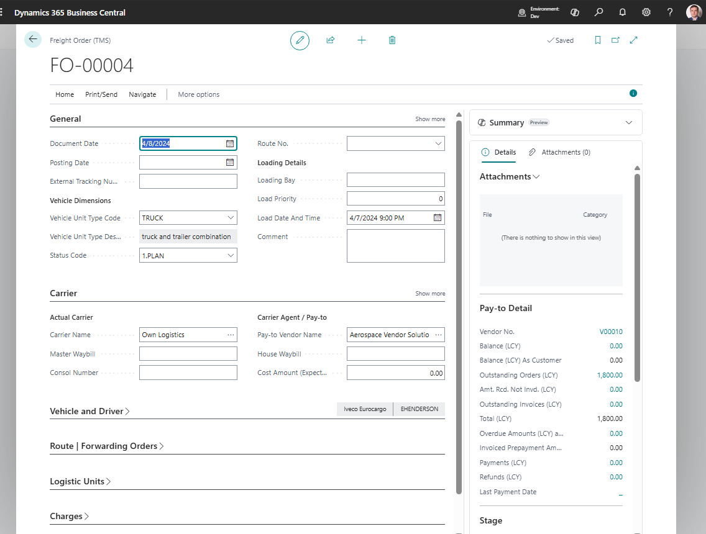

# Freight Order

Use a **Freight Order** to manage the carrier or internal resource that executes one or more transportation stages.

A Freight Order defines who performs the work, what content is carried, which stages are covered, and which carrier costs are expected or recorded.

## Before you start

Make sure that:

- a Forwarding Order with stages exists,
- a [Freight Order Type](freightordertype.md) exists,
- a carrier or internal executor exists,
- optional vehicle and driver records are ready,
- content or logistic units are available to assign,
- charges are configured if carrier costs are tracked.

## What lives on a Freight Order

| Part | Use it for |
|---|---|
| **General** | Freight Order number, type, dates, status, and route summary. |
| **Carrier** | Actual carrier and pay-to vendor or agent. |
| **Vehicle and Driver** | Resource assignment for execution. |
| **Content** | Cargo, logistic units, or unit types assigned to the Freight Order. |
| **Stages** | Forwarding Order stages covered by this Freight Order. |
| **Charges** | Expected or actual carrier cost lines. |
| **Stage Entries** | Execution events, statuses, coordinates, images, and attachments. |
| **Attachments** | Carrier documents, confirmations, and execution files. |

## How to work in this page

1. Create the Freight Order from a Forwarding Order stage or open an existing Freight Order.
2. Select the carrier.
3. Fill pay-to vendor details if the invoice vendor differs from the actual carrier.
4. Add vehicle and driver if they are tracked.
5. Review content and stage lines.
6. Add or review freight charges.
7. Assign purchase lines when carrier invoices must be matched to costs.
8. Print or email the required carrier documents.
9. Update execution information as the work progresses.

## Key actions

| Action | Use it for |
|---|---|
| **Show Route** | Display the route for this Freight Order. |
| **Route Optimization** | Optimize route sequence when map data is available. |
| **Freight Order** | Print the carrier instruction document. |
| **Email Freight Order** | Send the Freight Order as a PDF. |
| **Details** | Print logistic unit or cargo details. |
| **Load Summary** | Print a compact load overview. |
| **Packing List** | Print cargo packing information. |
| **Bill of Lading** | Print transport handover documentation. |
| **Booking Confirmation** | Print confirmation for the carrier. |
| **Purchase Assignment** | Assign vendor purchase lines to Freight Order charges and settlement costs. |
| **Stage Entries** | Review execution events, statuses, images, attachments, and map points. |
| **Attachments** | Add or review Freight Order files. |

## Fields that matter most

| Field | Why it matters |
|---|---|
| **Carrier No.** | Identifies who executes the stage. |
| **Pay-to Vendor** | Identifies who is paid for the carrier service. |
| **Vehicle No. / Driver No.** | Supports planning, reporting, and execution documents. |
| **Mode of Transport** | Helps classify execution and documents. |
| **Content totals** | Show capacity and cargo values. |
| **Freight charges** | Feed cost control and settlement. |

## Good to know

- A Forwarding Order can have several Freight Orders.
- One Freight Order can cover content or stages from more than one Forwarding Order when the operation allows it.
- Freight Order charges can be distributed back to settlement.
- Purchase Assignment connects vendor invoice lines to Freight Order charges.
- Stage Entries give operations a timeline of execution events.
- Print and email actions use Business Central report selection and email setup.

## Troubleshooting

| Problem | What to check |
|---|---|
| Freight Order cannot be created | Check Forwarding Order status and stage selection. |
| Carrier defaults are missing | Check the carrier card for default vehicle, driver, and unit type. |
| Route is not shown | Check map locations on related stages and map provider setup. |
| Report is missing data | Review carrier, vehicle, driver, content, and stage lines before printing. |
| Charges do not appear in settlement | Review charge distribution and settlement recalculation. |
| Vendor invoice line cannot be assigned | Check vendor, purchase document status, charge setup, and whether the line is already assigned. |

## Related

- [Forwarding Order](forwardingorder.md)
- [Freight Load Management](freightloadmanagement.md)
- [Freight Order Types](freightordertype.md)
- [Purchase Assignment](purchaseassignment.md)
- [Stage Entries](stageentries.md)
- [Settlement](settlement.md)
- [Reports and Documents](reports.md)
- [Carriers](carrier.md)
