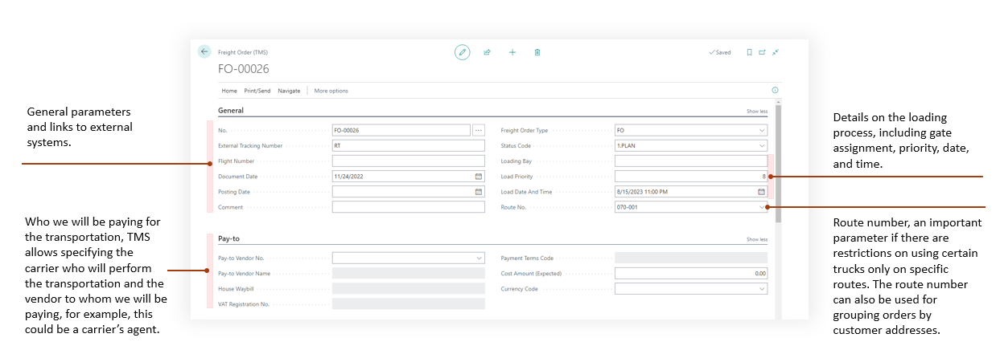

# Freight Order

The Freight Order system is a core component of the Transportation Management System (TMS) extension for Microsoft Dynamics 365 Business Central, designed to manage carrier-based transportation operations for LSP scenation. 

A Freight Order serves as a comprehensive document that coordinates the execution of transportation services, primarily for carriage operations such as Pickup, Pre-transport, On-transport, and Delivery stages.

The Freight Order serves as the central document containing essential transportation details including carrier information, vehicle and driver assignments, loading specifications, route planning, and financial data. It supports multiple freight order types with configurable status profiles, enabling different workflows for various transportation scenarios.

Freight Order Content manages the actual cargo being transported, linking logistic units and unit types to specific forwarding order stages. This content management system tracks physical characteristics like weight, volume, and footage while maintaining relationships with forwarding orders and their execution stages.

The Freight Order Charge system handles cost management, supporting multi-currency operations, automatic charge calculations based on weight or distance, and integration with purchase documents for cost allocation. The system enables charge distribution across multiple forwarding orders and provides detailed financial tracking through purchase invoice assignments.

The user interface includes specialized pages for order management, list views, and subforms for content and charge management. The system supports advanced features like route optimization, tracking integration, document generation (freight orders, packing lists, bills of lading), and comprehensive reporting capabilities. Integration points include map services for route visualization, attachment management, and seamless connectivity with Business Central's standard purchase and vendor management systems.

## Freight Order and Forwarding Order link

This Freight ORder details **HOW**: the Forwarding Order will be executed, indicating who will actually carry it out. It specifies the carrier and the driver involved. The Freight Order reflects the actual journey of a truck or carrier.

Each stage of a Forwarding Order is carried out either by the company itself or by third-party carriers. Therefore, a Freight Order must be created for each stage. A Freight Order is the tool used to monitor the execution of Forwarding Order stages.

Forwarding Orders and Freight Orders have a many-to-many relationship. This means a large Forwarding Order can be executed by several Freight Orders (trucks), and conversely, a single Freight Order can transport multiple Forwarding Orders.

## Interface

Expense control/charges in Freight Order.

Freight Order includes a tool for optimal route creation by identifying the shortest total distance or delivery time.

