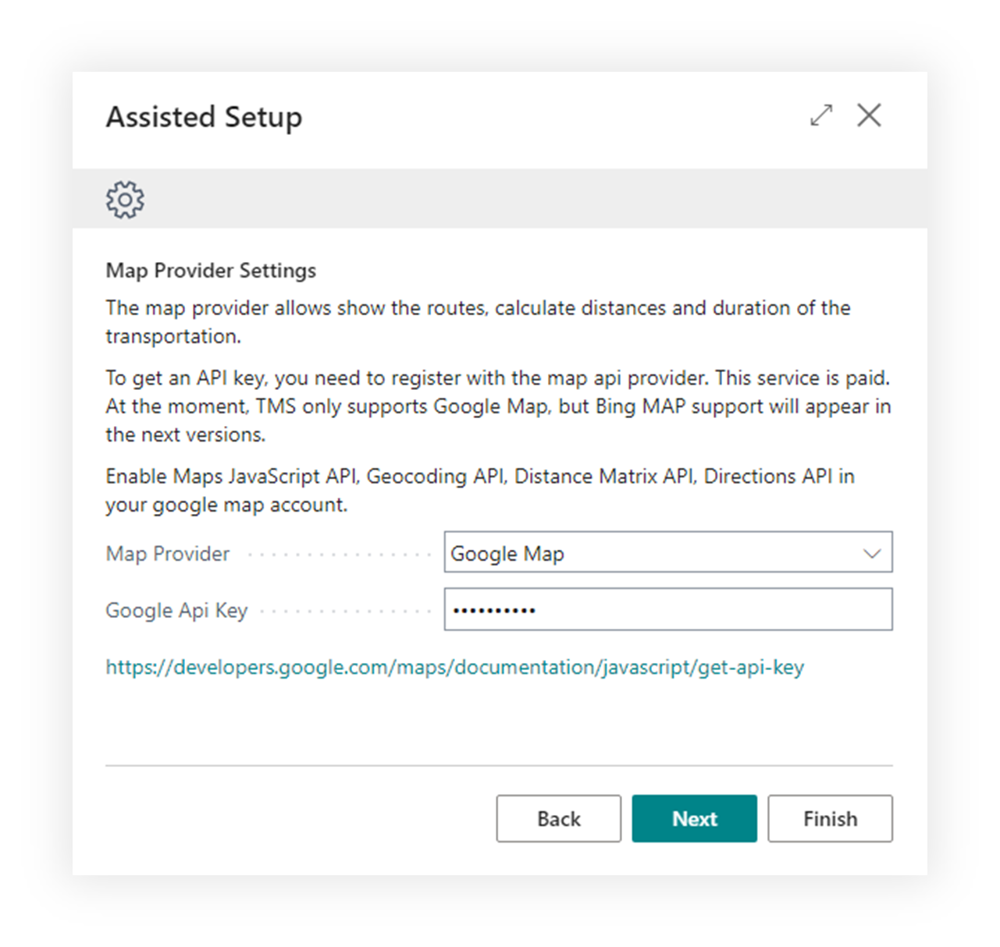
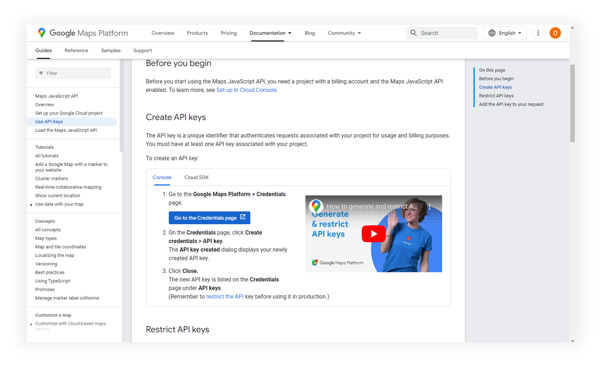
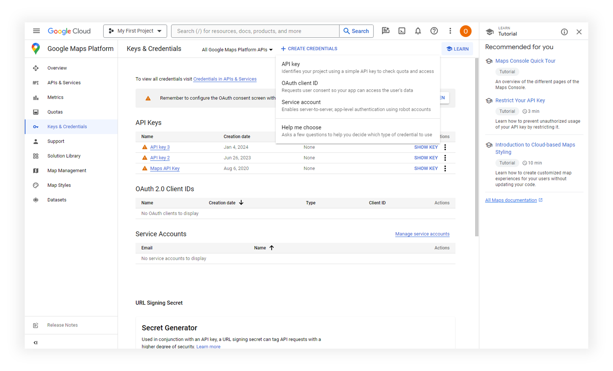
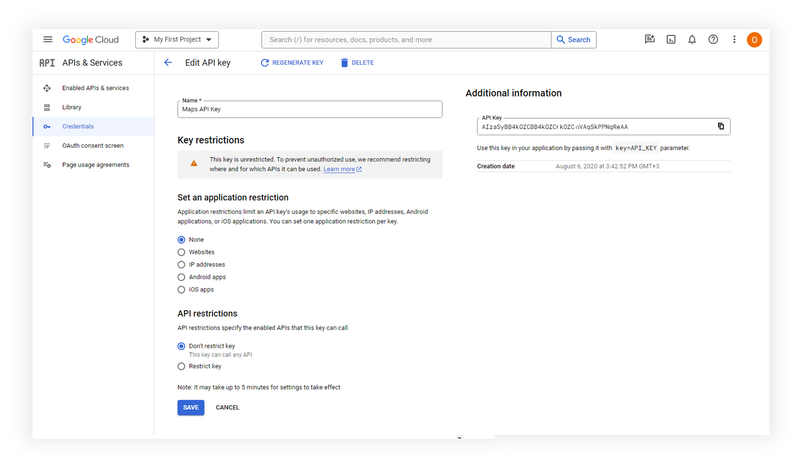
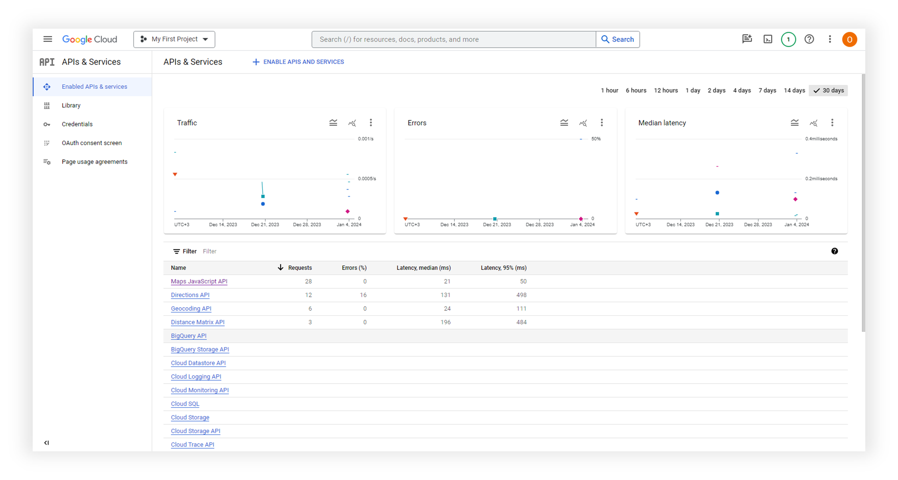

# Google MAPs Integration

TMS utilizes the Google Maps service for access to mapping services for geocoding addresses, route planning, and determining distances and transport durations.

Companies using TMS must have their own Google account with activated Google Maps services, which will be used by TMS.

Google Maps is a paid service.

To enable Google Maps in TMS, it is necessary to enter the Google API Key in the Assisted Setup window of the TMS module.

## How to receive Google MAP API Key

Follow the link from the Assisted Setup window. Click on blue “Go to Credentials page” button.

On the page that opens, click "Create Credentials" and then "API Key."

Copy API Key field value to past in field Google API of the TMS Assisted Setup page.

Enable 4 services for API key: Maps JavaScript API, Directions API, Geocoding API, Distance Matrix API

