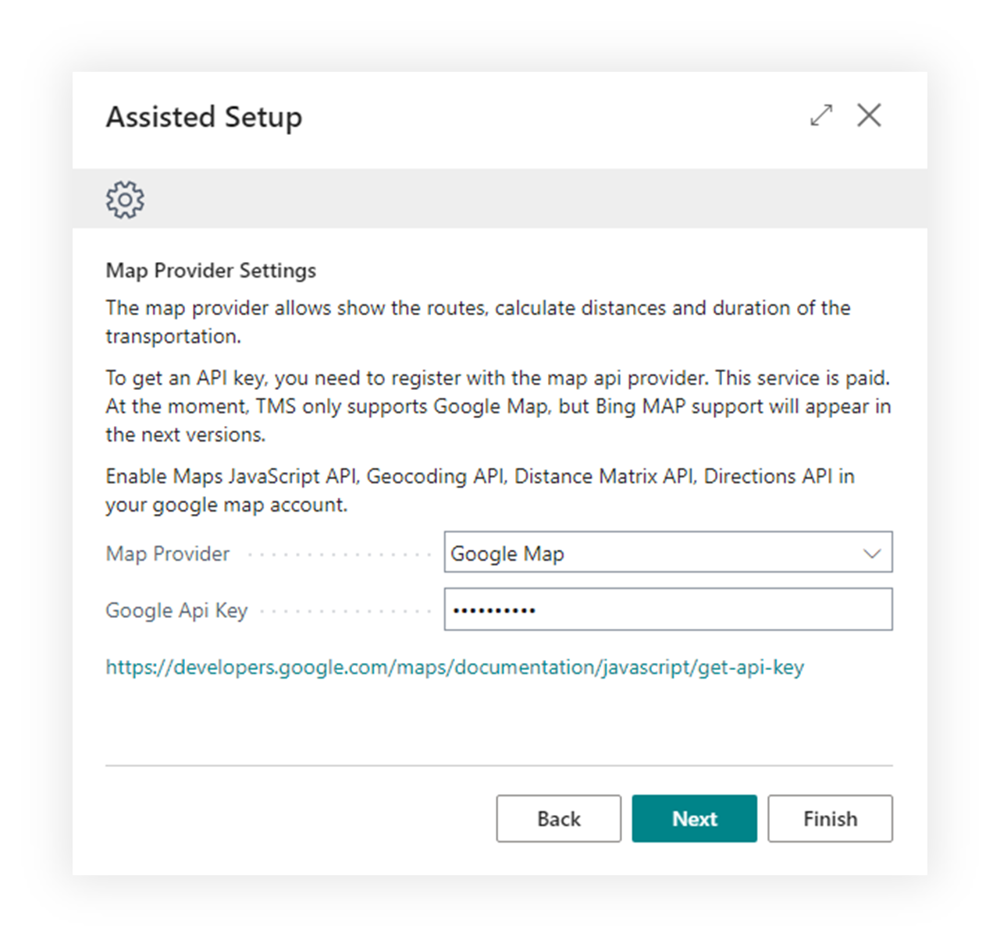

# Google Maps Integration

Use **Google Maps Integration** when TMS should calculate coordinates, show routes, or calculate distance and duration from map locations.

## Before you start

Make sure that:

- your company has a Google Maps Platform account,
- billing and the required Google APIs are enabled,
- an API key is created and restricted according to your security policy,
- users have permission to maintain TMS Setup and map locations.

## How to configure Google Maps

1. Create or open the Google Maps Platform project.
2. Enable the APIs required by your TMS process.
3. Create an API key.
4. Restrict the key according to your company policy.
5. Open [TMS Setup](setup.md).
6. Select Google Maps as the map provider.
7. Paste the API key.
8. Test geocoding on a [Map Location](maplocation.md).
9. Test route or distance calculation on a Forwarding Order or Freight Order.

## What Google Maps supports

| Capability | Use it for |
|---|---|
| **Geocoding** | Convert address details into coordinates. |
| **Map display** | Show a location or route on a map. |
| **Distance and duration** | Estimate route distance and travel time. |
| **Position correction** | Update coordinates when an address was matched incorrectly. |

## Good to know

- Google usage can create costs in your Google account.
- Restrict API keys. Do not share unrestricted keys with users or external systems.
- Address quality matters. Clean city, country, postal code, and street data gives better results.

## Troubleshooting

| Problem | What to check |
|---|---|
| Geocoding fails | Check API key, enabled APIs, billing, and address quality. |
| Route is not shown | Check coordinates on all required map locations. |
| Distance is empty | Confirm map provider setup and that the document has valid origin and destination locations. |
| Google returns a permission error | Review API restrictions and enabled APIs in Google Cloud. |

## Related

- [TMS Setup](setup.md)
- [Map Locations](maplocation.md)
- [Map Location Types](maplocationtype.md)
- [Forwarding Order](forwardingorder.md)
- [Freight Order](freightorder.md)
