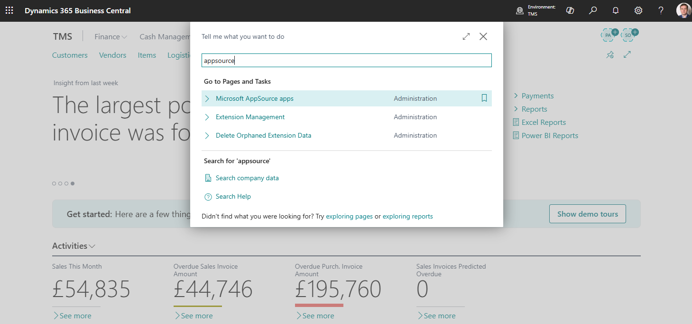
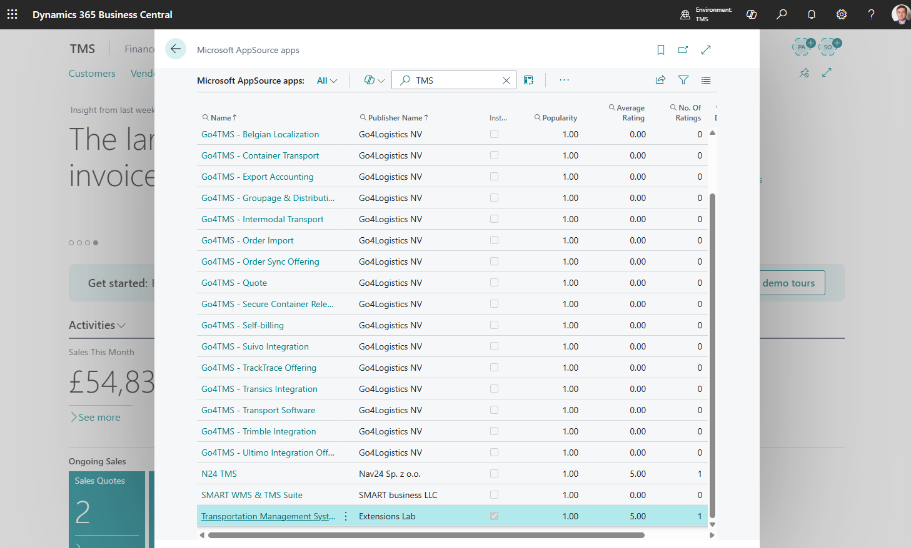

# Installation

Install TMS from Microsoft AppSource into your Business Central environment.

## Before you start

You need:

- Business Central administrator access,
- an environment that allows AppSource apps,
- a company where TMS setup can be completed and tested.

## Install the app

1. In Business Central, search for **Extension Marketplace**.
2. Search for **TMS for Logistics Service Providers**.
3. Open the TMS AppSource card.
4. Choose **Install from AppSource**.
5. Follow the AppSource installation prompts.
6. Wait until the extension is installed.

## What to do next

1. [Buy licenses](buylicenses.md).
2. [Assign permission sets](assignpermissionsets.md).
3. Open [TMS Setup](setup.md).
4. Configure the required number series, statuses, stages, and forwarding order types.
5. Configure [Google Maps integration](googlemapintegration.md) if you use distance, duration, route display, or route optimization.

## Verify the installation

1. Search for **TMS Setup**.
2. Confirm that the page opens.
3. Search for **Forwarding Orders**.
4. Confirm that the list page opens.
5. Confirm that licensed users can open TMS pages with their assigned permission sets.

## Troubleshooting

| Problem | What to check |
|---|---|
| TMS pages do not appear | Confirm the app is installed in the correct environment and company. |
| User cannot open TMS pages | Assign the correct TMS permission set and license. |
| Setup page opens but actions fail | Complete [TMS Setup](setup.md) and required number series. |

## Related

- [Buy licenses](buylicenses.md)
- [Assign permission sets](assignpermissionsets.md)
- [TMS Setup](setup.md)