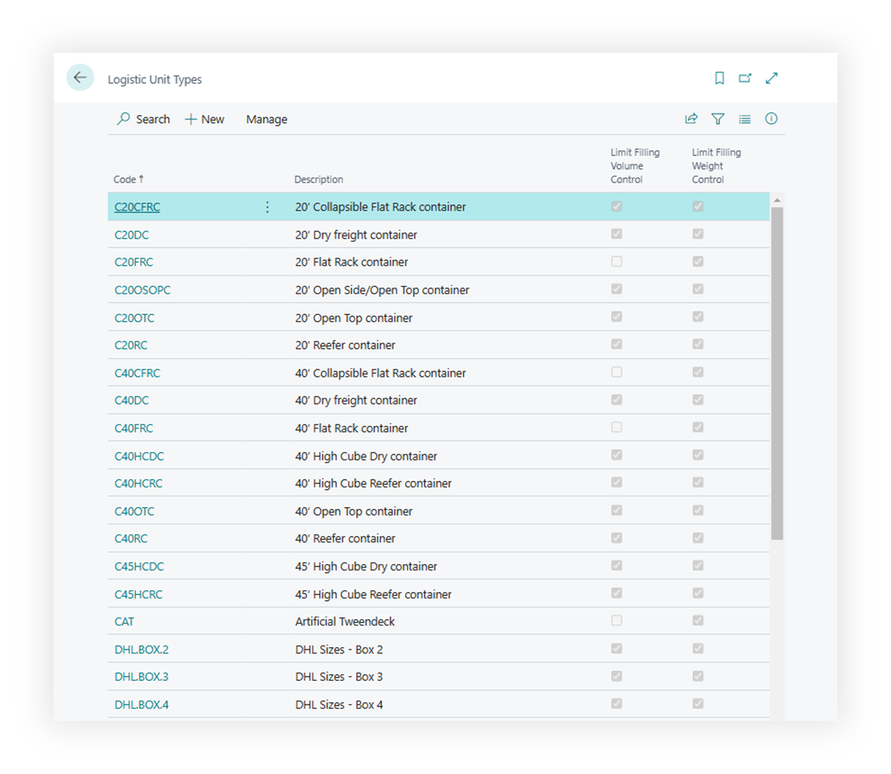

# Logistic Unit Types

Use **Logistic Unit Types** to describe the units used to pack, handle, or measure cargo.

Examples include pallet, box, crate, container, roll cage, tote, or any reusable unit type your operation tracks.

## Before you start

Make sure that:

- units of measure are defined,
- your company knows which dimensions and weight values should be maintained,
- users understand whether a unit type is a planning estimate or an exact handling unit.

## How to create a logistic unit type

1. Search for **Logistic Unit Types**.
2. Choose **New**.
3. Enter a code and description.
4. Fill default dimensions, weight, volume, and other capacity values when used.
5. Link handling or reporting defaults if your process requires them.
6. Save the record.

## Fields that matter most

| Field | Why it matters |
|---|---|
| **Code** | Identifies the unit type on content and logistic unit lines. |
| **Description** | Helps users choose the correct unit. |
| **Weight** | Supports capacity and cost review. |
| **Length / Width / Height** | Supports volume and dimensional planning. |
| **Volume** | Helps review cargo capacity. |
| **Blocked** | Prevents new use while preserving history. |

## Where unit types are used

| Area | Use |
|---|---|
| **Forwarding Order content** | Describes cargo units requested by the customer. |
| **Logistic units** | Builds structured cargo records. |
| **Freight Order content** | Shows what the carrier is expected to move. |
| **Reports** | Prints cargo and unit details. |

## Good to know

- Keep unit type descriptions user-friendly. They appear in lookup pages and documents.
- Block old unit types instead of deleting them.
- Unit type values can affect planning totals. Review defaults before go-live.

## Troubleshooting

| Problem | What to check |
|---|---|
| Unit type is not available | Check whether the record is blocked or filtered. |
| Capacity totals look wrong | Review weight, dimensions, volume, and quantity on the content line. |
| Report shows unclear cargo text | Improve unit type description and content description. |

## Related

- [Forwarding Order](forwardingorder.md)
- [Freight Order](freightorder.md)
- [Product](product.md)
