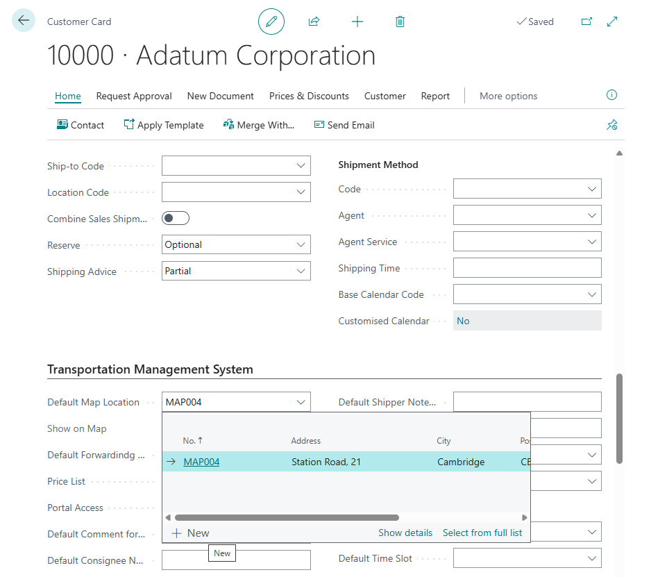
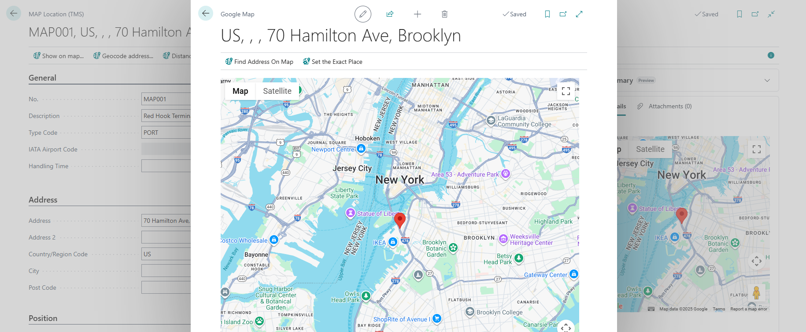
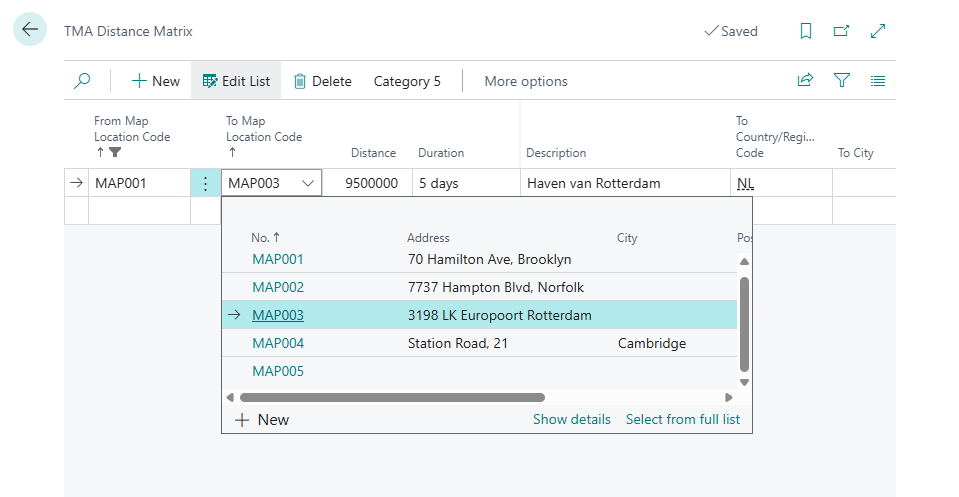

# MAP Location

The Map Location entity is a comprehensive geospatial master data table in the Transportation Management System (TMS) that manages precise geographical coordinates and address information for transportation planning and execution.
It contains extensive location data including:

- basic identification (location number, description, type classification)
- complete address information (street address, city, postal code, country/region with automatic validation and lookup capabilities)
- geographical coordinates (latitude, longitude, altitude with high precision for GPS calculations)
- Business Central integration (source type linking to customers, vendors, locations, contacts, ship-to addresses, and order addresses with automatic data population)
- specialized location features (IATA airport codes with automatic coordinate lookup, Global Location Numbers for EDI integration, time zone specifications)
- map display settings (zoom level, view type, Google Place ID for enhanced mapping)
- operational parameters (handling time for loading/unloading, position validation status)
- geocoding capabilities (API call results, position verification, wizard creation tracking)

The entity supports flexible integration with existing Business Central entities through an extensible source type enum, includes comprehensive address validation and postal code lookup functionality, features Google Maps integration with geocoding and distance matrix capabilities, and provides both card and list pages with map visualization and geocoding actions.

The Map Location entity serves as the central geospatial repository for transportation operations within the TMS, enabling precise route planning, distance calculations, delivery scheduling, and location-based logistics management while supporting seamless integration with existing Business Central master data and providing advanced mapping capabilities for enhanced transportation visibility and efficiency.

You can create any number of map points (MAP Locations) for any Business Central entity.

## Fields Description

Basic Identification:

- **No.**: Unique identifier for this map location in TMS. The number series for MAP Locations is configured in the TMS Setup [details](setup.md).
- **Description**: Brief description or label for this map location in TMS
- **Type Code**: Location category, such as an airport, port, or warehouse [details](maplocationtype.md)
Address Information:
- **Address**: Street address for this map location (e.g., street and house number)
- **Address 2**: Additional address details, such as suite or building information
- **Country/Region Code**: Country or region associated with this map location
- **City**: City in which this map location is found
- **Post Code**: Postal code used for routing or shipping references
- **County**: County, district, or province for this address

Specialized Identifiers:

- **GLN**: Global Location Number used for EDI or supply chain documents (with validation)
- **Contact**: Contact person's name for this location in TMS
- **Phone No.**: Primary telephone number for this map location

Time and Location Services:

- **Time Zone**: Time zone to use for scheduling and timeline accuracy at this location
- **Airport Code**: IATA airport code if this location is an airport (with automatic coordinate lookup)

Geographical Coordinates:

- **Latitude**: GPS latitude coordinate for map-based calculations (10 decimal places)
- **Longitude**: GPS longitude coordinate for routing or distance calculations (10 decimal places)
- **Altitude**: Elevation above sea level for this location (10 decimal places)

Map Display Settings:

- **Map Zoom Level**: Default zoom level for map displays at this location
- **Map View Type**: Default map view type (e.g., satellite or terrain)
- **Position Is Set**: Whether the location's coordinates have been set by a map service
- **Last API Call Result**: Outcome of the last geocoding or map API request for this location
- **Google Place ID**: Unique identifier assigned by Google for this place

Creation Tracking:

- **Created by Wizard**: Whether this location was automatically created by a wizard

Business Central Integration:

- **Source Type**: Type of linked entity (undefined, customer, ship-to address, vendor, order address, location, contact)
- **Source No.**: Record identifier of the entity linked to this map location (with automatic data population)
- **Source Code**: Secondary code for addresses (ship-to or order address) linked to this location
- **Source Name**: Name or label of the linked source entity (auto-populated)

Operational Parameters:

- **Handling Time**: Additional time needed at this location for loading, unloading, or other tasks

System Configuration:

- **No. Series**: Number series code used to assign new location numbers automatically

Audit Trail:

- **Last Modified Date Time**: Local date-time when this record was last changed
- **Last Modified Date Time (UTC)**: UTC date-time when this record was last changed
- **Last Modified UserID**: User who last modified this record in TMS

## Notes

MAP Locations are usually points on the map that correspond to customers, vendors, warehouses, or their office addresses—in such cases, the MAP Location is linked to the corresponding address by filling in fields like Source Type, Source No., etc. However, there are situations where a MAP Location is not linked to any specific entity. For example, it could represent ports, hubs, airports, etc., which may be part of a route but not belong to any customer, vendor, or warehouse. In such cases, it's recommended to manually assign their codes during creation.

## How to create Map Location

### MAP Location Card or List pages

Directly in the MAP Location Card or List Pages.

- Press "+" / "New" button.
- A new number is assigned to the map location.
- Select Map Location Type code.
- Complete description and address (country, city, postcode) fields.
- To define position on map click "Geocode address on the map" to geocode map location address and use "Map API Provider" to set up precise position on map.
- To check position click "Show on MAP"

### From Entity

You can create a MAP Location from the Customer, Ship-to Address, Vendor, Order Address, Location, or Contact card pages.
In this case, the system will automatically link the MAP Location to the main entity, fill in the Source Type, Source No., etc., and set the created MAP Location as the default.
To do this, go to the Transportation Management System section in the card and fill in the Default MAP Location field, then use Drilldown and click New.

If this field is filled in, the MAP Location value will be automatically added to related documents.

## Change geoposition for existing MAP Location

To adjust the exact location on the map, use the "Show On Map" menu option. In the opened map, you will see the current position and the previously saved zoom level. Use zooming to visually find the exact spot. Then click "Set the Exact Place", place the marker on the map, and press Save (the button on the map itself) to store the results in the MAP Location card.

### Distance Matrix

By default, TMS uses the MAP Provider as the source for distance and transportation duration data. However, this is not always possible—for example, Google does not provide distance data between ports, since there are no roads connecting them. To enable transportation planning in such cases, TMS allows you to define distances between any two MAP Locations.

This is done using the Distance Matrix in the MAP Location card. By default, the system filters the list by the "From Map Location Code", which is set to the MAP Location code of the current card. For proper configuration, you need to fill in the "To Map Location Code", along with the Distance and Duration fields.

