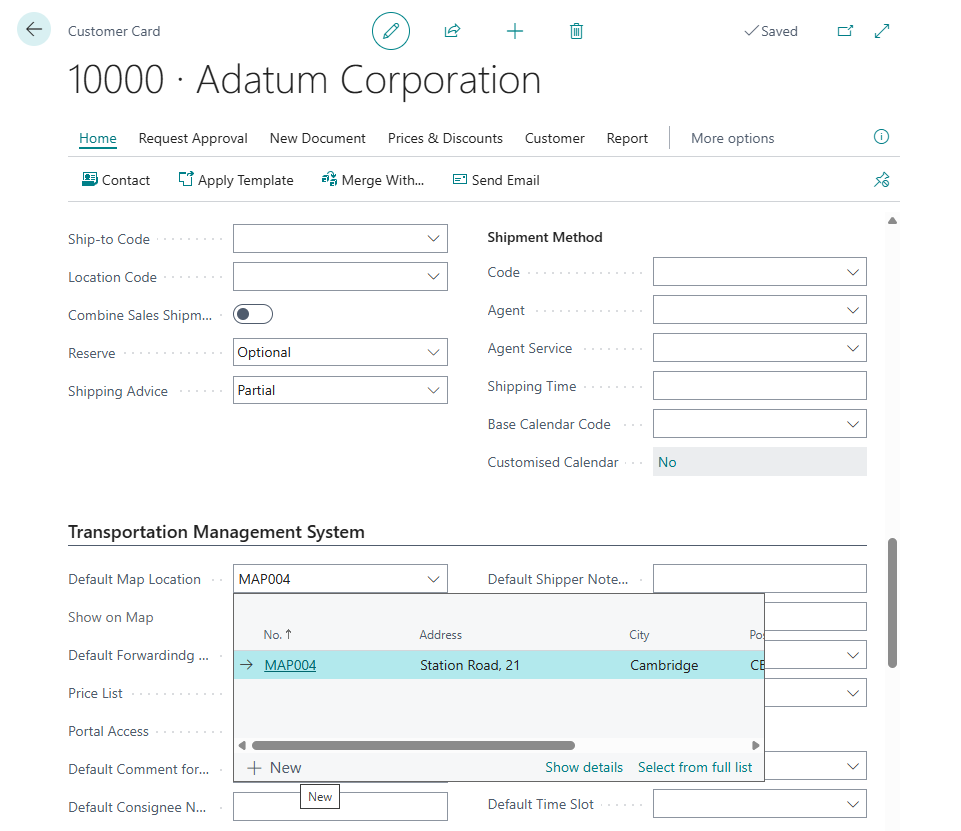
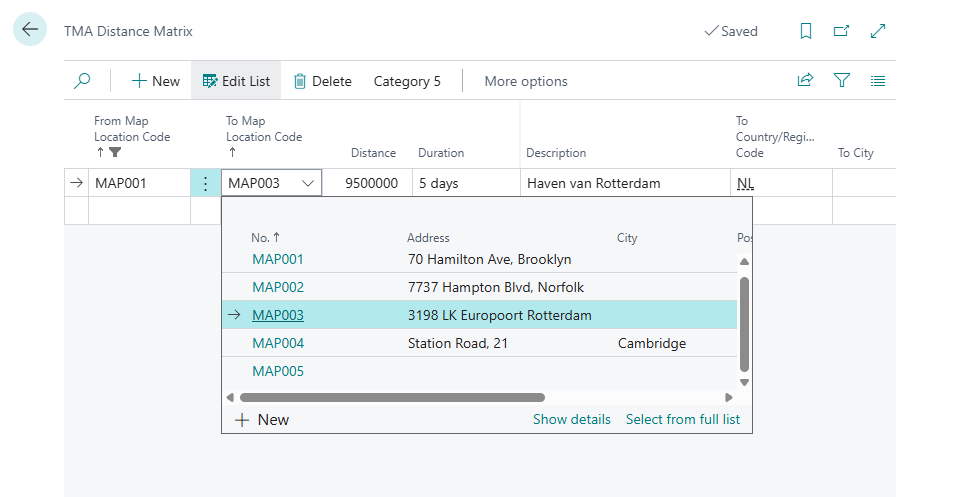

# Map Locations

Use **Map Locations** to store reusable geographic locations for TMS documents.

A map location can represent a customer site, vendor site, port, airport, terminal, warehouse, depot, or any planned stop used by your LSP process.

## Before you start

Make sure that:

- a map provider is configured in [TMS Setup](setup.md),
- country, city, postal code, and address data are accurate,
- map location types exist if your company classifies locations,
- users have permission to create or update map locations.

## How to create a map location

1. Search for **Map Locations**.
2. Choose **New**.
3. Enter code, name, type, and address details.
4. Choose the geocode action if coordinates are not filled automatically.
5. Review the map position.
6. Correct the position manually if the provider matched the wrong place.
7. Save the location.

## Fields that matter most

| Field | Why it matters |
|---|---|
| **Code** | Identifies the location in documents and routes. |
| **Name** | Helps users select the right site. |
| **Map Location Type** | Classifies the location for filtering and reporting. |
| **Address fields** | Used for geocoding and printed documents. |
| **Latitude / Longitude** | Used for map display, route, distance, and duration. |
| **Contact details** | Help users communicate with the location. |

## Distance matrix

Use distance matrix data when your process stores distance and duration between common locations.

Distance matrix values can help reporting and planning, especially when the same lanes are used often.

## Good to know

- Clean address data is the best way to improve geocoding quality.
- Coordinates should be reviewed for ports, terminals, large warehouses, and rural addresses.
- Use map location types to keep lookup lists easier to scan.

## Troubleshooting

| Problem | What to check |
|---|---|
| Geocoding returns the wrong place | Correct address fields or manually change the position. |
| Route does not calculate | Confirm all required locations have coordinates. |
| Location is hard to find | Improve name, type, and code naming convention. |
| Distance matrix is missing | Check whether the lane has been calculated or entered. |

## Related

- [Map Location Types](maplocationtype.md)
- [Google Maps Integration](googlemapintegration.md)
- [Routes](route.md)
- [Forwarding Order](forwardingorder.md)
- [Freight Order](freightorder.md)
