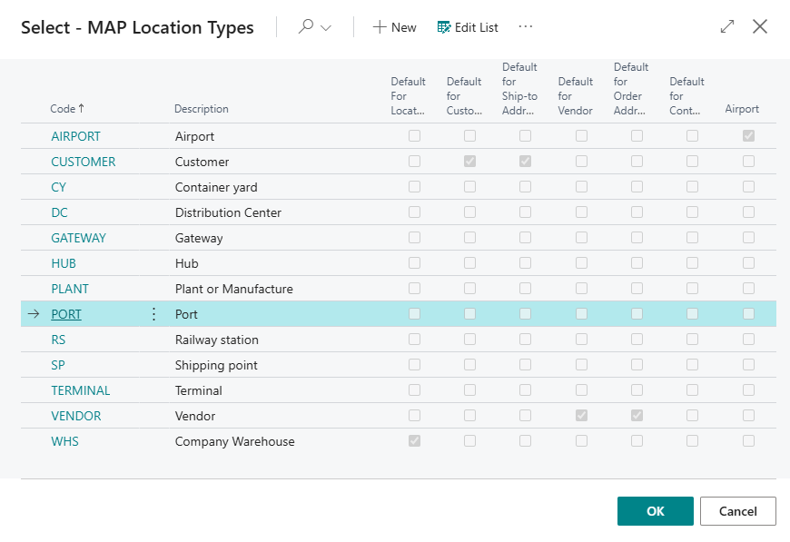

# MAP Location Type

The Map Location Type is a configuration entity within the Transportation Management System that categorizes and defines different types of map locations used throughout the TMS. This entity serves as a master data table that allows administrators to classify map locations based on their purpose and characteristics.

The Map Location Type includes a unique code identifier and description, along with several boolean flags that determine default behavior for different source entities in the system.

The key functionality includes setting default location types for various Business Central entities such as Customers, Vendors, Locations, Ship-to Addresses, Order Addresses, and Contacts.

Each type can be marked as the default for one or more of these entity types, with the system ensuring only one default per entity type through validation triggers.

Additionally, location types can be specifically marked as "Airport" types, which enables specialized TMS logic for aviation-related locations. The entity also includes standard audit fields for tracking modifications, including timestamps and user identification.

The Map Location Type List page provides a simple administrative interface for managing these location type definitions, allowing users to view and edit all the configuration options in a tabular format. This system enables flexible categorization of map locations while maintaining data integrity and providing clear defaults for different business scenarios within the transportation management workflow.

## Fields Description

Primary Fields:

- **Code**: Unique identifier for the map location type
- **Description**: Descriptive text for the location type

Default Assignment Fields:

- **Default For Location**: Sets this type as default for standard Location entities
- **Default for Customer**: Sets this type as default for Customer-related map locations
- **Default for Ship-to Address**: Sets this type as default for customer ship-to addresses
- **Default for Vendor**:  Sets this type as default for Vendor-based map locations
- **Default for Order Address**: Sets this type as default for vendor order addresses
- **Default for Contact**: Sets this type as default for Contact-related map locations

Specialization Fields:

- **Airport**: Indicates if this type represents an airport, enabling specialized TMS logic

Audit Fields:

- **Last Modified Date Time**: Local timestamp of last record modification
- **Last Modified Date Time (UTC)**: - UTC timestamp of last record modification
- **Last Modified UserID**: - User who last modified the record

## Page

