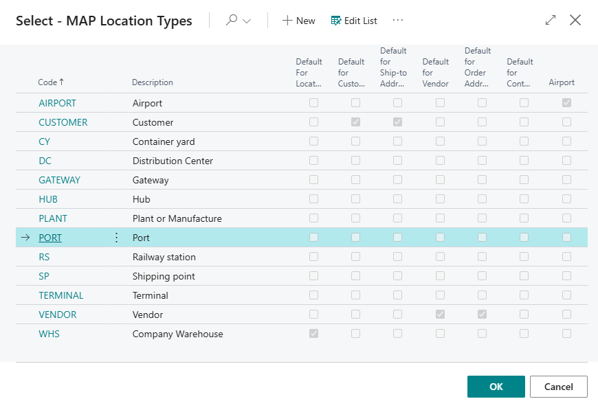

# Map Location Types

Use **Map Location Types** to classify map locations.

Common types include customer site, vendor site, warehouse, airport, seaport, terminal, depot, or border point.

## Before you start

Make sure that your company agrees on a short list of location categories.

Too many categories make lookup pages harder to use.

## How to create a type

1. Search for **Map Location Types**.
2. Choose **New**.
3. Enter a code.
4. Enter a clear description.
5. Save the record.

## Fields that matter most

| Field | Why it matters |
|---|---|
| **Code** | Identifies the type in map location records. |
| **Description** | Helps users understand when to use the type. |

## Good to know

- Use short, readable codes.
- Keep descriptions business-friendly.
- Review old types before adding new ones. Similar types create inconsistent reporting.

## Troubleshooting

| Problem | What to check |
|---|---|
| Users choose inconsistent types | Merge business guidance into fewer, clearer type descriptions. |
| Type cannot be deleted | It may already be used on map locations. Rename only when safe and allowed by your release policy. |
| Reporting is unclear | Review whether map locations use the expected type. |

## Related

- [Map Locations](maplocation.md)
- [Google Maps Integration](googlemapintegration.md)
- [Routes](route.md)
