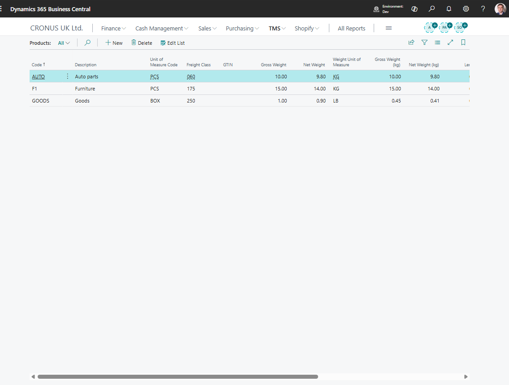

# Products

Use **Products** to maintain reusable cargo descriptions for Forwarding Order content.

A product can represent a generic cargo type, commodity, or item description used by operations and documents.

## Before you start

Make sure that:

- users agree which cargo descriptions should be standardized,
- logistic unit types exist when products are normally moved in standard units,
- any required weight, volume, or classification data is known.

## How to create a product

1. Search for **Products**.
2. Choose **New**.
3. Enter a code and description.
4. Fill weight, volume, unit, or classification details when used.
5. Save the product.
6. Select the product on Forwarding Order content lines when applicable.

## Fields that matter most

| Field | Why it matters |
|---|---|
| **Code** | Identifies the product in content lines and reporting. |
| **Description** | Prints or appears as cargo text. |
| **Unit data** | Helps calculate totals and documents. |
| **Weight / Volume** | Supports planning and settlement review. |
| **Blocked** | Prevents new use while preserving history. |

## Good to know

- Products in TMS are cargo descriptions. They do not replace standard Business Central items unless your process maps them that way.
- Keep product descriptions clear for customers and carriers.
- Use generic products only when detailed item tracking is not required.

## Troubleshooting

| Problem | What to check |
|---|---|
| Product is not available | Check whether it is blocked or filtered. |
| Cargo text is wrong on a document | Review the product description and the content line description. |
| Totals are wrong | Check quantity, unit type, weight, and volume on the content line. |

## Related

- [Forwarding Order](forwardingorder.md)
- [Logistic Unit Types](logisticunittype.md)
- [Freight Order](freightorder.md)
