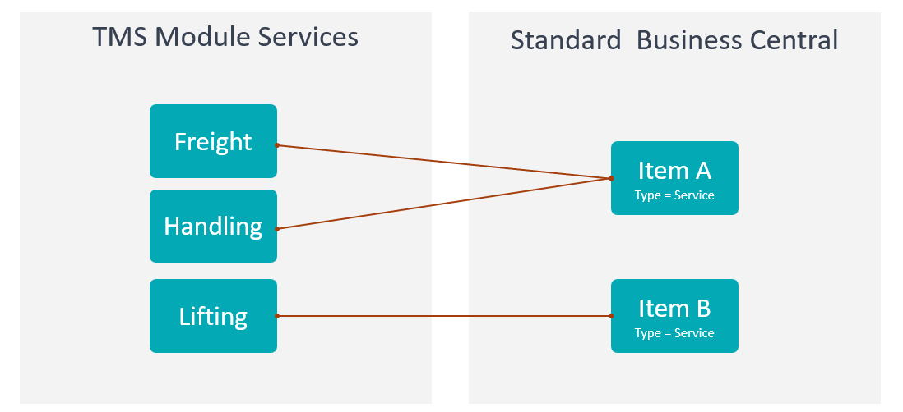

# Services

Use **Services** to define what your company charges customers for.

Services are the income side of settlement. Charges are the cost side.

## Before you start

Make sure that:

- Business Central posting setup exists for customer invoicing,
- service descriptions are agreed with finance and operations,
- pricing rules are configured if services should receive automatic prices,
- users know which services are standard and which are exception services.

## How to create a service

1. Search for **Services**.
2. Choose **New**.
3. Enter a code and description.
4. Fill posting, tax, unit, and pricing defaults when required.
5. Mark the service blocked only when it should no longer be used.
6. Test the service on a settlement income line.

## Fields that matter most

| Field | Why it matters |
|---|---|
| **Code** | Identifies the service on settlement lines. |
| **Description** | Appears on invoices and internal reports. |
| **Posting mapping** | Controls customer invoice creation. |
| **Unit of Measure** | Controls quantity and price interpretation. |
| **Blocked** | Prevents new use while preserving history. |

## Where services are used

| Area | Use |
|---|---|
| **Settlement income lines** | Defines what the customer is billed for. |
| **Pricing** | Finds or calculates expected income. |
| **Sales documents** | Creates customer invoice or credit memo lines. |
| **Reporting** | Shows revenue by service. |

## Good to know

- Use clear invoice-friendly descriptions.
- Do not mix services and charges. Services are income. Charges are cost.
- Block obsolete services instead of deleting them.

## Troubleshooting

| Problem | What to check |
|---|---|
| Service cannot be selected | Check whether the service is blocked. |
| Invoice line is wrong | Review service description, posting mapping, quantity, price, and tax setup. |
| Price is missing | Check pricing setup, customer, agreement, currency, and validity dates. |
| User cannot create invoice | Check settlement status, permissions, and TMS Setup. |

## Related

- [Settlement](settlement.md)
- [Pricing](pricing.md)
- [Charges](charges.md)
- [TMS Setup](setup.md)
