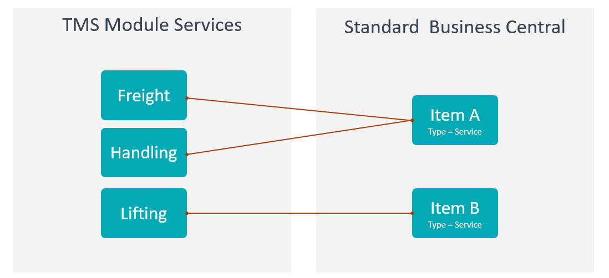
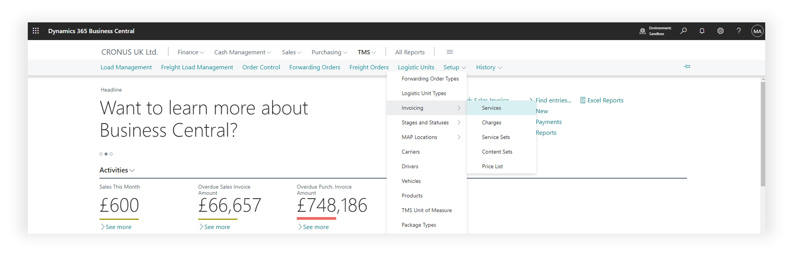
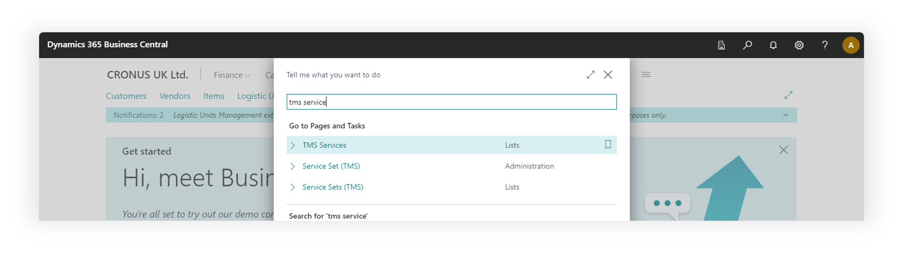
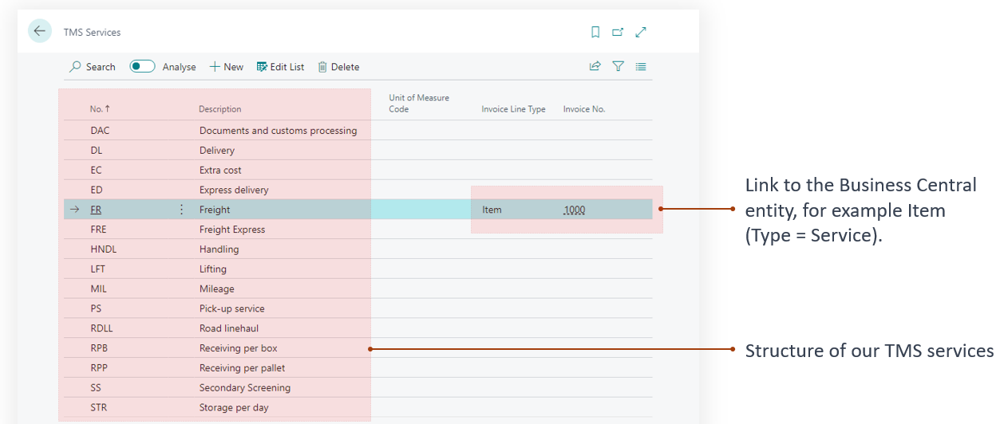
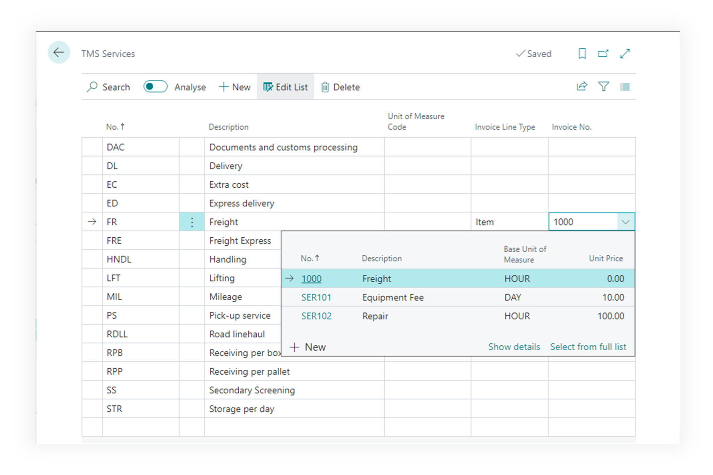

# Services

Services are used in TMS for the LSP scenario to issue invoices to the customer and to record the services provided to them.

- The TMS module possesses its own service directory/system, enabling the flexible customization of services offered within the context of the transportation process.
- TMS services are mapped to entities within the standard Business Central, facilitating operations for billing.
- Mapping can be one-to-one, where a TMS service is directly mirrored in the item directory, or many-to-one, where multiple TMS services aggregate into a single billable item-service.
- TMS services are employed in the settlement of forwarding orders, and setting up TMS services is essential for invoicing clients.
- TMS represents the suite of transportation services we provide to the client and for which we issue invoices.

Possible relations between TMS Services and Items of the Business Central

- Mapping TMS services to BC items means that within the TMS module, we operate and work with TMS services, but when invoicing or allocating costs in standard BC documents, items will appear instead.
- Business Central is unaware of the TMS module and cannot interact with its entities.

## Prerequisites

To change or create status profiles user must have TMS Admin Permissions.

## Where to find

using main menu of the TMS

using search

TMS Services list page

Set link to the Business Central entity

- Create a product that will serve as a reflection of the TMS service in the standard Business Central module.
- Establish the link.

p.s. The entity type corresponds to the type of purchase or sales order line.
