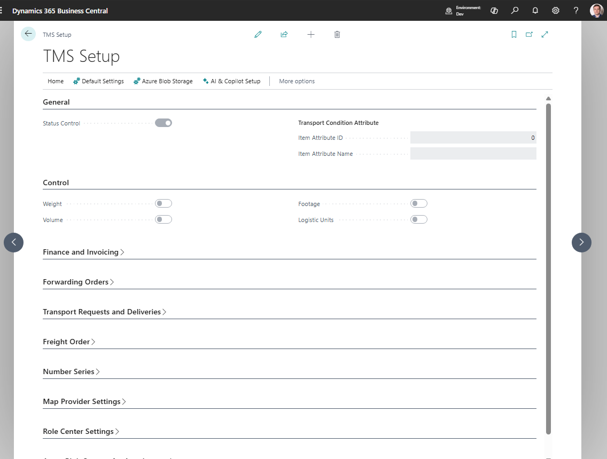

# TMS Setup

Use **TMS Setup** to define default behavior for the Logistics Service Provider workflow.

This page controls Forwarding Order defaults, Freight Order defaults, finance behavior, price list behavior, map provider settings, role center filters, Azure Blob Storage for attachments, and report defaults.

## How to open the page

Use one of these options:

- search for **TMS Setup**,
- open it from **Manual Setup**,
- open it from the TMS role center if your role center includes setup actions.

## Minimum setup checklist

Complete these items before users start working:

1. Fill the number series used by TMS.
2. Select the default [Forwarding Order Type](forwardingordertype.md).
3. Create status profiles for Forwarding Orders and Freight Orders.
4. Create stage profiles for the transportation process.
5. Set up [Services](services.md) for customer billing.
6. Set up [Charges](charges.md) for vendor and carrier costs.
7. Configure posting controls for settlement and Forwarding Order posting.
8. Configure [Freight Order Types](freightordertype.md).
9. Configure map provider settings if distance or route calculation is used.
10. Configure [Azure Blob Storage for Attachments](azureblobstorage.md) when external file storage is used.
11. Choose **Set default reports** if report selections are missing.

## Setup by process

| If your company uses | Set up these areas |
|---|---|
| Basic forwarding | Forwarding Order Types, number series, statuses, and stages. |
| Carrier execution | Freight Order type, carriers, vehicles, drivers, and stage rules. |
| Customer invoicing | Invoice document type, services, service mapping, customer currency, and posting setup. |
| Carrier cost allocation | Charges, purchase line mapping, settlement controls, and vendor setup. |
| Price automation | Price List Enabled, default price list, services, and price records. |
| Map and route calculation | Map Provider, API key, map locations, and coordinates. |
| Attachment governance | Attachment categories, Azure Blob Storage, and status requirements. |
| Guided order creation | Forwarding Order Types, Freight Order Types, number series, and [Order Wizards](orderwizards.md). |
| Role Center monitoring | Filter captions and values for role center cues. |

## Settings most teams review

| Area | What to review |
|---|---|
| **General** | Global status control and core default behavior. |
| **Control** | Weight, volume, footage, and logistic unit controls. |
| **Finance and Invoicing** | Invoice type, date behavior, credit limit warnings, and posting controls. |
| **Price List** | Whether pricing is enabled and which price list is used by default. |
| **Forwarding Orders** | Default type and source defaults. |
| **Freight Order** | Default type, unit type, charge distribution precision, and execution status profile. |
| **Map Provider Settings** | Google Maps provider and API key. |
| **Role Center Settings** | Cue filter captions and values. |
| **Azure Blob Storage** | External storage for TMS attachments. |
| **Reports** | Default report selection setup. |

## Useful actions

| Action | Use it for |
|---|---|
| **Set default reports** | Reset default report selections for TMS documents. |
| **Check Connection** | Test Azure Blob Storage connection. |
| **Transfer Attachments to ABS** | Move existing TMS attachments to Azure Blob Storage. |
| **Free Space** | Remove imported file payload after transfer to Azure Blob Storage. |

## Verify setup

1. Search for **Forwarding Orders** and confirm the page opens.
2. Create a test Forwarding Order.
3. Confirm a Forwarding Order Type can be selected.
4. Confirm stages and statuses appear as expected.
5. Add one settlement income line and one cost line.
6. Confirm the expected invoice and charge actions are available.
7. Create a Freight Order from a stage.
8. Run the [first forwarding job tutorial](first-forwarding-job.md) in a sandbox.

## Troubleshooting

| Problem | What to check |
|---|---|
| Forwarding Order cannot be created | Check default Forwarding Order Type, number series, and permissions. |
| Freight Order action is disabled | Check the Forwarding Order status and status profile permissions. |
| Settlement cannot create an invoice | Check service mapping, invoice document type, customer, and status permissions. |
| Posting is blocked | Review posted document control, settlement document posting, and FWO posting date control. |
| Attachments do not move to Azure Blob Storage | Check account name, container, account key, and **Check Connection** result. |

## Related

- [Forwarding Order Types](forwardingordertype.md)
- [Freight Order Types](freightordertype.md)
- [Statuses and Status Profiles](statuses.md)
- [Stages](stages.md)
- [Settlement](settlement.md)
- [Azure Blob Storage for Attachments](azureblobstorage.md)
- [Google Maps Integration](googlemapintegration.md)
- [Attachment Control](attachmentcontrol.md)
