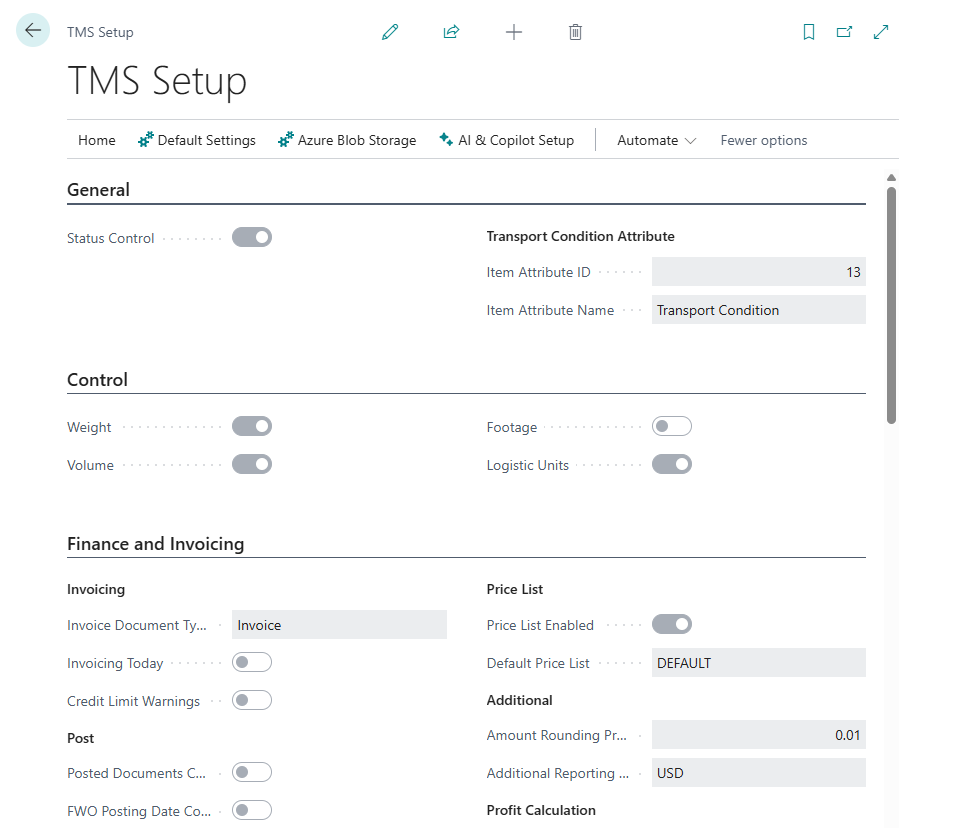

# Setup

On the TMS Setup page, the core settings for the TMS module are established, such as default types for created documents, document accounting features, numbering, etc.

## Where to find

TMS Setup is accessible via search

or through Manual Setup in Advanced settings

## Settings Description

### General

- **Status Control**. Enabling/disabling the action control system for statuses across all profiles. Gloval control.
- **Transport Condition Attribute**. Transport Condition Attribute defines a product attribute that determines transportation conditions. For example, you can create a product attribute called “Transport Conditions” to be assigned to each item—or selected items—that require special handling (such as frozen or chilled goods), which cannot be transported together with regular items. Specifying transport conditions will result in order splitting and grouping based on these conditions.
You first need to create an Item Attribute and assign values to it.
For example:
Item Attribute = Transportation Conditions, Type = Option
Values = Frozen, Refrigerated, CRT, Ambient, Warm, Ventilation

### Control

This settings block defines the parameters controlled by the TMS. You can select the specific parameters that will be used as the basis for transportation planning.

- **Weight**. Specifies whether the system checks item weight capacity when placing or assigning orders.
- **Volume**. Specifies whether the system checks item volume capacity when placing or assigning orders.
- **Footage**. Specifies whether the system checks footage constraints before finalizing transport or freight orders.
- **Logistic Units**. Specifies whether the system checks the number of logistic units when assigning or finalizing an order.

Parameters that are not selected will not be displayed on pages or included in totals calculations.

### Finance and Invoicing

A group of settings used in the customer billing process within the LSP scenario through Forwarding Orders.

- **Invoice Document Type**. Specifies the default sales document type when creating an invoice from a forwarding order. When invoicing a customer from a Forwarding Order ("Forwarding Order" > "Invoicing" menu > "Create Sales Invoice"), the system can automatically create any type of sales document. Typically, this is a sales invoice.
- **Invoicing Today**. The "Invoicing Today" setting determines whether the created invoice will use the current date (Today()). If not selected, the invoice will be assigned the "Document Date" from the Forwarding Order.
- **Credit Limit Warnings**. Specifies whether credit limit alerts are shown when creating or invoicing forwarding orders. When creating a sales invoice from a Forwarding Order, the standard Business Central credit limit check for the customer is triggered.
- **Posted Documents Control**. Specifies whether posted settlement documents are required before you can post a forwarding order. This setting defines a strict rule that, before posting a Forwarding Order, the system checks whether all related documents in the Settlement are also posted. This means that all customer sales invoices must be posted, and all vendor purhcase  invoices (e.g., from carriers) must also be posted for.
- **FWO Posting Date Control**. Specifies whether the forwarding order posting date must be later than any settlement postings. This setting enforces strict control to ensure that the posting date of the Forwarding Order cannot be earlier than the posting date of any document in the Settlement (purchase or sales invoices). In other words, all purchase and sales invoices must be posted before the Forwarding Order can be posted.
Price List
- **Price List Enabled**. Specifies whether price list functionality is enabled for calculating transportation charges for clients.
- **Default Price List**. Specifies the default price list used to derive freight or forwarding rates.
Additional
- **Amount Rounding Precision**. Specifies the rounding interval for invoice prices. For example, enter 1.00 to round amounts to whole numbers.
- **Additional Reporting Currency**. Specifies the Additional Reporting Currency. The additional reporting currency allows all amounts in the Settlement and other TMS financial metrics to be reflected not only in the local currency but also in any other chosen currency. This is useful, for example, for comparing financial results across multiple branches operating in different countries.
Profit Calculation
- **Profit Calculation Enabled**. Specifies whether profit percentage calculations are enabled for forwarding orders (list page).
- **Profit Calculation Method** Specifies how profit is computed: Profit/Cost*100% or Profit/Income*100%.

### Forwarding Orders

LSP scenation specific settings

- **Def. Forwarding Order Type**. Specifies the default [forwarding order type](forwardingordertype.md) to apply when creating new forwarding orders.
- **Default FWO Type for Sales**. Specifies the default forwarding order type when creating a forwarding order from a sales order.
- **Select FWO Type For LSP**. Specifies whether users must choose a forwarding order type for LSP when converting a sales invoice. The system has displayed a list of Forwarding Order Types for selection.
- **Default FWO Type for Purchases** Specifies the default forwarding order type when creating a forwarding order from a purchase order.
- **Default FWO Type for ЕЕransfers** Specifies the default forwarding order type when creating a forwarding order from a transfer order.
- **Chargeable Weight Precision** Specifies the rounding precision for calculating chargeable weight in freight or forwarding orders.

### Transport Requests and Deliveries

Shipper scenation specific settings

- **Transport Request Nos.** Specifies the number series code used for assigning numbers to transport requests by default.
- **Delivery Nos.** Specifies the number series code used to assign numbers to carrier or delivery orders.
- **Default Mode of Transport** Specifies the default mode of transport used for new TMS deliveries or requests.
- **Default Charge Assignment Type** Specifies the default charge assignment method for distributing carrier charges among deliveries or orders. This setting determines how transportation costs will be allocated to the orders that were shipped. For example, if we transported 10 orders using a third-party carrier who issued an invoice, we enter that invoice as a purchase invoice in Business Central. We then need to distribute the total amount of the carrier’s invoice across the transported orders. This can be done based on weight, amount, distance, or equally.
This setting defines the default allocation method, but it can be changed at any time in the cost allocation window within the Delivery Order.
- **Default Item Charge Assignment Type** Specifies the default item charge assignment method used when allocating costs within orders. This setting determines how transportation costs will be allocated to the item lines within an order—similar to the standard cost allocation functionality in Business Central. In other words, we distribute the portion of the transportation cost related to a specific order across the items included in that order.
This setting defines the default allocation method, but it can be changed at any time in the cost allocation window within the Delivery Order.
- **Auto Create Transport Request for Sale** Specifies whether a transport request is created automatically when a sales document is released.
- **Auto Create Transport Request for Purchase** Specifies whether a transport request is created automatically when a purchase document is released.
- **Auto Create Transport Request for Transfer** Specifies whether a transport request is created automatically when a transfer order is released.
- **Build Estimated Logistic Units** Specifies whether the system builds logistic units automatically when creating new transport requests. For a preliminary estimate of how many logistics units (pallets, boxes) are needed, you can set up logistics unit formation rules—for example, how much of item X is required to form one pallet.
By defining these rules and enabling this setting, the system will estimate the number of pallets (or boxes, containers) required to transport the order when a Transport Request is created.
This helps in breaking down a large order into multiple shipments (i.e., multiple Delivery Orders).
- **Delivery Execution Status Profile** Specifies the status profile used to manage the execution steps of a delivery order. This status profile is used to monitor the execution progress of a Delivery Order, for example, via a Proof-of-Delivery app. Each line in the Delivery Order has a status, and by updating it, you can effectively track the order fulfillment process.

### Freight Order

LSP scenation specific settings

- **Def. Freight Order Type** Specifies the default freight order type used when creating new freight orders.
- **Freight Order Charges is Editable** Specifies whether freight order charge lines can be edited manually.
- **Default Vehicle Unit Type** Specifies the default vehicle unit type for newly created freight orders.
- **Charge Distribution Precision** Specifies the rounding increment used when distributing freight charges to lines or orders.
- **Stage Execution Status Profile** Specifies the status profile for controlling each stage's progress in an order.

### Number Series

- **MAP Location Nos.** Specifies the number series code used for assigning IDs to TMS map locations.

### Map Provider Settings

- **Map Provider** Specifies which mapping service is used, such as Google or Bing. At this moment only Google integration exits.
- **Google Api Key** Specifies the Google Maps API key for location or route data.

### Role Center Settings

If you're using the TMS Role Center, you can configure which documents and statuses you want to monitor and display.

- **FWO Filter X Caption** Specifies the text label for the first Forwarding Order role center filter. Where X is value from 1 to 5.
- **FWO Filter X Value** Specifies the value used for the first Forwarding Order role center filter. Where X is value from 1 to 5.

- **FO Filter X Caption** Specifies the text label for the first Freight Order role center filter. Where X is value from 1 to 5.
- **FO Filter X Value** Specifies the value used for the first Freight Order role center filter. Where X is value from 1 to 5.

### Azure Blob Storage For Attachment

TMS allows you to store TMS module attachments not in Business Central itself, but in Azure Blob Storage.

- **Enabled** Specifies whether Azure Blob Storage is used for TMS attachments.
- **Account Name** Specifies the account name for connecting to Azure Blob Storage.
- **Container** Specifies the Azure Blob Storage container that will store TMS attachments.
- **Account Access Key** Specifies the Azure Blob Storage account key used for attachments.

There are additional functions available in the TMS Setup window for working with attachments.

- **Check Connection** Check Azure Blob Storage Connection to approve settings.
- **Transfer Attachments to ABS** Transfer all TMA attachments (Forwarding Orders, Posted Forwarding Orders, Freight Orders, Posted Freight Orders) to Azure Blob Storage
- **Free Space** Delete imported to attachment record file that was trasfered to Azure Blob Storage.

## Additional Setup Functions

- **Set default reports** Reset default reports settings (if you have problems with TMS reports). Path. "TMS Setup" > "Default Settings" > "Set default reports"
