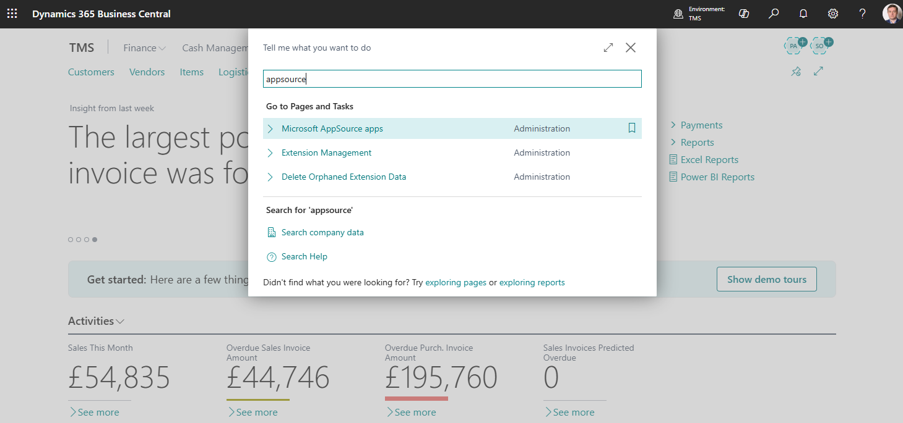
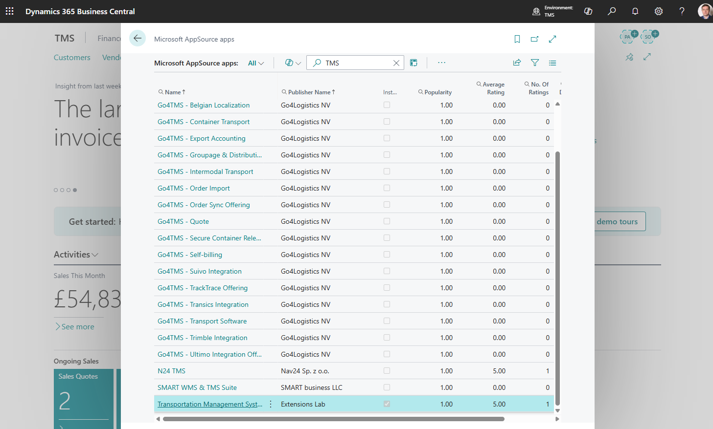

# Transportation Management System (TMS) Setup

## Introduction

The TMS configuration process involves the creation and editing of TMS directories and entities to ensure optimal alignment of the TMS module with the company's business processes.

The configuration process is contingent on the company type, whether it is a Shipper, that is, it manages the shipment of its own goods, or an LSP (Logistic Service Provider), whose business revolves around managing the transportation of third-party cargo.

Many settings are utilized in both scenarios but with varying levels of detail.

TMS comprises two main components: the core TMS and the Logistic Units extension. The core TMS utilizes functions provided by Logistic Units, which offers functionality for handling pallets and containers and features its own configuration system.

## Installation

The easiest way to install TMS is directly from within Business Central. Just search for the AppSource page.

Search TMS

Open TMS card page and click "Install from AppSource"

## After Installation

After installing the TMS extension, several steps must be completed to make TMS available to users.

- Purchase and assign licenses. [See detailed instructions](buylicense.md)

- Assign permission set to users [See detailed instructions](assignpermissionsets.md)
