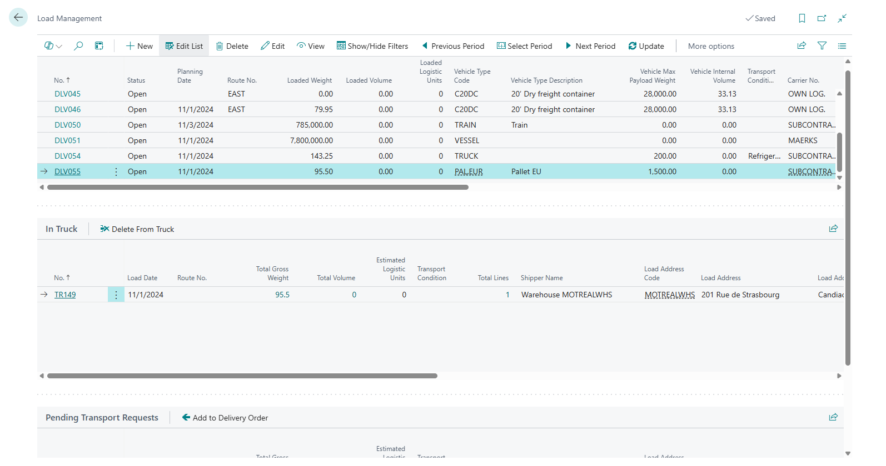
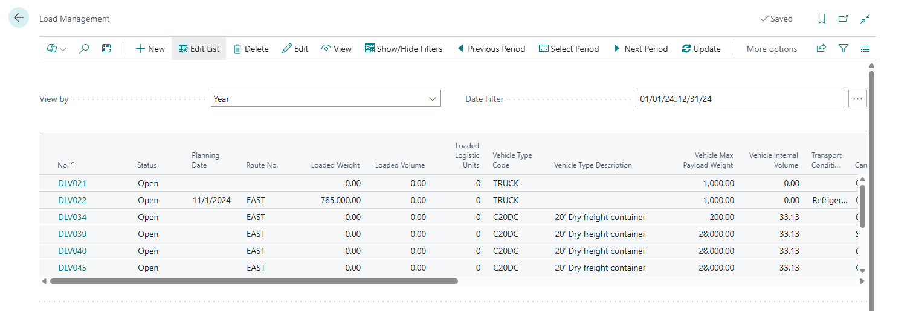
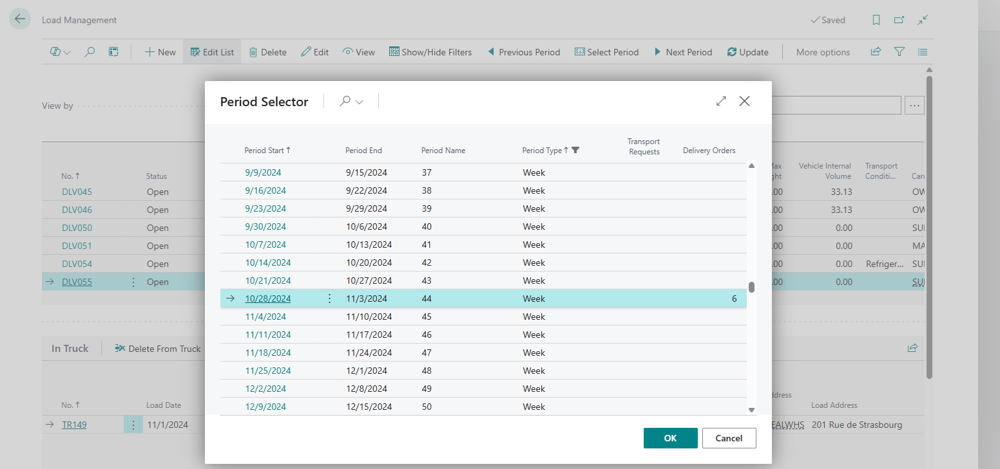
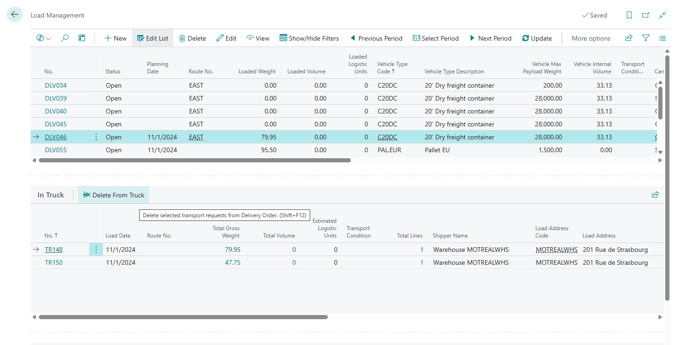
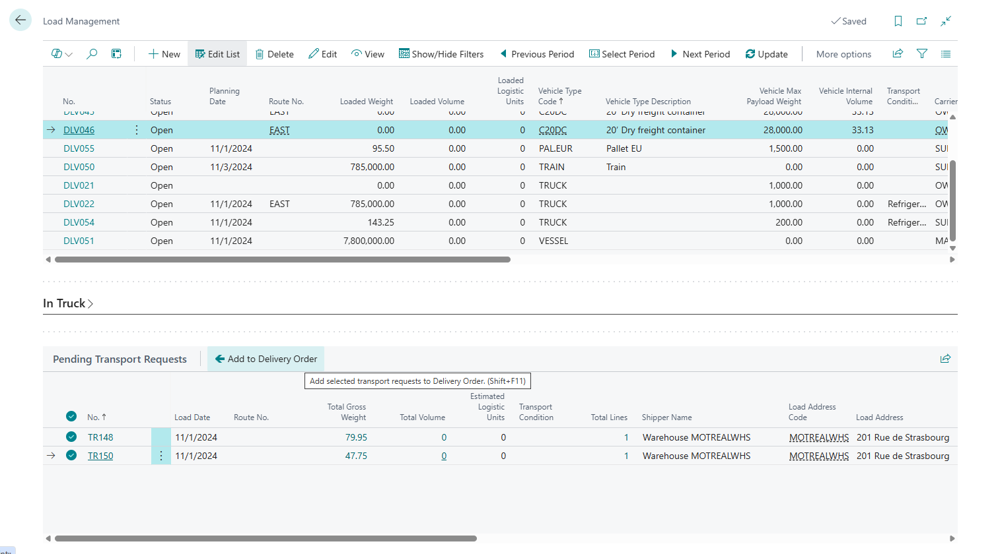

# Load Management for Shippers

The Load Management Tool is a comprehensive planning and optimization system designed for efficient cargo delivery operations in the Transportation Management System (TMS) extension for Microsoft Dynamics 365 Business Central for Shippers.
This tool serves as a centralized platform for logistics managers to allocate transportation requests to specific vehicles and routes, ensuring optimal resource utilization and timely delivery operations.
The system operates on two primary entities:

- [Transport Requests](transportrequest.md) (representing purchase or sales orders that need to be fulfilled)
- [Delivery Orders](deliveryorder.md) (representing the delivery vehicles/trucks along with their associated routes and capacity constraints).

The Load Management interface features a three-panel layout:

- filter panel displays the selected planning period.
- the main panel displays available Delivery Orders (trucks) with their current capacity status (loaded weight, volume, footage, and logistic units), vehicle specifications, assigned carriers, drivers, and routes.
- The **In Truck** panel displays transport requests that have already been allocated to the selected delivery vehicle, allowing for capacity monitoring and load optimization.
- The **Pending Transport Requests** panel shows unassigned transportation demands with detailed pickup and delivery information, cargo specifications, and scheduling requirements (document ready for delivery).

The tool includes advanced filtering capabilities by date periods, geographic zones, and item attributes, enabling users to focus on specific timeframes or cargo requirements. Users can seamlessly move transport requests between pending and assigned status usin dedicated actions, with real-time capacity validation to prevent overloading.

The system supports various capacity constraints (weight, volume, footage, logistic units) and provides visual indicators when approaching vehicle limits. Load Management integrates with Business Central's warehouse management.

## Interface

## Planning Period

The period control panel is hidden by default to save vertical screen space. To change the period:

- Switch the page to Edit mode
- Click "Show/Hide Filters" menu item.
- In the panel that appears, select the period type in the View by field (e.g., day, week, month, quarter, year). This is useful if planning is done in fixed periods.
- In the Date Filter field, choose the specific working period (Assist Button).

The Period Selector window helps you see whether there are any unassigned Transport Requests and the corresponding Delivery Orders created for them within the selected period, using the values in the fields with the same names.

Use the "Previous Period" and "Next Period" buttons in the main menu for quick navigation between periods.

## Main Panel

The main panel displays a list of Delivery Orders — i.e., trucks—for the planned period. A Delivery Order is considered part of the planning period if the Transport Requests it contains fall within that period.

The fields Loaded Weight, Loaded Volume, Loaded Footage, and Loaded Logistic Units show the truck’s load based on each parameter.
The list of controlled parameters (e.g., weight or volume) is defined in [TMS Setup](setup.md#control). For example, if only weight needs to be monitored, you just need to enable the "Control Weight" parameter in TMS Setup.

The weight and dimensional parameters and limitations, as well as the transport conditions of a truck, are defined using the [Vehicle Unit Type](logisticunittype.md) and are copied into the Vehicle Type fields. The logistic unit type defines the package type, size, and volume of the vehicle and complete fields "Vehicle Max Payload Weight", "Vehicle Internal Volume", "Transportation Condition", etc.

## In Truck

The In Truck section contains the list of Transport Requests that will be delivered by the truck selected in the upper section. At any time, a Transport Request (and therefore the sales order represented by that Transport Request) can be removed from the Delivery Order by clicking **Delete from Truck**.

## Pending Transport Requests

This section shows the Transport Requests that need to be processed/shipped within the analyzed period (filtered by the Load Date of the Transport Request).

To place requests into a Delivery Order:

- In the upper section, select the required Delivery Order.
- In the lower section, select one (or multiple using Ctrl) Transport Requests.
- Click **Add To Delivery Order**.

