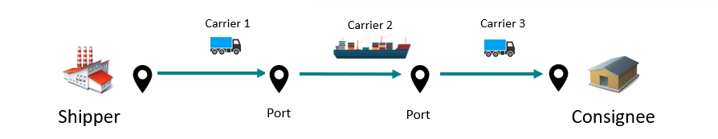
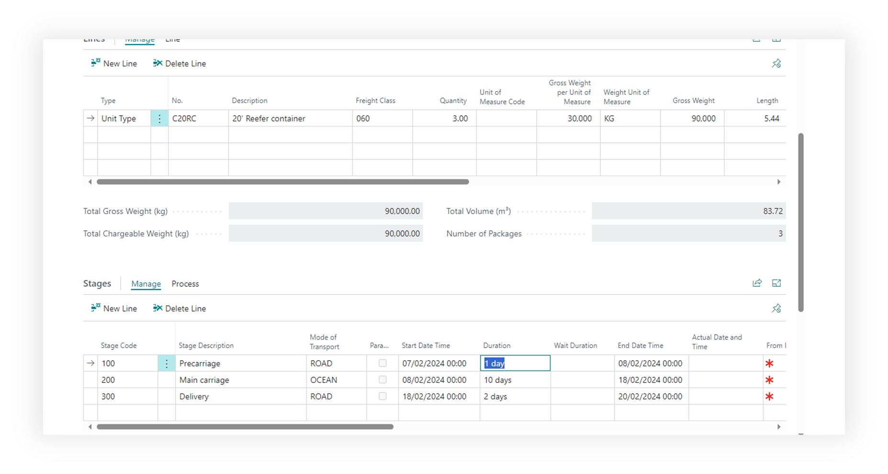
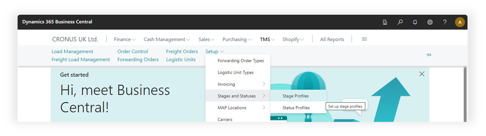
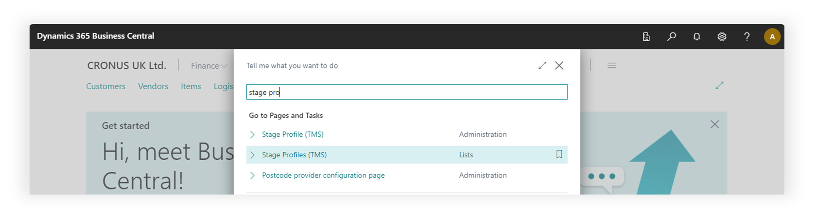
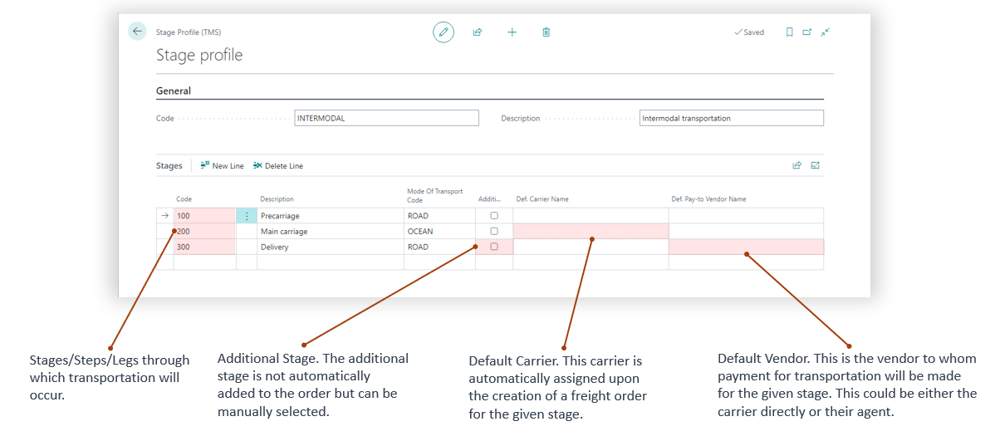
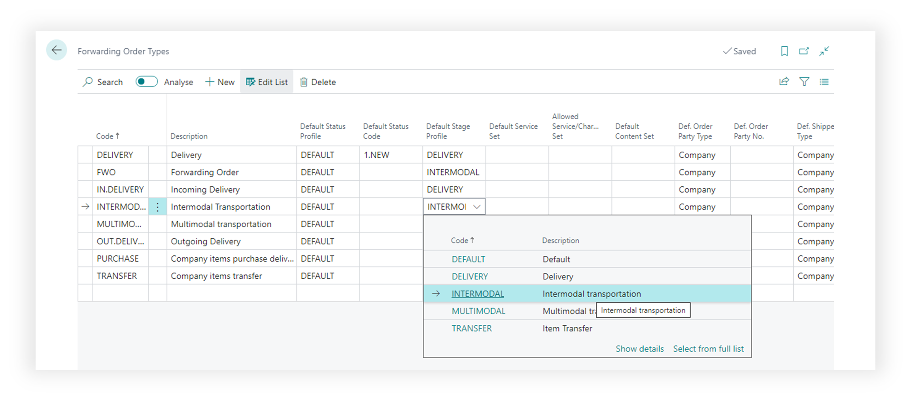

# Stages

The Stage Profile defines the sequence of steps (legs) that will occur during the transportation process. Stages are used in Forwarding Order to define steps, schedule, and duration of the transportation. The profile may include both mandatory steps executed via the Freight Order and additional steps that are manually added to the transportation process.';

## Use case

Example of a stage structure for a 3-leg transportation process, where a separate carrier is assigned to each stage and will issue an invoice for their services:

Transportation from Lengerich (Germany) to Grimsby (UK) can be divided into 3 legs (stages):

- From Lengerich to Frankfurt Airport (FRA) – this is the pick-up stage, road transportation.
- From FRA to London Heathrow (LHR) – the main leg, air freight.
- From LHR to Grimsby – the delivery stage, final road transportation to the consignee.

## Stages in Forwarding Order

Stages are used only in Forwarding Orders and are assigned to a Forwarding Order through the Forwarding Order Type during creation.

## Where to find

using main menu of the TMS

using search

## Fields description

- Code. Unique identifier of the status profile that will be used in Forwarding Order Types.
- Description. Name of the stage profile.

Each line in the profile represents a specific stage of the transportation process. For this, you need to fill in the Code (stages in the Forwarding Order are sorted by this code), the Stage Description, and the Mode of Transport.

If a certain stage always uses the same carrier or service provider, you can specify it in the "Def. Carrier Name" field. If the party we’re paying is different from the actual carrier (e.g. an agent), you can enter it in the "Def. Pay-to Vendor Name" field. These fields will be automatically populated when creating a Freight Order based on the current stage.

## Where stages are using

Stages are used in Forwarding Orders Types page. By assigning a stage profile to the forwarding order type, a set of stages is defined for all documents of this type.

## Prerequisites

To change or create status profiles user must have TMS Admin or Super Permissions.

