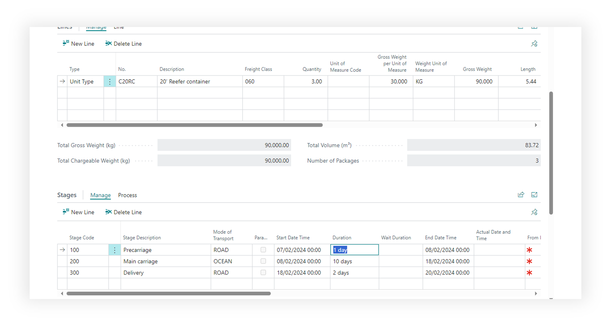

# Stages

Use **Stages** to define the transportation legs of a Forwarding Order.

A stage can represent pickup, pre-carriage, main carriage, on-carriage, terminal handling, customs-related movement, or another leg your company tracks.

## Before you start

Make sure that:

- the business process is mapped,
- map locations or party address rules are ready,
- status profiles exist,
- Forwarding Order Types are ready to use stage profiles.

## Stage profiles

A **Stage Profile** is a reusable list of stages that can be assigned to a Forwarding Order Type.

When users create a Forwarding Order, the stage profile helps create the expected transportation legs automatically.

## How to create a stage profile

1. Search for **Stage Profiles**.
2. Choose **New**.
3. Enter code and description.
4. Add stage lines in the expected sequence.
5. Fill stage type, locations, mode, and defaults when used.
6. Assign the profile to a Forwarding Order Type.
7. Test by creating a Forwarding Order.

## Fields that matter most

| Field | Why it matters |
|---|---|
| **Sequence** | Controls the order of stages. |
| **Stage Code** | Identifies the leg. |
| **Description** | Helps users understand the leg. |
| **Mode of Transport** | Classifies the stage. |
| **Origin / Destination** | Defines the movement for the leg. |
| **Status Profile** | Controls stage or execution behavior when used. |
| **Create Freight Order** | Indicates whether carrier execution is expected for the stage. |

## Good to know

- Stages are the bridge between customer job planning and carrier execution.
- Keep stage profiles simple enough for users to understand.
- Different Forwarding Order Types can use different stage profiles.

## Troubleshooting

| Problem | What to check |
|---|---|
| Stages do not appear on a new order | Check the Forwarding Order Type and selected stage profile. |
| Freight Order cannot be created for a stage | Check stage setup, current status, and status action control. |
| Stage order is wrong | Review sequence values in the stage profile. |
| Route or map data is incomplete | Check stage origin, destination, and map locations. |

## Related

- [Forwarding Order Types](forwardingordertype.md)
- [Forwarding Order](forwardingorder.md)
- [Freight Order](freightorder.md)
- [Statuses and Status Profiles](statuses.md)
