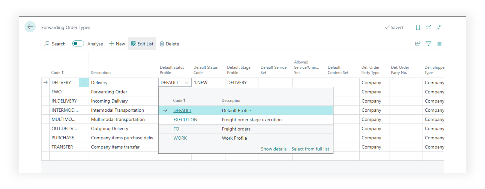
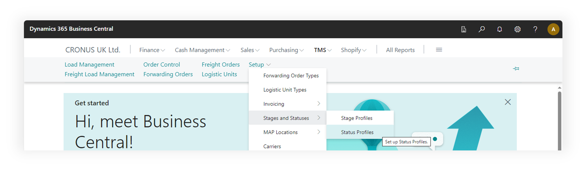
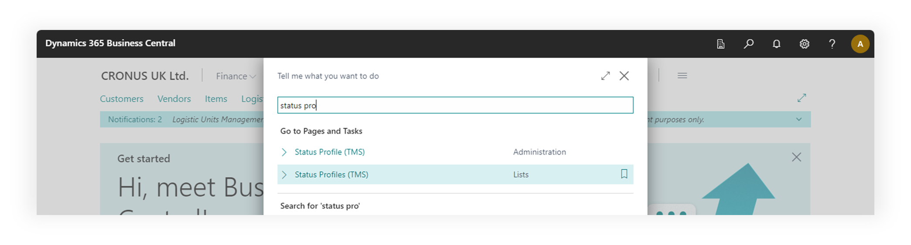
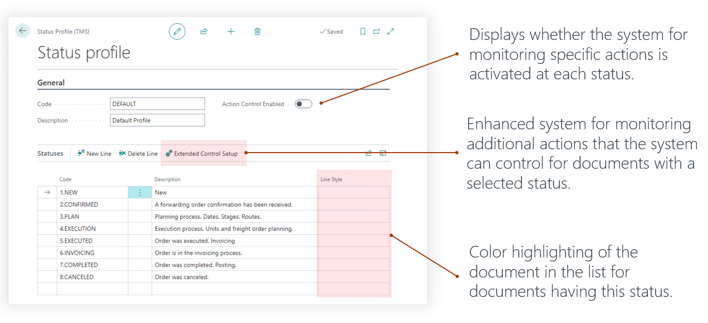
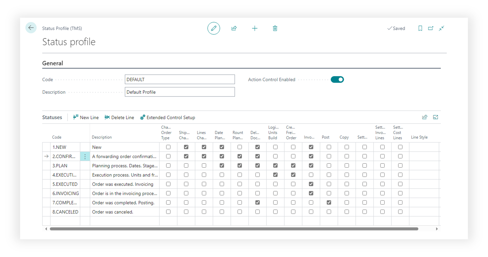
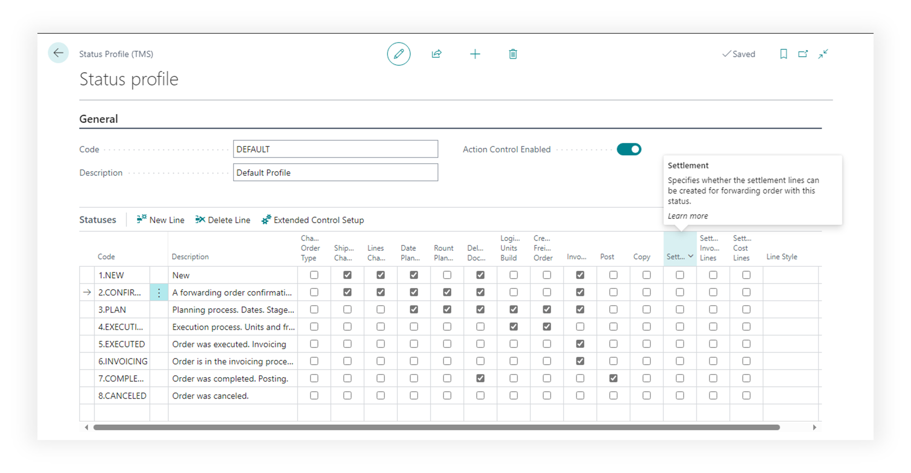
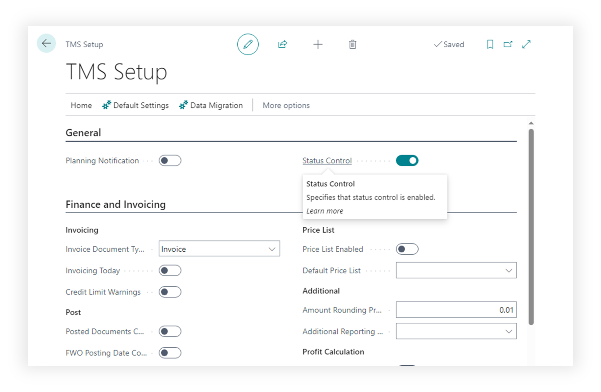

# Statuses

A status profile is a structured set of statuses that a forwarding and freight order progresses through during its lifecycle in a business process. This profile outlines the allowed operations and limitations for the document at each specific status. This setup provides a systematic advancement and control over the document states within the processing workflow.

## How TMS uses the status system

The status system is utilized for document types such as Forwarding Orders and Freight Orders. Different types of documents may have diverse status structures, allowing for more flexible configuration of the document processing business process.

## Where to find

using main menu of the TMS

using search

## Main Fields

- Code. Unique identifier of the status profile that will be used in the Forwarding Order Types.
- Description. Name of the status profile.
- Action Control System. Displays whether the system for monitoring specific actions is activated at each status.
- Enhanced system for monitoring additional actions that the system can control for documents with a selected status.
- Color highlighting of the document in the list for documents having this status.

- "Action Control System" parameter allows for the authorization or prohibition of actions that can be performed with documents having a selected status. This facilitates the organization of workflow and the orderly processing of documents, as well as synchronizing the efforts of individuals working simultaneously on the same document. Works only for Forwarding Orders.

You can activate verification by setting a flag in the field of the corresponding column. Determine whether an order can be posted, whether an invoice can be issued, and whether copying or modifying a document with the given status is allowed.

## Additional

To ensure the action control system functions, it must be activated globally in the TMS Setup page.

## Prerequisites

To change or create status profiles user must have TMS Admin or Super Permissions.
