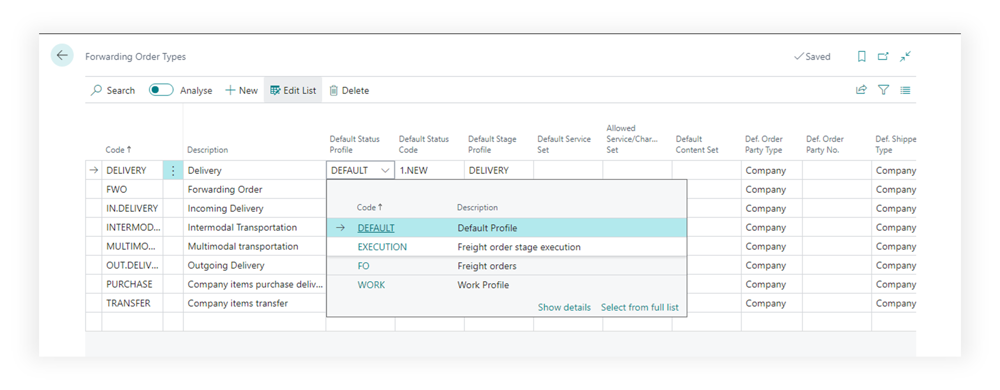

# Statuses and Status Profiles

Use **Statuses** and **Status Profiles** to control the business process for TMS documents.

Statuses are process steps. They are not the physical location of the cargo. They control what users can change, create, invoice, attach, or post.

## Before you start

Make sure that:

- your process steps are agreed with operations and finance,
- attachment categories exist if documents are required at certain steps,
- TMS Setup has status control enabled when you want action rules enforced,
- administrators understand which actions should be allowed at each status.

## What is a status profile

A **Status Profile** is a reusable set of statuses and action rules.

Assign status profiles to Forwarding Order Types, Forwarding Orders, Freight Orders, or stage execution rules depending on your setup.

## How to configure a profile

1. Search for **Status Profiles**.
2. Create or open a profile.
3. Add statuses in the business sequence.
4. Define which actions are allowed at each status.
5. Add extended control when attachments or extra requirements are needed.
6. Assign the profile to the related setup record.
7. Test the profile with a sample Forwarding Order.

## Common action controls

| Control | What it allows or blocks |
|---|---|
| **Change Order Type** | Lets users change the Forwarding Order Type. |
| **Party Details Change** | Lets users edit origin and destination party details. |
| **Lines Change** | Lets users add or change content lines. |
| **Date Planning** | Lets users change planning dates. |
| **Route Planning** | Lets users change stages or route-related data. |
| **Delete Document** | Lets users delete the document. |
| **Logistic Units Build** | Lets users build logistic units. |
| **Create Freight Order** | Lets users create carrier execution from stages. |
| **Invoicing** | Lets users create customer financial documents. |
| **Settlement** | Lets users change settlement lines. |
| **Post** | Lets users post the Forwarding Order. |
| **Copy** | Lets users copy data when allowed. |
| **Extended Control** | Adds extra requirements such as required attachments. |

## Extended control

Use **Extended Control** when a status should require specific attachment categories or other configured checks.

Example: before a Forwarding Order can move to a controlled status, the system can require a carrier confirmation file, customer approval file, or invoice support file.

## Good to know

- Status control should make work clearer, not slower.
- Keep the number of statuses practical.
- Test every status profile with the users who perform the work.
- Use attachment requirements only for documents that are truly mandatory.

## Troubleshooting

| Problem | What to check |
|---|---|
| User cannot change a field | Check the current status and action control. |
| Freight Order action is disabled | Check **Create Freight Order** control for the current status. |
| Invoice action is disabled | Check **Invoicing** and settlement controls. |
| Posting is blocked | Check **Post**, required attachments, and settlement posting controls. |
| Status rules do not apply | Check whether status control is enabled in TMS Setup. |

## Related

- [TMS Setup](setup.md)
- [Forwarding Order Types](forwardingordertype.md)
- [Forwarding Order](forwardingorder.md)
- [Attachment Control](attachmentcontrol.md)
- [Settlement](settlement.md)
