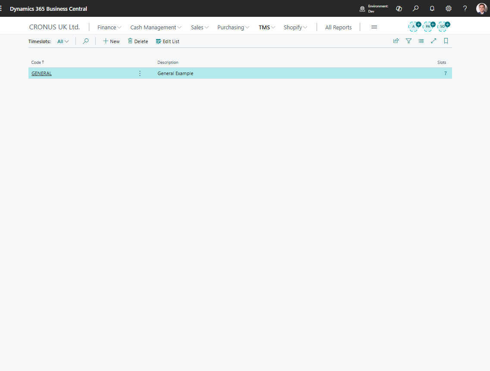

# Time Slots

Use **Time Slots** to define standard appointment windows for transportation work.

Time slots help users describe expected pickup, arrival, terminal, or carrier appointment windows consistently.

## Before you start

Make sure that your company agrees on the time windows users should select.

Examples include morning, afternoon, evening, fixed warehouse window, carrier appointment window, or customer appointment window.

## How to create a time slot

1. Search for **Time Slots**.
2. Choose **New**.
3. Enter a code and description.
4. Fill starting and ending time when the slot has fixed times.
5. Save the record.
6. Use the time slot on planning or document pages where available.

## Fields that matter most

| Field | Why it matters |
|---|---|
| **Code** | Identifies the time slot in lookups and documents. |
| **Description** | Helps users choose the correct window. |
| **Starting Time** | Defines when the window begins. |
| **Ending Time** | Defines when the window ends. |
| **Blocked** | Prevents new use without breaking history. |

## Good to know

- Keep time slot names short and clear.
- Do not create a time slot for every single appointment. Use direct date and time fields for one-off appointments.
- Time slots support planning consistency. They do not replace confirmed carrier or customer communication.

## Troubleshooting

| Problem | What to check |
|---|---|
| Time slot is not available | Check whether it is blocked or filtered. |
| Users select inconsistent slots | Reduce duplicate slots and improve descriptions. |
| Appointment time is still wrong | Review the actual planned date and time fields on the document. |

## Related

- [Forwarding Order](forwardingorder.md)
- [Freight Order](freightorder.md)
- [Stages](stages.md)
