# Transport Request

is a transportation request based on internal company documents, such as purchase orders, sales orders, or transfer orders. It defines WHAT needs to be transported, where the goods are to be picked up, and where they need to be delivered, while also specifying the shipper and the consignee.

## Capabilities

The Transport Request document covers the following functional areas of the TMS:

- Order Grouping
- Routes and Zones
- Load Management

To transport something from one place to another in the TMS module, you need to create a Transport Request. The request can be created for any document (sales, purchase, transfer), whether it has been posted or not. A Transport Request serves as an assignment or instruction, indicating that these specific items need to be delivered from this location to that destination.

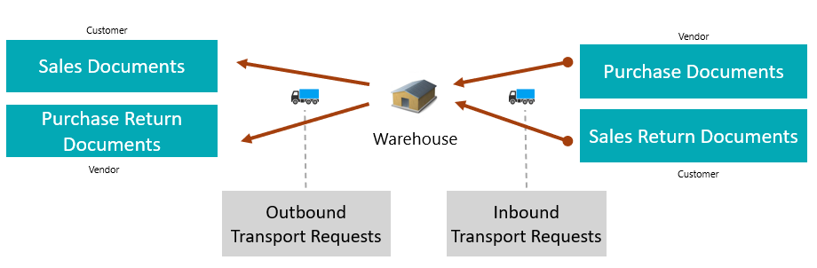

Transport Request is a document used to initiate a request for organizing the transportation of goods from one point to another. It serves as a formal request for transportation services. This document can include line items from one source documents, but they are grouped based on the principle of moving from point A to point B. It does not include complex routes or multiple stops, focusing solely on straightforward point-to-point transport requests.

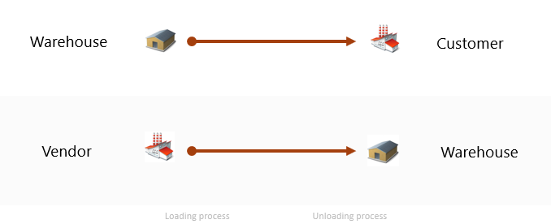

The Transport Request allows grouping source documents based on the warehouse from which goods will be shipped or received. The connection is made at the line level, as in Business Central, sometimes different lines within the same document can be associated with different warehouses.

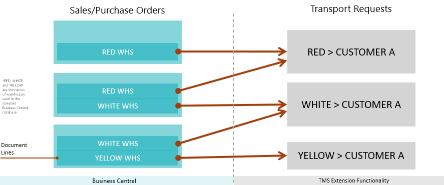

The Transport Request allows grouping source documents based on the destination address where the delivery is to be made, within a scenario where goods are shipped from a single warehouse to a single customer, but with different delivery addresses for each order.

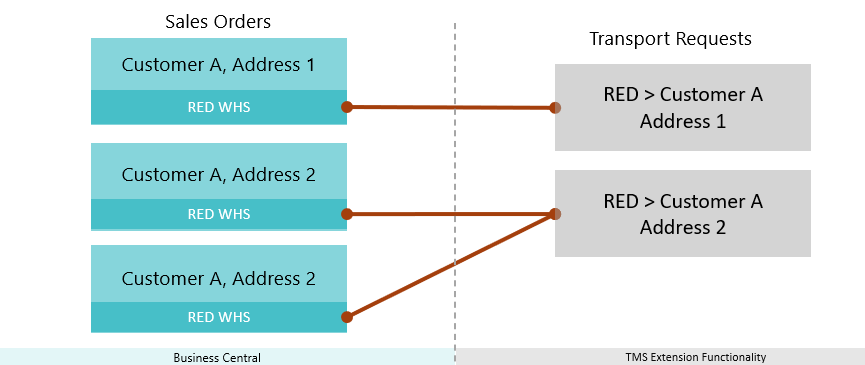

The key parameters of a Transport Request are the pickup and drop-off locations—where the goods are coming from and where they are going. The Shipper and Consignee can be our warehouse, a customer, or a vendor, offering flexibility to meet various transportation needs.

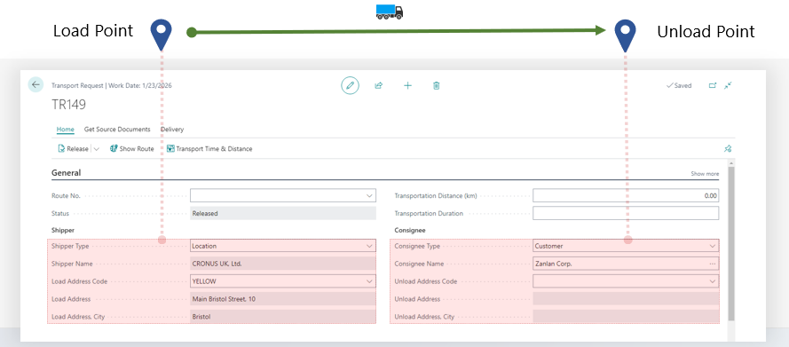

The Transport Request leverages MAP Location data, matched with warehouses, suppliers, customers, or client and supplier addresses, to visualize the transportation route. This provides greater clarity and accuracy when planning the route.

The Transport Request offers powerful tools for estimating both the duration and distance of the transportation, ensuring precise planning and efficient execution.

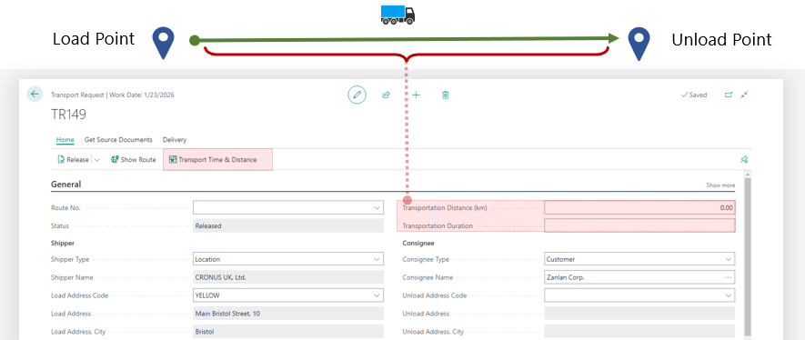

The Transport Request allows you to precisely specify the required parameters: location, date, time, and most importantly, the duration of key transportation stages. The transportation duration can be estimated using the Google MAP API.

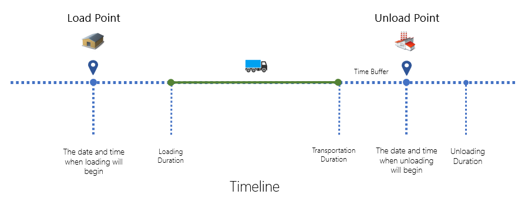

You can provide additional information about the loading and unloading locations that may be useful for the driver, such as the gate and the loading sequence.

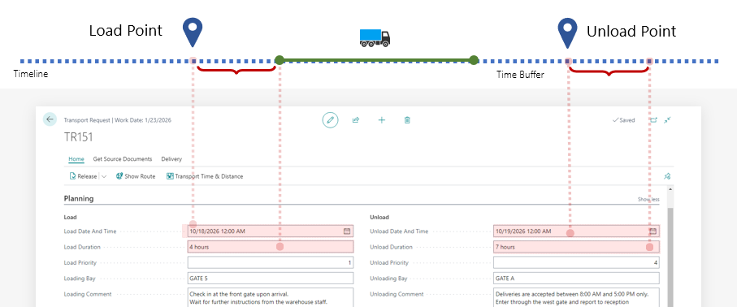

The Transport Request includes line items from source documents and gives you the flexibility to adjust the quantities for the current transportation, allowing for multiple deliveries when needed by one source document. If the goods are packed into logistical units, that information is clearly displayed, ensuring seamless and organized transportation planning.

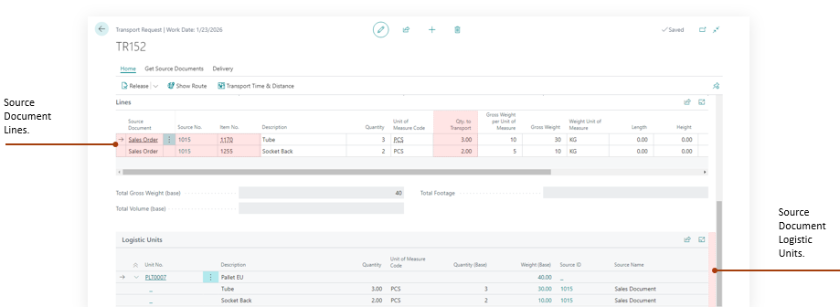

## Why to Create a Transport Request

A Transport Request is used in the shipper scenario to initiate and manage the transportation process for one or multiple sales or purchase orders. It serves as the initial planning document and helps with:

- To initiate the transportation process, for example, to hand over the order to the delivery department
- Estimating logistics needs (e.g., number of pallets, containers).
- Planning shipments before creating actual transportation documents.
- Grouping multiple orders into a single transportation document.
- Triggering transport planning and execution processes.

## How to Create a Transport Request

### Create automatically

When the document is released — that is, when the order status is changed to "Release" - one or more Transport Requests will be generated automatically. This means the order is handed over to transportation and can be included in a Delivery Order. To enable this, make sure the "Auto Create Transport Request for Sale" option is activated in the TMS Settings [details](setup.md).

Result: one order – one transport request (if all line items have the same warehouse).

### Create Manually from List

The simplest way to send orders for transportation is by selecting one or more documents directly from the list of source documents and invoking the appropriate function: Create Transport Request.

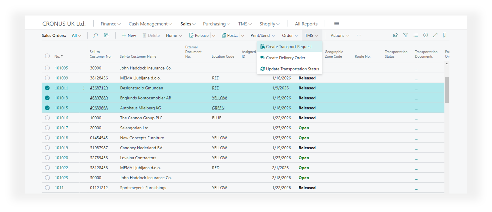

Result: one transport request will be created for each selected order (if all line items have the same warehouse).

From any list of source documents, the Transportation Status and Transportation Documents fields allow you to determine whether the document has been sent to the TMS module for transportation, if a delivery order has been created, and whether this applies to the entire document or only certain lines.

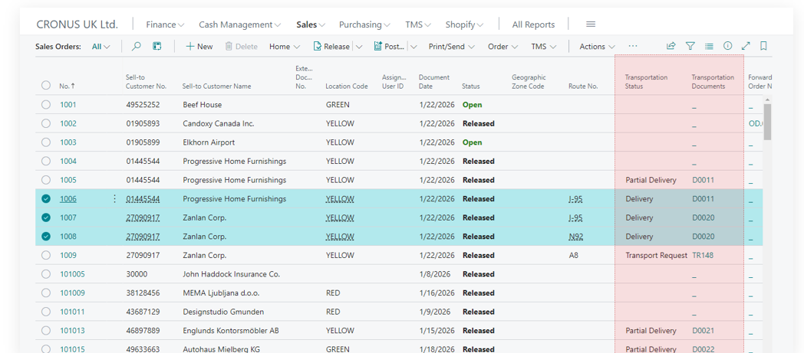

### Create Manually from Card

This method is useful when it’s clear that a large order cannot be delivered all at once and needs to be split into parts that will be delivered at different times or by different carriers. In this case, the order is manually divided into parts and assigned to different Transport Requests, which in turn are assigned to different Delivery Orders.

Menu path:

Document Card -> TMS -> Transport and Delivery -> Transportation Request Planning

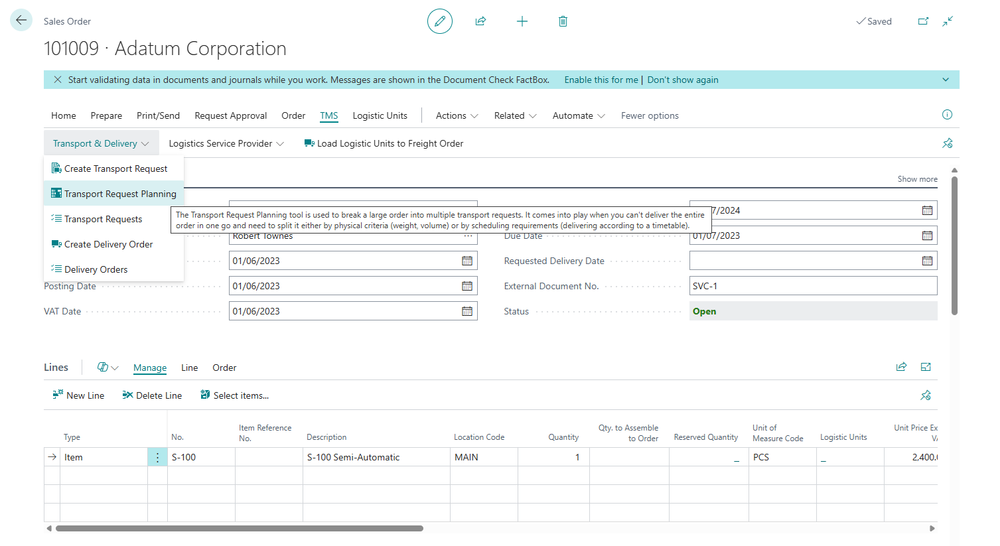

### Create Manually for Grouping

This method differs in that we don't start from the original document to create a Transport Request — instead, we create the Transport Request first and then assign to it a set of documents (or parts of documents) that can be combined. A typical case would be creating a Transport Request for a specific customer and grouping all orders for that customer into a single Transport Request.

Step-by-step process:

- Create a new Transport Request. Navigate to: Business Central Main Menu → TMS → Transport & Delivery → Transport Requests → + New
- Define the shipper and consignee. At minimum, specify the type of the shipper or consignee. This is necessary so that the system only shows compatible documents for selection based on the source and destination. If a specific Customer, Vendor, or Warehouse is selected, the system will filter documents accordingly.
- Click: Menu → Prepare → Get Documents. Select the relevant documents using CTRL and click OK. Note: If the selected documents cannot be combined into a single Transport Request, the system will display an error—for example, if they have different customers or shipping warehouses.

Main rule for combining documents: One origin point – one destination point.

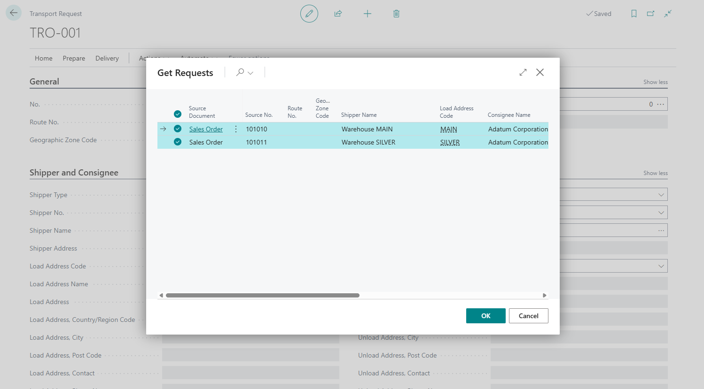
