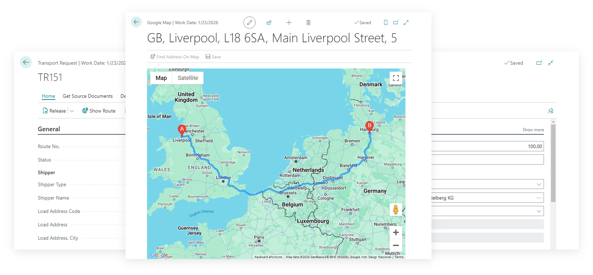

# Transport Request

The Transport Request is a core document in the Transportation Management System (TMS) that consolidates sales, purchase, and transfer orders based on delivery addresses. It serves as a single entity for managing transportation logistics, specifying pickup and delivery locations, and designating shipper and consignee information.

It defines **WHAT** needs to be transported, where the goods are to be picked up, and where they need to be delivered, while also specifying the shipper and the consignee.

## Capabilities

The Transport Request document covers the following functional areas of the TMS:

- Order Grouping
- Routes and Zones
- Transportation Conditions
- Time Slots

To transport something from one place to another in the TMS module, you need to create a Transport Request. The request can be created for any document (sales, purchase, or transfer), whether it has been posted or not. A Transport Request serves as an assignment or instruction, indicating that these specific items need to be delivered from this location to that destination.

A Transport Request is a document used to initiate a request for organizing the transportation of goods from one point to another. It serves as a formal request for transportation services. This document can include line items from one or more source documents, but they are grouped based on the principle of moving from point A to point B. It does not include complex routes or multiple stops, focusing solely on straightforward point-to-point transport requests.

The Transport Request allows grouping source documents based on the warehouse from which goods will be shipped or received. The connection is made at the line level, as in Business Central, sometimes different lines within the same document can be associated with different warehouses.

The Transport Request allows grouping source documents based on the destination address where the delivery is to be made, within a scenario where goods are shipped from a single warehouse to a single customer, but with different delivery addresses for each order.

The key parameters of a Transport Request are the pickup and drop-off locations—where the goods are coming from and where they are going. The Shipper and Consignee can be our warehouse, a customer, or a vendor, offering flexibility to meet various transportation needs.

The Transport Request leverages MAP Location data, matched with warehouses, suppliers, customers, or client and supplier addresses, to visualize the transportation route. This provides greater clarity and accuracy when planning the route.

The Transport Request offers powerful tools for estimating both the duration and distance of the transportation, ensuring precise planning and efficient execution.

The Transport Request allows you to precisely specify the required parameters: location, date, time, and most importantly, the duration of key transportation stages. The transportation duration can be estimated using the Google Maps API.

You can provide additional information about the loading and unloading locations that may be useful for the driver, such as the gate and the loading sequence.

The Transport Request includes line items from source documents and gives you the flexibility to adjust the quantities for the current transportation, allowing for multiple deliveries when needed by one source document. If the goods are packed into logistical units, that information is clearly displayed, ensuring seamless and organized transportation planning.

## Why to Create a Transport Request

A Transport Request is used in the shipper scenario to initiate and manage the transportation process for one or multiple sales or purchase orders. It serves as the initial planning document and helps with:

- To initiate the transportation process, for example, to hand over the order to the delivery department
- Estimating logistics needs (e.g., number of pallets, containers)
- Planning shipments before creating actual transportation documents
- Grouping multiple orders into a single transportation document
- Triggering transport planning and execution processes

## How to Create a Transport Request

### Create automatically

This approach is convenient when dealing with relatively small and similar orders that can be easily grouped together for transportation.

When the document is released—that is, when the order status is changed to "Released"—one or more Transport Requests will be generated automatically. This means the order is handed over to transportation and can be included in a Delivery Order. To enable this, make sure the "Auto Create Transport Request for Sale" option is activated in the TMS Settings [details](setup.md).

Result: one order – one transport request (if all line items have the same warehouse).

### Create manually from document list

The simplest way to send orders for transportation is by selecting one or more documents directly from the list of source documents and invoking the appropriate function: Create Transport Request.

Result: one transport request will be created for each selected order (if all line items have the same warehouse).

From any list of source documents, the Transportation Status and Transportation Documents fields allow you to determine whether the document has been sent to the TMS module for transportation, if a delivery order has been created, and whether this applies to the entire document or only certain lines.

### Create manually from document card

This approach is useful when handling large orders that cannot be delivered all at once or need to be delivered on a regular schedule.

This method is useful when it’s clear that a large order cannot be delivered all at once and needs to be split into parts that will be delivered at different times or by different carriers. In this case, the order is manually divided into parts and assigned to different Transport Requests, which in turn are assigned to different Delivery Orders.

Menu path:

Document Card → TMS → Transport and Delivery → Transportation Request Planning

### Create manually for order grouping

This approach is convenient when there are a large number of orders for the same customer that need to be grouped by customer.

This method differs in that we don't start from the original document to create a Transport Request—instead, we create the Transport Request first and then assign to it a set of documents (or parts of documents) that can be combined. A typical case would be creating a Transport Request for a specific customer and grouping all orders for that customer into a single Transport Request.

Step-by-step process:

- Create a new Transport Request. Navigate to: Business Central Main Menu → TMS → Transport & Delivery → Transport Requests → + New
- Define the shipper and consignee. At minimum, specify the type of the shipper or consignee. This is necessary so that the system only shows compatible documents for selection based on the source and destination. If a specific Customer, Vendor, or Warehouse is selected, the system will filter documents accordingly.
- Path: Menu → Prepare → Get Documents. Select the relevant documents using CTRL and click OK. Note: If the selected documents cannot be combined into a single Transport Request, the system will display an error—for example, if they have different customers or shipping warehouses.

Main rule for combining documents: One origin point – one destination point.

## Documents from which Transport Requests can be created

From the card page of a document, you can manage the creation of Transport Requests more precisely—for example, by splitting a large order into several Transport Requests and later assigning them to different trucks. However, in list pages, it's more convenient to group multiple orders into a single request or truck.

Document Card and List Pages:

- **Purchase Credit Memo** / **Purchase Credit Memos**
- **Purchase Invoice** / **Purchase Invoices**
- **Purchase Order** / **Purchase Order List**
- **Purchase Return Order** / **Purchase Return Order List**

- **Sales Credit Memo** / **Sales Credit Memos**
- **Sales Invoice** / **Sales Invoice List**
- **Sales Order** / **Sales Order List**
- **Sales Return Order** / **Sales Return Order List**

- **Transfer Order**

Posted Documents Card and List Page:

- **Posted Purchase Invoice** / **Posted Purchase Invoices**
- **Posted Purchase Receipt** / **Posted Purchase Receipts**
- **Posted Return Shipment** / **Posted Return Shipment**
- **Posted Purchase Credit Memo** / ***Posted Purchase Credit Memos**

- **Posted Sales Credit Memo** / **Posted Sales Credit Memos**
- **Posted Sales Invoice** / **Posted Sales Invoices**
- **Posted Return Receipt** / **Posted Return Receipts**
- **Posted Sales Shipment** / **Posted Sales Shipments**

## Fields Description

- **No.** The unique identifier for the transport request document. This number is automatically generated using a number series when creating new transport requests, but can also be manually specified. It serves as the primary reference for tracking and managing the transport request throughout its lifecycle.
- **Status** The current processing status of the transport request that controls the document workflow and editing permissions. Possible values are:
  - Open: Document is being prepared and can be modified
  - Released: Document is finalized and ready for delivery assignment  
  - Delivery: Document has been assigned to a delivery order and cannot be deleted

### Route and Zone Information

- **Route No.** The assigned route or path for this transport request. This links to predefined routes for optimization and carrier assignment. Cannot be changed if lines exist in the transport request [details](route.md).
- **Geographic Zone Code** The geographic zone or region classification for this transport request. This enables regional analysis, pricing, and carrier assignment. Cannot be changed if lines exist in the transport request.

### Planning Fields - Load Information

- **Load Date And Time** The planned date and time for loading goods at the shipper's location. This is the primary scheduling field for pickup operations and automatically updates the Load Date field. It validates against the Unload Date And Time to ensure logical scheduling [details](timeslots.md).
- **Load Date** A simplified date field for loading that is automatically derived from the Load Date And Time. This field is used for date-based filtering, reporting, and scheduler index calculations.
- **Loading Bay** The specific loading bay or dock designation at the pickup location. This provides detailed location information for warehouse operations and helps coordinate loading activities and resource allocation.
- **Load Priority** The priority level for loading operations that helps sequence loading activities when multiple requests compete for resources. Used in loading bay scheduling and resource optimization.
- **Load Duration** The estimated time required to complete loading operations. This duration is used for capacity planning, scheduling accuracy, and is calculated into total transportation time estimates.
- **Loading Comment** Special instructions or notes for loading operations that communicate specific requirements or constraints to loading personnel. These comments are displayed on loading documents and delivery instructions.

### Planning Fields - Unload Information

- **Unload Date And Time** The planned date and time for unloading goods at the consignee's location. This is the primary scheduling field for delivery operations and automatically updates the Unload Date field. It validates against the Load Date And Time to ensure logical scheduling [details](timeslots.md).
- **Unload Date** A simplified date field for unloading that is automatically derived from the Unload Date And Time. This field is used for date-based filtering, reporting, and delivery scheduling.
- **Unloading Bay** The specific unloading bay or dock designation at the delivery location. This provides detailed location information for delivery operations and helps coordinate unloading activities and resource allocation.
- **Unload Priority** The priority level for unloading operations that helps sequence unloading activities when multiple deliveries arrive. Used in unloading bay scheduling and resource optimization.
- **Unload Duration** The estimated time required to complete unloading operations. This duration is used for capacity planning, scheduling accuracy, and is calculated into total transportation time estimates.
- **Unloading Comment** Special instructions or notes for unloading operations that communicate specific requirements or constraints to unloading personnel. These comments are displayed on delivery documents and unloading instructions.

### Shipper Information

- **Shipper Type** The type of shipper entity that determines which master data tables to reference for shipper information. Possible values are:
  - Customer: Links to customer master data
  - Vendor: Links to vendor master data  
  - Location: Links to location master data
- **Shipper No.** The reference to the shipper's master data record (customer, vendor, or location). When selected, this automatically populates all shipper address fields and related information from the master data.
- **Shipper Name** The full name of the shipping entity. This field supports lookup functionality for entity selection and is displayed in reports and documents.
- **Shipper Address** The main address details for the shipper, including street and location information. This field is automatically populated from the master data and is used in shipping documents and labels.

### Load Address Fields

- **Load Address Code** A reference to a specific address within the shipper's address book that allows selection of alternate pickup addresses. When selected, this automatically populates all load address fields. The available addresses depend on the shipper type (Ship-to Address for customers, Order Address for vendors, Location for locations).
- **Load Address Name** The contact or site name under which the pickup address is listed. This identifies the specific pickup site and is displayed on pickup documents and delivery instructions.
- **Load Address** The street address details for the pickup location. This provides detailed pickup location information and is used in route planning and delivery documentation.
- **Load Address Country Code** The country/region code for the pickup address. This enables international shipping compliance and automatically updates city and county fields when changed. Used in customs documentation and international shipping.
- **Load Address City** The city or municipality of the pickup address. This provides location detail for routing and documentation and supports postcode lookup functionality for address validation.
- **Load Address Post Code** The postal code for the pickup address. This enables accurate address validation and routing and supports postcode lookup functionality for address validation.
- **Load Address Contact** The main contact person at the pickup location. This provides contact information for coordination and is used in pickup scheduling and communication.
- **Load Address Phone No.** The phone number for the pickup location. This enables direct communication with the pickup site and is used in pickup coordination and emergency contact.
- **Load Address County** The county or other regional subdivision of the pickup address. This provides additional location detail and is used in regional reporting and address validation.
- **Load Address E-Mail** The email address for the shipper or pickup site. This enables electronic communication and is used in electronic notifications and documentation.
- **Load Address GLN** The Global Location Number (GLN) for the pickup address. This is used for EDI system integration and standardized location identification. The system validates the GLN check digit to ensure accuracy.
- **Shipper Map Location No.** The map location code used by mapping services to pinpoint the shipper's address. This enables integration with mapping services for distance and duration calculation and is used in route planning and distance calculation [details](maplocation.md).
- **Shipper VAT No.** The VAT registration number for the shipping party. This is used for tax compliance and documentation and appears in tax calculations and compliance reporting.
- **Shipper Notes** Internal notes or comments regarding the shipper. This stores additional shipper-related information and is used for internal communication and documentation.

### Consignee Information

- **Consignee Type** The type of consignee entity that determines which master data tables to reference for consignee information. Possible values are:
  - Customer: Links to customer master data
  - Vendor: Links to vendor master data
  - Location: Links to location master data
- **Consignee No.** The reference to the consignee's master data record (customer, vendor, or location). When selected, this automatically populates all consignee address fields, default route, and related information from the master data.
- **Consignee Name** The full name of the receiving party or consignee. This field supports lookup functionality for entity selection and is displayed in reports and documents.
- **Consignee Address** The main address details for the consignee, including street and location information. This field is automatically populated from the master data and is used in delivery documents and labels.

### Unload Address Fields

- **Unload Address Code** A reference to a specific address within the consignee's address book that allows selection of alternate delivery addresses. When selected, this automatically populates all unload address fields. The available addresses depend on the consignee type (Ship-to Address for customers, Order Address for vendors, Location for locations).
- **Unload Address Name** The contact or site name under which the delivery address is listed. This identifies the specific delivery site and is displayed on delivery documents and instructions.
- **Unload Address** The street address details for the delivery location. This provides detailed delivery location information and is used in route planning and delivery documentation.
- **Unload Address Country Code** The country/region code for the delivery address. This enables international shipping compliance and automatically updates city and county fields when changed. Used in customs documentation and international shipping.
- **Unload Address City** The city or municipality of the delivery address. This provides location detail for routing and documentation and supports postcode lookup functionality for address validation.
- **Unload Address Post Code** The postal code for the delivery address. This enables accurate address validation and routing and supports postcode lookup functionality for address validation.
- **Unload Address Contact** The main contact person at the delivery location. This provides contact information for coordination and is used in delivery scheduling and communication.
- **Unload Address Phone No.** The phone number for the delivery location. This enables direct communication with the delivery site and is used in delivery coordination and emergency contact.
- **Unload Address County** The county or other regional subdivision of the delivery address. This provides additional location detail and is used in regional reporting and address validation.
- **Unload Address E-Mail** The email address for the consignee or delivery site. This enables electronic communication and is used in electronic notifications and documentation.
- **Unload Address GLN** The Global Location Number (GLN) for the delivery address. This is used for EDI system integration and standardized location identification. The system validates the GLN check digit to ensure accuracy.
- **Consignee Map Location No.** The map location code used by mapping services to pinpoint the consignee's address. This enables integration with mapping services for distance and duration calculation and is used in route planning and distance calculation [details](maplocation.md).
- **Consignee VAT No.** The VAT registration number for the consignee entity. This is used for tax compliance and documentation and appears in tax calculations and compliance reporting.
- **Consignee Notes** Internal notes or comments regarding the consignee. This stores additional consignee-related information and is used for internal communication and documentation.

### Transportation Conditions

- **Item Attribute ID** The reference to an item attribute for condition requirements. This links to specific condition or classification requirements and is used in condition-based carrier selection.
- **Item Attribute Value ID** The specific value for the item attribute that defines the exact condition requirement. This automatically updates the Item Attribute Value Name when changed and is used in condition validation and carrier matching.
- **Item Attribute Value Name** The human-readable name of the attribute value that defines the condition requirement. This field supports lookup functionality and is displayed in user interfaces and reports.

### Calculated Fields

- **Total Gross Weight** The sum of gross weight from all transport request lines in the base unit of measure. This provides total weight for capacity planning and is used in vehicle selection and capacity planning.
- **Total Net Weight** The sum of net weight from all transport request lines in the base unit of measure. This provides net weight excluding packaging and is used in weight-based calculations and reporting.
- **Total Volume** The sum of volume from all transport request lines in the base unit of measure. This provides total volume for capacity planning and is used in vehicle selection and space planning.
- **Total Lines** The count of lines in the transport request. This provides line count for validation and reporting and is used in validation rules and reporting.
- **Total Footage** The combined linear measurement of goods in this request. This is useful for capacity planning in linear transport and is used in trailer and container capacity calculations.
- **Estimated Logistic Units** The expected number of logistic units (such as pallets or parcels) based on rules or manual input. This is used for capacity planning and carrier selection and helps in vehicle selection and loading optimization.

### Transportation Information

- **Transportation Distance** The estimated distance between the shipper and consignee locations. This distance is typically retrieved from map services (Google Maps, etc.) and is used for cost calculation, route optimization, and capacity planning. Displayed in transportation entries and used for freight calculations.
- **Transportation Duration** The estimated transit time from loading to unloading. This duration is often calculated from map services based on the transportation mode and is used for scheduling, capacity planning, and delivery time estimation. Used in delivery planning and customer communication.

## Transport Request Line Fields

### Source Document Information

- **Source Type** The numeric code representing the source document type (Sales, Purchase, Transfer). This identifies the type of source document and is used in source document processing and validation.
- **Source Subtype** Additional distinctions for the source type using internal option values (0,1,2,3,4,5,6,7,8,9,10). This provides finer classification of source documents and is used in source document processing.
- **Source No.** The source document number reference that links to the original source document. This is used in drill-down and source document tracking.
- **Source Line No.** The line number in the source document that links to the specific line in the source document. This is used in quantity validation and source tracking.
- **Source Document** The human-readable source document type (such as Sales Order, Purchase Order, etc.). This provides clear identification of source document type and is used in reporting and user interfaces.
- **Source Link Active** Indicates whether the link to the source document is still valid. This tracks whether the original source line still exists and is used in validation and cleanup processes.

### Item Information

- **Item No.** The item number for the product being transported that links to item master data. When selected, this automatically populates item details, dimensions, and weights from the item master.
- **Variant Code** The item variant code if multiple versions or styles of the item exist. This specifies the specific variant of the item and is used in detailed item identification.
- **Description** A brief description of the item being requested. This provides item identification information and is displayed in reports and documents.
- **Description 2** Additional descriptive text for the item if needed. This provides supplementary item information and is used in detailed documentation.

### Quantity Management

- **Quantity** The total quantity of the item required for this transport request line. This specifies the total amount to be transported and automatically calculates the base quantity. Cannot be negative.
- **Unit of Measure Code** The unit of measure used for the requested quantity (such as PCS or BOX). This defines the measurement unit and automatically calculates conversion factors and rounding precision.
- **Qty. (Base)** The requested quantity in the base unit of measure. This provides standardized quantity for calculations and is used in system calculations and reporting.
- **Qty. per Unit of Measure** How many base units are contained in one unit of the specified measure. This enables quantity conversions and is used in quantity calculations.
- **Qty. Rounding Precision** The rounding precision for the quantity in the chosen unit of measure. This controls quantity rounding accuracy and is used in quantity validation.
- **Qty. Rounding Precision (Base)** The rounding precision for the base quantity calculation. This controls base quantity rounding accuracy and is used in base quantity calculations.
- **Location Code** The location or warehouse code where this item is stored or managed. This specifies where the item is stored and is used in inventory management and picking.
- **Qty. to Transport** How many units of this item will actually be transported for this request line. This specifies the portion of total quantity being transported and validates against source quantity and other transport requests to prevent over-allocation.
- **Qty. to Transport (Base)** How many units in the base measure will be transported. This provides standardized transport quantity and is used in system calculations.

### Dimensions

- **Length** The length measurement for dimensional items used for space or cost calculations. This automatically calculates volume when changed and is used in space planning and capacity calculations.
- **Width** The width measurement for dimensional items used for space or cost calculations. This automatically calculates volume when changed and is used in space planning and capacity calculations.
- **Height** The height measurement for dimensional items used for space or cost calculations. This automatically calculates volume when changed and is used in space planning and capacity calculations.
- **Linear Unit of Measure Code** The code for the unit of measure used for length, width, and height values. This defines the measurement unit for dimensions and automatically calculates volume when changed.

### Weight Management

- **Gross Weight per Unit of Measure** The gross weight of one unit used to calculate total weight based on quantity. This must be greater than or equal to net weight and automatically calculates total gross weight.
- **Net Weight per Unit of Measure** The net weight of one unit excluding packaging or other overhead. This must be less than or equal to gross weight and automatically calculates total net weight.
- **Volume per Unit of Measure** The volume of a single unit for capacity planning in transport or storage. This is automatically calculated from dimensions and is used in volume calculations and capacity planning.
- **Gross Weight per UoM (Base)** The gross weight of one unit in the base weight measure for system calculations. This provides standardized weight for calculations and is used in system calculations.
- **Net Weight per UoM (Base)** The net weight of one unit in base weight measure for system calculations. This provides standardized weight for calculations and is used in system calculations.
- **Volume per UoM (Base)** The volume of one unit in the base volume measure for system calculations. This provides standardized volume for calculations and is used in system calculations.
- **Gross Weight** The calculated total gross weight for the transported quantity. This is automatically calculated from per-unit weight and is used in vehicle selection and capacity planning.
- **Net Weight** The calculated total net weight for the transported quantity. This is automatically calculated from per-unit weight and is used in weight-based calculations.
- **Weight Unit of Measure Code** The weight unit of measure (like KG or LB) used for net and gross calculations. This defines weight measurement unit and automatically converts weights when changed.
- **Volume** The total volume of the transported quantity combining all individual units. This is automatically calculated from per-unit volume and is used in vehicle selection and space planning.
- **Volume Unit of Measure Code** The volume unit of measure (like cubic meters or liters) for item volume calculations. This defines volume measurement unit and automatically converts volumes when changed.
- **Gross Weight (Base)** The total gross weight in the system's base weight measure. This provides standardized weight for system calculations and is used in system calculations and reporting.
- **Net Weight (Base)** The total net weight in the system's base weight measure. This provides standardized weight for system calculations and is used in system calculations and reporting.
- **Volume (Base)** The total volume in the system's base volume measure used for calculations. This provides standardized volume for system calculations and is used in system calculations and reporting.

### Item Attributes (Item Transportation Condition)

- **Item Attribute ID** The internal ID for a tracked item attribute if relevant to shipping requirements. This links to condition or classification requirements and is used in condition-based processing.
- **Item Attribute Value ID** The internal value ID for the linked item attribute if any. This defines exact condition requirement and is used in condition validation.
- **Item Attribute Value Name** The name or descriptor of the item attribute used for this transport line. This provides display name for condition requirement and is displayed in user interfaces.

### Identification

- **GTIN** The Global Trade Item Number for the item used for tracking and identification. This is a 14-digit numeric code used in EDI transactions and item tracking.

## Key Relationships and Usage

### Source Document Integration

Transport Request Lines link to source documents (Sales Orders, Purchase Orders, Transfer Orders). Source document changes automatically update transport request status, and quantity validation ensures transport quantities don't exceed source quantities.

### Address Management

Shipper and Consignee information links to master data (Customer, Vendor, Location). Address codes enable selection of alternate addresses, and map locations enable integration with mapping services.

### Capacity Planning

Weight and volume calculations support vehicle selection. Dimensional data enables space optimization, and logistic units estimation supports capacity planning.

### Status Management

The Status field controls document workflow. Status changes trigger validation rules, and delivery assignment updates status automatically.

### Document Creation Workflow

1. Create Transport Request Header with basic information
2. Add lines by selecting source documents (use function "Get Documents")
3. Specify quantities to transport "Qty. to Transport".
4. Set planning dates and times
5. Release document for delivery assignment

### Capacity Planning Workflow

1. Review total weights and volumes
2. Estimate logistic units
3. Select appropriate vehicles
4. Plan loading and unloading times

### Route Optimization Workflow

1. Set map locations for shipper and consignee
2. Calculate distance and duration
3. Assign routes and geographic zones
4. Optimize delivery schedules
