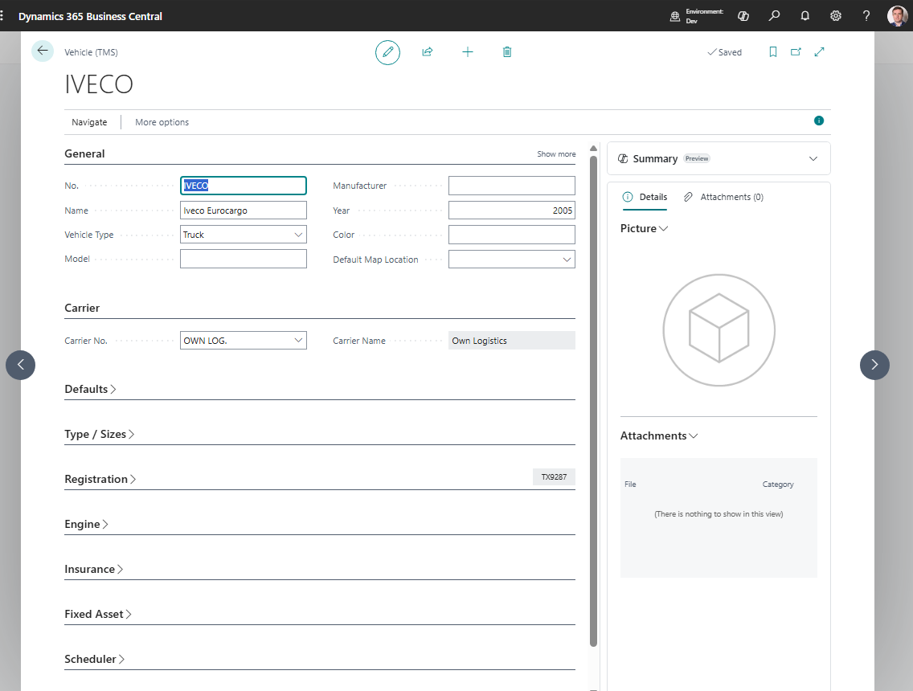

# Vehicles

Use **Vehicles** to store fleet or carrier equipment records used in Freight Orders and planning.

A vehicle can represent a truck, trailer, van, container chassis, vessel reference, or another execution asset your process tracks.

## Before you start

Make sure that:

- carriers exist if vehicles belong to carriers,
- logistic unit types or capacity units exist when capacity is tracked,
- users know which vehicle identifiers are required for documents,
- blocked or retired equipment rules are defined.

## How to create a vehicle

1. Search for **Vehicles**.
2. Choose **New**.
3. Enter the vehicle number or code.
4. Fill description, carrier, registration, and equipment details.
5. Fill capacity values when your process uses them.
6. Add default driver if appropriate.
7. Save the record.

## Fields that matter most

| Field | Why it matters |
|---|---|
| **No. / Code** | Identifies the vehicle in TMS. |
| **Description** | Helps users select the right equipment. |
| **Carrier No.** | Links equipment to the executing carrier. |
| **Registration No.** | Prints on operational documents when needed. |
| **Capacity values** | Support planning and load review. |
| **Default Driver** | Speeds up Freight Order assignment. |
| **Blocked** | Prevents new assignment while preserving history. |

## Where vehicles are used

| Area | Use |
|---|---|
| **Freight Order** | Shows equipment assigned to the work. |
| **Carriers** | Provides default execution resources. |
| **Reports** | Prints vehicle information on carrier documents. |
| **Freight Load Management** | Helps planners review assigned equipment. |

## Good to know

- Block retired vehicles instead of deleting them.
- Keep registration and equipment descriptions clean. They may print on documents.
- Vehicle assignment is operational data. Settlement usually depends on carrier, vendor, services, and charges.

## Troubleshooting

| Problem | What to check |
|---|---|
| Vehicle is not available | Check whether it is blocked or filtered by carrier. |
| Wrong vehicle appears by default | Review carrier and driver defaults. |
| Capacity totals look wrong | Check vehicle capacity and document content quantities. |
| Vehicle data is missing on a report | Review the Freight Order and vehicle card before printing. |

## Related

- [Freight Order](freightorder.md)
- [Freight Load Management](freightloadmanagement.md)
- [Carriers](carrier.md)
- [Drivers](driver.md)
